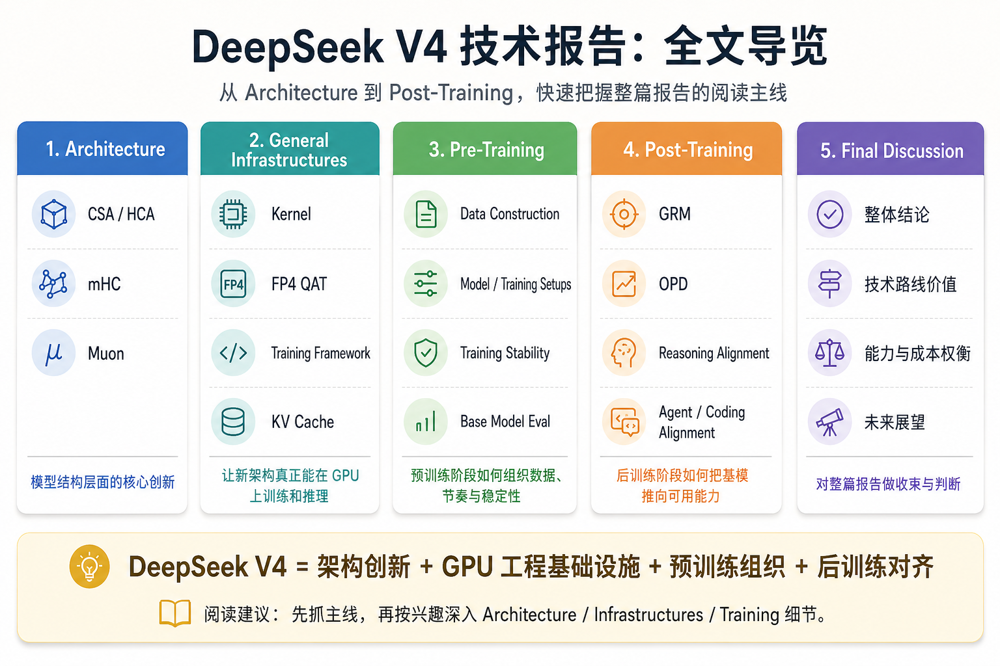

# 🧭 后端人视角下的 DeepSeek V4 技术报告解读

> 面向有后端工程经验、理解 LLM/Agent 基础概念，但没有系统做过大模型训练的读者。

---

## 📌 本文怎么读

DeepSeek V4 技术报告可以粗略拆成五个层次：

| 章节 | 主题 | 适合关注点 | 阅读门槛 |
|---|---|---|---|
| Introduction | 全文总览 | 先建立全局问题意识 | 中 |
| Architecture | 算法设计 | CSA / HCA、mHC、Muon | 高 |
| General Infrastructure | 工程基础设施 | Kernel、FP4 QAT、训练框架、KV Cache | 高 |
| Pre-Training | 预训练工程 | 数据、训练节奏、稳定性、基模评测 | 中 |
| Post-Training | 后训练工程 | GRM、OPD、reasoning / agent / coding 对齐 | 中 |

---

## 🗺️ 全文路线图

---

## 🧱 各章重点速览

### 2️⃣ Architecture：算法层的三件事

- **CSA / HCA**：面向 1M context 的长上下文注意力与 KV cache 压缩机制。
- **mHC**：残差流与层间连接稳定性优化。
- **Muon**：面向大规模矩阵参数的训练优化器。

### 3️⃣ General Infrastructure：算法如何真的跑在 GPU 上

- **Kernel / TileLang**：GPU 算子与训练吞吐优化。
- **FP4 QAT**：面向低精度训练/推理的量化感知训练。
- **训练框架**：分布式训练、并行策略与调度优化。
- **KV Cache 管理框架**：长上下文推理的显存与吞吐优化。

### 4️⃣ Pre-Training：预训练如何组织

- **数据**：预训练数据组织与长上下文数据构造。
- **Training Schedule**：不同阶段的训练节奏安排。
- **稳定性处理**：训练不稳定与 loss spike 处理。
- **Base Model 评测**：只作为现象参考，不作为本文核心。

### 5️⃣ Post-Training：统一模型如何吸收专家能力

- **GRM**：unverified task 的奖励建模 / 评价优化。
- **OPD**：多专家策略到统一模型的在线策略蒸馏。
- **Reasoning / Agent / Coding 对齐**：面向工具使用、代码任务和 Agent 轨迹的行为对齐。

---

## 🚦阅读路径建议

| 你的兴趣 | 建议入口                             |
|---|----------------------------------|
| 对算法本身感兴趣 | 从第 2 章 Architecture 开始           |
| 对 GPU / 训练基础设施感兴趣 | 从第 3 章 General Infrastructure 开始 |
| 对模型预训练感兴趣 | 从第 4 章 Pre-Training 开始           |
| 对后训练、Agent、工具调用感兴趣 | 从第 5 章 Post-Training 开始          |
| 只关心 Agent 中如何用 V4 | 重点看第 5.1 节，必要时回看第 2 / 3 章        |

---

## ✅ 本文关心什么

1. DeepSeek V4 训练全过程中的算法和工程要点。
2. 这些算法和工程优化对 Agent 开发的影响。
3. 为什么长上下文、KV Cache、推理成本和后训练 runtime 会成为同一个问题。

## 🚫 本文不关心什么

1. 具体 benchmark 跑分高低。
2. 官方或非官方公布的模型能力排名。
3. DeepSeek V4 如何接入现有 coding agent，例如 Claude Code、Codex、Hermes 等。

## 🎯 本文可能提供什么帮助

1. 帮助理解如何更好地在 Agent 中使用 DeepSeek V4。
2. 帮助解释一些 DeepSeek V4 在 Agent 场景中的 issue。
3. 把模型报告里的算法术语尽可能通俗化直白化，理解算法中的数学直觉。
4. 把大模型训练工程中的工程细节尽可能通俗化直白化，理解工程中具体场景和要解决的问题。

---

## 📈 模型参数表

在仓库的 `config/` 路径中有两个config.json, 一个是Pro的，一个是Flash的

这两个json实际上是模型的架构参数说明书，用来描述模型结构，和整体的导读有映射关系。考虑到如果直接放在开头非算法背景读者根本看不懂，不在这里展开

参数和导读的对照，单独拉了一个md文档，大家可以在阅读完全文后对照着这个文档回顾一下模型架构的细节，理解一下模型的设计细节和参数规模

---

## 🧩 必须前置知识

> 有这些知识只能保证阅读能继续，不代表可以非常顺畅地理解全部细节。

- Dense 模型 / MoE 模型的基本差异。
- LLM 基础概念：Transformer、Prefill、KV Cache 等。
- 后训练基础概念：SFT、RL 等。
- 分布式训练基础概念。
- Agent / ReAct loop 基础概念。

---

## 🌍 核心问题

> **DeepSeek V4 报告全程围绕一个核心问题展开：如何同时支持超长上下文、长程推理和可承受成本。**

与 DeepSeek V3 时代相比，V4 面临的问题已经发生变化。

### 1. 长上下文从附加能力变成基础设施

V3 早期主要支持 32K 上下文。当时长上下文需求还没有今天显著，提供一个廉价可用的模型服务已经足够关键。

但 V4 时代，1M context 已经成为一线模型常见的能力边界。此时真正的问题不再只是“能不能放进去”，而是：

- prefill 成本是否可承受；
- KV Cache 是否会压垮显存；
- 长上下文服务成本是否会失控；
- 私有化部署是否能跑得动。

### 2. Agent 从边缘场景变成核心检验场景

模型不再只是回答单轮问题，而是要在 ReAct loop、tool call、多轮状态和长任务轨迹中持续工作。

因此，模型能否在长历史中低成本提取关键信息，已经成为影响 Agent 体验的核心因素。

### 3. 推理预算更重要，也更昂贵

给模型更多上下文、更多中间步骤和更多推理时间，通常能提升复杂任务效果。

但在真实服务中，长 prefill、长 decode、KV Cache 驻留、多轮工具调用都会快速放大成本。V4 的关键目标之一，就是让模型可以支持长推理，同时控制成本。

---

## 🔍 最后声明

- 本文存在大量个人主观理解和解读，已尽可能的标注出哪些是报告原文，哪些是业界做法，哪些是笔者主观理解
- 为了可读性、通俗性和流畅性，本文在很多算法和技术细节上做了不小的简化和概括，也没有完全的忠实于原文章节结构，敬请谅解。如需深入细节，建议直接阅读也已放在仓库中的原文报告pdf
- 本文为了让coder们直观感受到一些核心数学过程，在 `/scripts` 路径下放置了两个演示具体算法的python脚本。这两个脚本仅负责演示算法的核心数学过程，仅仅是toy case，并非算法本身。
- 本文90%以上的文本由笔者自行撰写，由 AI 校对了叙述真实性合理性，并由 AI 重新整理了文本框架和分段结构，做了部分润色，以提高可读性和流畅性。
- 本文所有图片，除部分报告截图外，均由 ChatGPT 生成
- 本文中所有涉及报告原文的部分，均已做了标注，为了可读性而做的翻译不可避免的存在表达偏差，如有疑问，应以英文原文报告为准。
