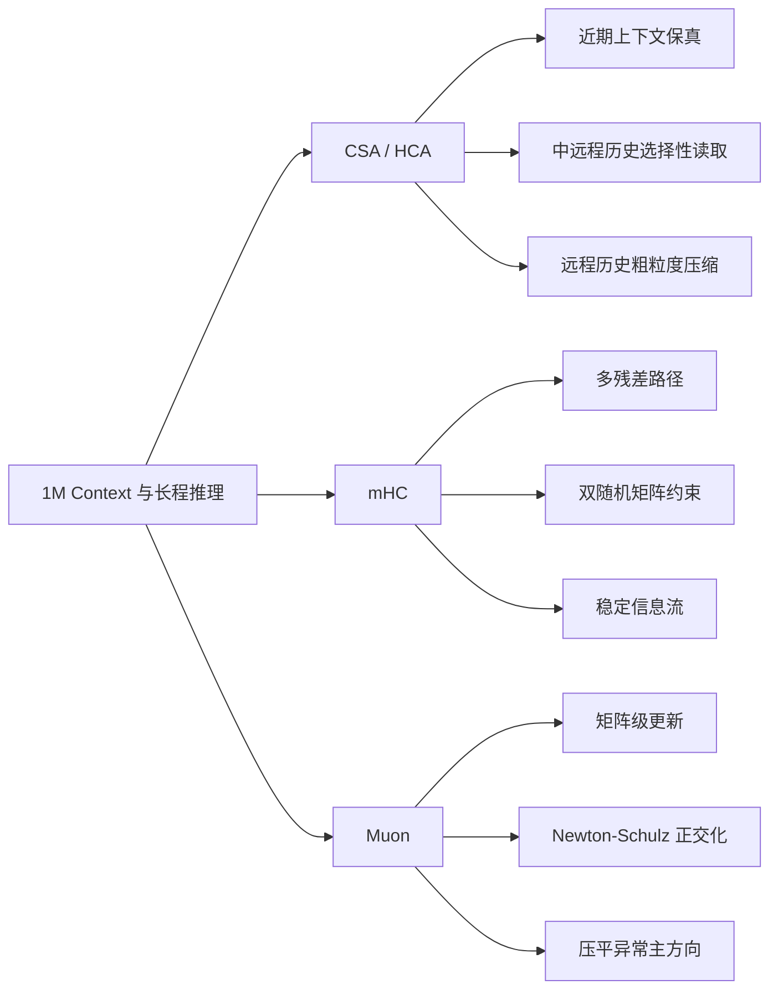
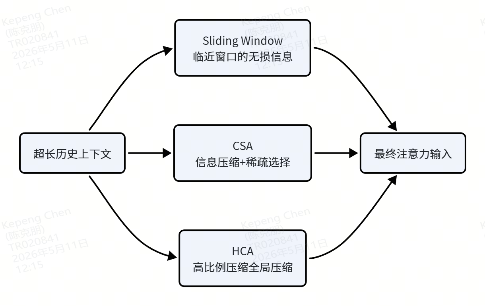
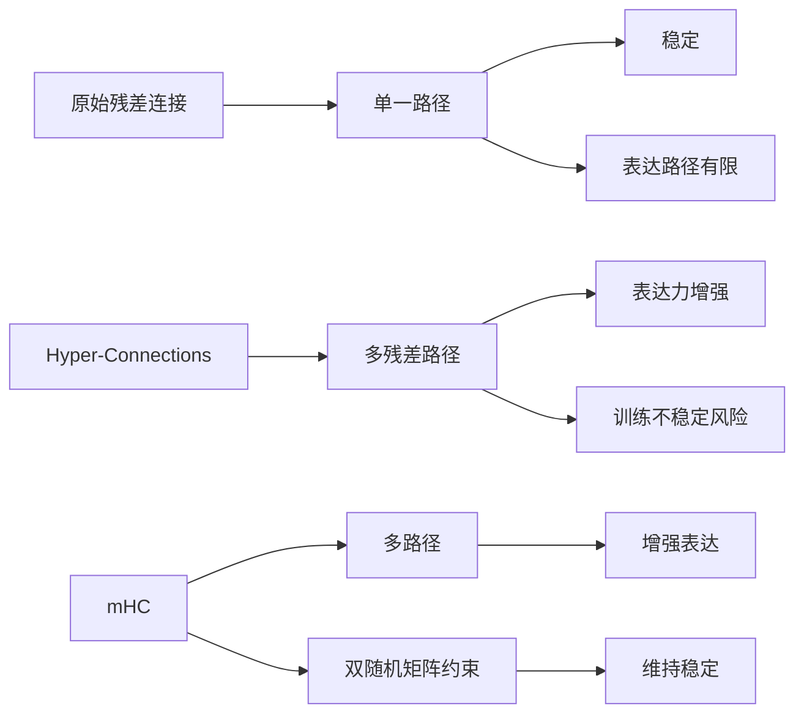
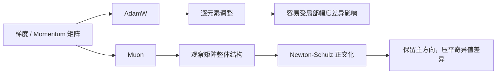

# 🧱 第 2 章 Architecture：DeepSeek V4 的算法设计

> 本章回答的是：为了低成本支持 1M context，同时保持模型能力可用，DeepSeek V4 在模型结构上改了什么。

---

## 🧭 本章速览

DeepSeek V4 在 Architecture 层面主要做了三件事：

| 问题 | 对应设计 | 直观理解 |
|---|---|---|
| 怎么读超长上下文 | CSA / HCA | 把历史上下文分层阅读，而不是一视同仁地全量扫描 |
| 怎么让信息穿过深层网络 | mHC | 给残差流增加更多通路，但用约束保证稳定 |
| 怎么更新大矩阵参数 | Muon | 不只逐元素微调，而是考虑矩阵整体几何结构 |



---

# 1️⃣ CSA / HCA：交替使用的注意力压缩机制

> 前置知识：Transformer Attention、KV Cache、长上下文推理。

## 🎯 问题背景

传统 Transformer attention 默认把历史 token 当成一整块统一记忆池，理论上都可以被完整访问。

这个做法在超长上下文中会遇到三个问题：

- 每一步都完整看所有历史，成本太高。
- 如果粗暴压缩，又容易把真正重要的远程信息一起压没。
- 超长上下文中，很难提前知道当前问题会不会需要很久以前的信息。

所以，长上下文带来的问题不只是“历史太长”，而是：

> **历史里只有一小部分现在用得上，但模型事先不知道是哪一部分。**

## 🧠 直观类比：读一个超长项目文档库

想象你在读一个很长的项目文档库：

- 最近几页你会直接盯着看，因为马上要用。
- 更早的历史，你不会整本重读，而是先看目录和索引，再决定打开哪几章。
- 再远一点，你甚至不会看原文，只保留一个“这个项目大概干过什么”的低分辨率印象。

DeepSeek V4 做的，就是把这种人类阅读方式做进模型内部。

## 🗺️ 结构图



## 🔧 轻技术解释

### Sliding Window：最近上下文保真

`Sliding Window` 负责最近上下文。这部分最像工作记忆，必须尽量保真。因此 DeepSeek 对这部分不做压缩。

### CSA：选择性读取

`CSA` 类似一种 `Abstract Retrieval`。

它先把历史压成中等粒度的块，再从这些块里选出最相关的部分，重新拉回来参与 attention 计算。

所以 CSA 的关键词不是“压缩”，而是：

> **Selective Reading：选择性阅读。**

从工程直觉上说，这一步和 RAG 工程有相似之处：压缩、检索、rerank，然后只读取最相关的信息。

### HCA：全局低分辨率记忆

`HCA` 是全局高比例压缩。

它不定位具体某一句，但能让模型始终保留“远处还有什么”的感觉。类似于人的长期记忆：

- 你可能不记得事情细节；
- 但你知道曾经有这么一件事；
- 当需要时，它能提供一个全局背景。

## ✅ 小结

三者合起来，是 DeepSeek V4 对长上下文最关键的回答：

> **不是所有历史都值得同等对待，而应该按信息价值和用途分层处理。**

---

# 2️⃣ mHC：混合残差连接的稳定器

> 前置知识：残差连接。  
> 本部分理解难度较大，可以先只看“通俗解释”和“小结”。

## 🚦 mHC 的简化通俗解释

原始残差连接、HC、mHC 可以类比成三种道路系统：

| 结构 | 类比 | 特点 |
|---|---|---|
| 原始残差连接 | 单行道 | 所有车只能从一条道上过，稳定但路径单一 |
| HC | 没有红绿灯的双向八车道 | 通行能力大幅增强，但车流可能混乱 |
| mHC | 有红绿灯、交警、车道标志的双向八车道 | 保留多通路能力，同时控制车流稳定性 |

### 🖼️ 原始配图




## 🎯 问题背景

残差连接的意义是：

> **不要直接学习完整目标，而是学习在原输入基础上的偏移量。**

传统残差连接可以写成：

```plaintext
y = x + F(x)
这一层输出 = 原输入 + 这一层学到的修正量
新的 token 表示 = 原来的 token 表示 + Attention/MLP 计算出来的增量
```

它的重要意义在于：如果某一层训练得不好，模型可以近似让 `F(x)` 归零。

也就是说，最坏情况下，这一层可以什么都不做，让信息原样通过。

## 🧱 传统残差连接的优点与代价

普通 Transformer 的 residual connection 非常稳定，因为它给每一层都保留了一条“退路”。

这也是深层神经网络能够稳定训练的重要原因之一。

但它也有代价：

- 信息路径相对单一；
- 表达能力受到路径结构限制；
- 深层网络里仍然可能遇到梯度与信息流问题。

## 🔀 HC 的动机与风险

Hyper-Connections 在 2024-2025 年被提出，意图是把单一路径变成多条残差路径混合，让不同类型的信息有更多通行方式。

但这也会破坏传统残差连接的一个核心好处：

> **最坏情况下退化成近似恒等映射的稳定性。**

如果多路径混合矩阵没有约束，信息可能被任意放大、抵消或扭曲，从而导致训练不稳定。

## 🛠️ mHC 对 HC 的改良

mHC 想保留 HC 的好处：

- 多残差通路；
- 多路径信息流；
- 更强表达力。

但为了保证训练稳定，mHC 对混合矩阵加了约束。

DeepSeek V4 报告中提到的关键点是：

> 使用双随机矩阵限制 HC 中原本自由的连接矩阵。

双随机矩阵具有三个性质：

1. 所有元素非负。
2. 每一行元素累加为 1。
3. 每一列元素累加为 1。

这可以理解为：训练时仍然学习一个自由矩阵，但真正用于多条残差通路混合之前，会先通过归一化 / 近似投影，把它变成一个近似双随机矩阵。

这样做大幅压缩了连接矩阵的自由度，使它更像是在多条残差通路之间做受控重分配，而不是任意放大、抵消或扭曲信息流。

## ✅ 小结

mHC 的核心不是“让信息路径越多越好”，而是：

> **在增强多路径表达力的同时，用矩阵约束保住残差连接的稳定性。**

---

# 3️⃣ Muon：大规模训练优化器

> 前置知识：基础 Transformer、神经网络、梯度下降、AdamW。  
> 本部分理解难度较大，可以先只看“简化通俗解释”和“效果总结”。

## 🚦 Muon 的简化通俗解释

Muon 的主要作用：

1. 避免一次矩阵更新过度集中在少数主方向。
2. 让更新步长更可控。
3. 相信方向结构，但不完全相信幅度比例。

### 🖼️ 原始配图




## 🎯 问题背景

传统神经网络 / Transformer 在训练过程中常使用 AdamW 优化梯度下降。

AdamW 的优势是：

1. 在 Transformer 训练中通常表现稳定，比 SGD 等优化器对学习率、梯度尺度差异更鲁棒。
2. 超参相对不敏感。

但 AdamW 的问题在于：

> 它主要是逐元素优化和微调，但大规模权重矩阵和梯度矩阵其实有整体几何结构。

这些整体结构包括：

- 行列空间结构；
- 奇异值分布；
- 条件数；
- 主方向。

## 🧠 Excel 类比

如果把一个权重矩阵想象成一张 Excel 表：

- **AdamW**：逐个单元格微调。
- **Muon**：先看整张表的整体倾斜方向，再决定怎么整体修正。

两者都在更新参数，但看问题的尺度不同。

## 🔧 技术解释

纯技术术语版解释：

> 对二维矩阵参数的 momentum update 做 Newton-Schulz 正交化，让更新方向更 matrix-aware。

一个极简 toy case：

```plaintext
AdamW（极简版本，忽略二阶动量、weight decay、warmup/decay 等工程处理）

权重矩阵：
Wt = [[1,0,0], [0,1,0], [0,0,1]]

假设反向传播后得到梯度矩阵，经过历史积累获得惯性更新矩阵：
Mt = [[3,0,0], [0,1,0], [0,0,0.5]]

假设学习率为 0.1，更新后的权重矩阵：
Wt+1 = [[0.7,0,0], [0,0.9,0], [0,0,0.95]]
```

```plaintext
Muon（同样是极简演示版本）

权重矩阵：
Wt = [[1,0,0], [0,1,0], [0,0,1]]

惯性更新矩阵：
Mt = [[3,0,0], [0,1,0], [0,0,0.5]]

对 Mt 进行有限轮次 Newton-Schulz 近似正交化：
Mt' = [[1,0,0], [0,0.852,0], [0,0,0.522]]

假设学习率为 0.1，更新后的权重矩阵：
Wt+1 = [[0.9,0,0], [0,0.9148,0], [0,0,0.9478]]
```

## 🧮 从过程上看

对经过适当归一化、且满足收敛条件的非奇异矩阵，Newton-Schulz 迭代可以近似其极分解中的正交因子。

也就是说：

1. AdamW 的 momentum 得到惯性更新矩阵 `Mt`。
2. Muon 以 `Mt` 为前提。
3. Muon 通过 Newton-Schulz 迭代，把它拉成一个保留左右奇异向量所定义主方向结构、同时压平奇异值差异的结果。
4. 最后用这个结果更新权重矩阵。

## ✅ 从效果上看

Muon 的核心效果可以概括为三点：

1. 避免一次矩阵更新过度集中在少数主方向。
2. 让更新步长更可控。
3. 相信方向结构，不完全相信幅度比例。

## 🧠 一句话总结

> **AdamW 更像逐元素修表格；Muon 更像先理解整张矩阵的方向结构，再做更受控的整体更新。**
