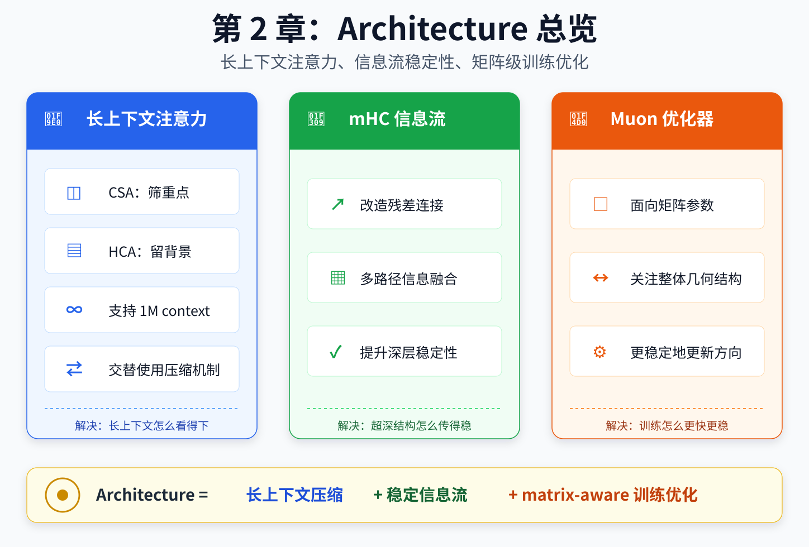

# 🧱 第 2 章 Architecture：DeepSeek V4 的算法设计

> 由于预期内的读者群体大部分没有算法背景，本章的阐述省略了大量数学细节，仅保留算法设计的核心直觉和工程实现的关键细节

---

## 🧭 本章速览

DeepSeek V4 在 Architecture 层面主要做了四件事：

| 问题 | 对应设计 | 直观理解 |
|---|---|---|
| 怎么读超长上下文 | CSA / HCA | 把历史上下文分层阅读，而不是一视同仁地全量扫描 |
| 怎么在总参数很大时控制单 token 成本 | MoE | 用 router 只激活少量专家，把模型容量和计算成本拆开 |
| 怎么让信息穿过深层网络 | mHC | 给残差流增加更多通路，但用约束保证稳定 |
| 怎么更新大矩阵参数 | Muon | 不只逐元素微调，而是考虑矩阵整体几何结构 |



---

## 1️⃣ DeepSeek MoE

> 前置知识：MoE 的基本概念

2.1. 从 DeepSeek-V3 专家混合设计继承的设计。
与之前的 DeepSeek 系列模型（DeepSeek-AI, 2024；DeepSeek-AI, 2024）一样，DeepSeek-V4 系列也对前馈网络（FFNs）采用 DeepSeekMoE 范式（Dai 等人, 2024）， 该范式设置了细粒度路由专家和共享专家。
与 DeepSeek-V3 不同，我们将计算亲和分数的激活函数从 Sigmoid(·) 改为 Sqrt(Softplus(·))。
为了负载平衡，我们还采用了无辅助损失策略（DeepSeek-AI, 2024；Wang 等人, 2024a），并辅以轻微的按序列平衡损失， 以防止单个序列内的极端不平衡。
对于 DeepSeek-V4，我们移除了路由目标节点数量的约束，并仔细重新设计了并行策略以维持训练效率。
此外，相比 DeepSeek-V3，我们用采用 Hash 路由（Roller 等人, 2021）的 MoE 层替换了前几个 Transformer 块中的密集 FFN 层。Hash 路由策略根据输入 token ID 的预定义哈希函数确定每个 token 的目标专家。多 token 预测。与 DeepSeek-V3 一样，DeepSeek-V4 系列也设置了 MTP 模块和目标。鉴于 MTP 策略已在 DeepSeek-V3 中验证，我们在 DeepSeek-V4 系列中采用相同策略，未做修改。

## 🧩 从 V3 MoE 延续下来的设计

V4 延续了之前 V3 中 MoE 的核心设计：使用细粒度专家和共享专家；
> 细粒度专家负责专门的细分知识领域，共享专家则负责提供语法、格式、常用推理等通用能力。
> pro 和 flash 模型的专家总数，每个 token 激活的专家数量，以及 shared expert 的数量等参数，参见 `模型参数配置表与导读的对照关系.md` 中 `n_routed_experts`， `n_shared_experts`，`num_experts_per_tok` 三个参数 。

除此之外，V4 延续了 V3 的 MTP 模块和目标。
> MTP 是 Multi-Token Prediction，多 token 预测目标。它在常规 next-token prediction 之外，让模型在同一位置学习预测更远的未来 token，从而提供更密集的训练信号。

## 🔧 V4 MoE 的新设计

V4 MoE 相较于 V3，做了以下几个改变：

1. 将计算 Affinity Scores 的激活函数从 Sigmoid(·) 改为 Sqrt(Softplus(·))
> Affinity Scores 可以被理解为专家路由判断某个 token 和某个 expert 有多匹配的分数。

激活函数从 Sigmoid(·) 改为 Sqrt(Softplus(·))，可以提高 top-k expert 选择的区分度，减少 sigmoid 饱和带来的梯度问题。

下面提供了一个可运行脚本来直观对比两个函数的结果，大家可自行执行脚进行理解
[激活函数对比](./scripts/affinity_scores_sample.py)

2. 使用无辅助损失策略，并辅以轻微的按序列平衡损失，以防止单个序列内的极端不平衡
> 现实中的 MoE 模型的现状是，某些专家被激活次数极高，而某些专家被激活次数很低，结果就是负载不均衡

传统 MoE 模型对于专家之间的负载均衡问题，解决方案是加一个额外 auxiliary loss，强行鼓励 expert 使用更均衡。

V4 MoE 取消了这种辅助损失策略，用一个很轻的按序列平衡损失的策略，来防止单个序列内的极端不平衡

3. 移除了路由目标节点数量的约束
> 在 MoE 训练中，token 会被路由到不同 expert，而 expert 可能分布在不同 GPU 节点上。为了控制通信复杂度，系统通常会限制 token 可以路由到的目标节点范围

V4 MoE 取消了这种路由目标节点数量的限制，这可能得益于DeepSeek在通信延时上做的工程优化，具体可以参见第三章中关于 expert wave 的内容

4. 采用 Hash 路由的 MoE 层替换了前几个 Transformer 块中的密集 FFN 层
> 旧设计中，一个 token 会激活哪些专家是全部由前向推理计算得到的

V4 MoE 在这个 expert router 的过程中，把前几个 Transformer 块中的密集 FFN 层替换成了 Hash 路由的 MoE 层。Hash 路由策略根据输入 token ID 的预定义哈希函数确定每个 token 的目标专家

这意味着，专家的选择不完全依赖于前向推理计算得到的 affinity score，而是部分依赖于 token ID 的哈希结果。

---

## 2️⃣ mHC：混合残差连接的稳定器

> 前置知识：残差连接。  
> 本部分理解难度较大，可以先只看通俗解释和小结。

## 🚦 mHC 的简化通俗解释

原始残差连接、HC、mHC 可以类比成三种道路系统：

| 结构 | 极简技术解释                        | 类比                     | 特点                      | 
|---|-------------------------------|------------------------|-------------------------|
| 原始残差连接 | 为第n层和第n+1层之间的信息传递保留一条原始输入表示通道 | 单行道                    | 所有车只能从一条道上过，稳定但路径单一     |
| HC | 跨多层的多通道信息传递，存在稳定性问题           | 所有车道之间全是虚线的双向八车道 | 通行能力大幅增强，但车流可能混乱，造成交通事故 |
| mHC | 保留跨多层的多通道信息传递，但施加流形约束         | 有红绿灯、交警、车道标志的双向八车道     | 保留多通路能力，同时控制车流稳定性       |


## 🎯 问题背景

残差连接的意义是：

> **不要直接学习完整目标，而是学习在原输入基础上的偏移量。**

传统残差连接可以写成：

```plaintext
y = x + F(x)
这一层输出 = 原输入 + 这一层学到的修正量
新的 token 表示 = 原来的 token 表示 + Attention/MLP 计算出来的增量
```

它的重要意义在于：如果某一层训练得不好，模型可以近似让 `F(x)` 归零。

也就是说，最坏情况下，这一层可以什么都不做，让信息原样通过。

## 🧱 传统残差连接的优点与代价

普通 Transformer 的 residual connection 非常稳定，因为它给每一层都保留了一条“退路”。

这也是深层神经网络能够稳定训练的重要原因之一。

但它也有代价：

- 信息路径相对单一；
- 表达能力受到路径结构限制；
- 深层网络里仍然可能遇到梯度与信息流问题。

## 🔀 HC 的动机与风险

Hyper-Connections 由字节的 Seed 团队于 2025.03 的论文中被提出（https://openreview.net/forum?id=9FqARW7dwB）。 意图是把单一路径变成多条残差路径混合，让不同类型的信息有更多通行方式。

但这也会破坏传统残差连接的一个核心好处：

> **最坏情况下退化成近似恒等映射的稳定性。**

如果多路径混合矩阵没有约束，信息可能被任意放大、抵消或扭曲，从而导致训练不稳定。

## 🛠️ mHC 对 HC 的改良

mHC 由 DeepSeek 在 2026.01 的论文中被提出，是基于字节提出的 HC 的改进版（https://arxiv.org/abs/2512.24880）

mHC 想保留 HC 的好处：

- 多残差通路；
- 多路径信息流；
- 更强表达力。

但为了保证训练稳定，mHC 对混合矩阵加了约束。

DeepSeek V4 报告中提到的关键点是：

> 使用 Sinkhorn 归一化，将HC 中原本自由的连接矩阵转换成使近似双随机矩阵。

双随机矩阵具有三个性质：

1. 所有元素非负。
2. 每一行元素累加为 1。
3. 每一列元素累加为 1。

这可以理解为：训练时仍然学习一个自由矩阵，但真正用于多条残差通路混合之前，会先通过归一化 / 近似投影，把它变成一个近似双随机矩阵。

这样做大幅压缩了连接矩阵的自由度，使它更像是在多条残差通路之间做受控重分配，而不是任意放大、抵消或扭曲信息流。

为了让读者直观感受双随机矩阵的作用，本仓库还提供了一个极简的 toy case 和执行脚本，读者可以下载numpy包后直接执行，观察20轮迭代的结果。

> 将迭代轮数设置为 20，直接采用了 DeepSeek 公开的模型参数 config.json，具体映射见 `模型参数配置表与导读的对照关系.md` 中 `hc_sinkhorn_iters` 参数。

[计算脚本](./scripts/mHC_sample.py)

## ✅ 小结

mHC 的核心不是“让信息路径越多越好”，而是：

> **在增强多路径表达力的同时，用矩阵约束保住残差连接的稳定性。**

---

## 3️⃣ CSA / HCA：交替使用的注意力压缩机制

> 前置知识：Transformer Attention、KV Cache、长上下文推理。

## 🎯 问题背景

传统 Transformer attention 默认把历史 token 当成一整块统一记忆池，理论上都可以被完整访问。

这个做法在超长上下文中会遇到三个问题：

- 每一步都完整看所有历史，成本太高。
- 如果粗暴压缩，又容易把真正重要的远程信息一起压没。
- 超长上下文中，很难提前知道当前问题会不会需要很久以前的信息。

> **长上下文带来的问题不只是历史太长，而是历史里只有一小部分现在用得上，但模型事先不知道是哪一部分。**

## 🧠 直观类比：在一个陌生的项目里开发一个新需求

假如你刚入职，产品来了一份prd，建了一个需求，你的 mentor 跟你说应该改哪个应用的哪个接口：

- 你会非常仔细的看这个接口的相关代码。
- 你会优先看一下这个接口的历史 commit 以及这块业务相关的文档，对这个接口为什么要有，要干啥的，之前同事怎么做的有了个了解。
- 你会看看这个项目的README.md，再看一下这个项目的模块和分层，代码风格，保留了一个这个项目是干啥的，代码风格，分层规则的整体印象。

可以把 DeepSeek V4 的 CSA / HCA 粗略类比为这种分层阅读方式：最近上下文保真，部分历史选择性读取，更远历史保留低分辨率背景。

## 🗺️ 结构图


## 🔧 轻技术解释

### Sliding Window：最近上下文保真

`Sliding Window` 负责最近上下文。这部分最像工作记忆，必须尽量保真。因此 DeepSeek 对这部分不做压缩。

### CSA：选择性读取

`CSA` 类似一种 `Abstract Retrieval`。

它先把历史按 4：1 压缩，再从这些压缩后的块里选出最相关的部分，重新拉回来参与 attention 计算。

所以 CSA 的关键词不是压缩，而是：

> **Selective Reading：选择性阅读。**

从工程直觉上说，这一步和 RAG 工程有相似之处：压缩、检索、rerank，然后只读取最相关的信息。

### HCA：全局低分辨率记忆

`HCA` 是全局高比例 128：1 压缩。

它不定位具体某一句，但能让模型始终保留历史上曾经有过什么的感觉。类似于人的长期记忆：

- 你可能不记得事情细节；
- 但你知道曾经有这么一件事；
- 当需要时，它能提供一个全局背景。

### CSA 和 HCA 的交替使用

- HCA 和 CSA 不是替代关系。一个完整的 LLM 拥有多层 Transformer，HCA 和 CSA 会在这些层中交替使用
- 具体交错方式，绝大多数时候是一层 HCA 一层 CSA，pro 和 flash 在前两层的处理上有所不同，具体参见 `模型参数配置表与导读的对照关系.md`
- 这种交替让模型在不同层次上有不同的感知方式：一些层更强调全局感觉，另一些层更强调选择性阅读能力。

## ✅ 小结

三者合起来，是 DeepSeek V4 对长上下文最关键的回答：

> **不是所有历史都值得同等对待，而应该按信息价值和用途分层处理。**

---

## 4️⃣ Muon：大规模训练优化器

> 前置知识：基础 Transformer、神经网络、梯度下降、AdamW。  
> 本部分理解难度较大，可以先只看简化通俗解释和效果总结。  
> 严格说，Muon 更偏训练优化器，而不是推理时的模型结构。但由于报告在 Architecture 部分讨论它，本文也放在第二章一起讲。

## 🚦 Muon 的简化通俗解释
Muon 的主要作用：

1. 避免一次矩阵更新过度集中在少数主方向。
2. 让更新步长更可控。
3. 相信方向结构，但不完全相信幅度比例。


## 🎯 问题背景

传统神经网络 / Transformer 在训练过程中常使用 AdamW 优化梯度下降。

AdamW 的优势是：

1. 在 Transformer 训练中通常表现稳定，比 SGD 等优化器对学习率、梯度尺度差异更鲁棒。
2. 超参相对不敏感。

但 AdamW 的问题在于：

> 它主要是逐元素优化和微调，但大规模权重矩阵和梯度矩阵其实有整体几何结构。

这些整体结构包括：

- 行列空间结构；
- 奇异值分布；
- 条件数；
- 主方向。

因此，2024 年 Keller Jordan 在 GitHub 上开源了 Muon: An optimizer for hidden layers in neural networks (https://github.com/KellerJordan/Muon)，

## 🔧 技术解释

纯技术术语版解释：

> 对二维矩阵参数的 momentum update 做 Newton-Schulz 正交化，让更新方向更 matrix-aware。

下面给出一个极简计算的 toy case，本仓库中也直接提供了一个可运行脚本，读者可下载numpy包后直接执行，观察逐轮迭代的结果

[计算脚本](./scripts/newton_schulz_sample.py)

```plaintext
AdamW（极简版本，忽略二阶动量 / bias correction / weight decay 等数学表示，还有学习率的 warmup / decay 等工程处理）

权重矩阵：
Wt = [[1,0,0], [0,1,0], [0,0,1]]

假设反向传播后得到梯度矩阵，经过历史积累获得惯性更新矩阵：
Mt = [[0,0,3], [1,0,0], [0,0.5,0]]

假设学习率为 0.1，更新后的权重矩阵：
Wt+1 = [[1,0,-0.3], [-0.1,1,0], [0,-0.05,1]]
```

```plaintext
Muon（同样是极简演示版本）

权重矩阵：
Wt = [[1,0,0], [0,1,0], [0,0,1]]

惯性更新矩阵：
Mt = [[0,0,3], [1,0,0], [0,0.5,0]]

对 Mt 进行3轮 Newton-Schulz 近似正交化（这部分计算结果可以看脚本演示）：
Mt' = [[0,0,1], [0.852,0,0], [0,0.522,0]]

假设学习率为 0.1，更新后的权重矩阵：
Wt+1 = [[1,0,-0.1], [-0.0852,1,0], [0,-0.0522,1]]
```

## 🧮 从过程上看

对经过适当归一化、且满足收敛条件的非奇异矩阵，Newton-Schulz 迭代可以近似其极分解中的正交因子。

也就是说：

1. AdamW 的 momentum 得到惯性更新矩阵 `Mt`。
2. Muon 以 `Mt` 为前提。
3. Muon 通过 Newton-Schulz 迭代，把它拉成一个保留左右奇异向量所定义主方向结构、同时压平奇异值差异的结果。
4. 最后用这个结果更新权重矩阵。

## ✅ 从效果上看

Muon 的核心效果可以概括为三点：

1. 避免一次矩阵更新过度集中在少数主方向。
2. 让更新步长更可控。
3. 相信方向结构，不完全相信幅度比例。

## 🧠 一句话总结

> **AdamW 更像逐元素修表格；Muon 更像先理解整张矩阵的方向结构，再做更受控的整体更新。**

---

## 🧷 报告提到的几个补丁

除了 CSA / HCA 这类核心注意力机制外，报告在 Architecture 部分还提到了一些更局部的结构性处理，共同指向同一个问题。

> 在 1M context、稀疏注意力和 MoE 结构共同存在时，需要大量局部稳定性补丁来维持训练和推理行为。

可以非常粗略地理解为：

| 设计 | 直观作用 |
|---|---|
| additional RMSNorm | 在关键位置增加归一化，帮助控制激活尺度和信息流稳定性 |
| RoPE 相关处理 | 让位置编码更好适配长上下文扩展 |
| Attention Sink | 为 attention 提供稳定锚点，缓解长上下文中注意力分布漂移或退化问题 |

这方面详细的阐述，可参看报告原文 2.3.3 节，属于模型架构中的局部稳定器，由于这部分内容在报告后续章节相较于 CSA / HCA / mHC / Muon 提及较少，因此本文不展开细讲，感兴趣的读者可以直接参看报告原文。

---

## ✅ 本章总结

本章主要是 DeepSeek V4 在底层算法层面针对长上下文、大规模参数容量、深层信息流和大规模训练的几个核心设计：HCA/CSA、MoE、mHC 和 Muon。

需要指出的是，尽管一些基底算法并不都是 DS 自己独创的，作为算法本身他们被提出都远比报告发布要早，甚至 DS 也不是第一个把他们应用在大规模语言模型训练中的团队，比如第三章的导读中就提到，Kimi 团队早在 2025 年 2 月就发布了把 Muon 用于模型训练的论文，但两个团队的具体做法并不一样。

但这些算法虽然不是原创，它们在 DS 中的组合方式、应用位置和工程处理是非常有针对性的，在后面的章节中这一点非常明显。

最后的最后必须再声明一遍：

> 本章为了可读性，略去了大量数学细节，也没有展开完整公式，请专业算法读者谅解。  
> 文中的类比、toy case 和脚本均为极简演示版本，不代表 DeepSeek V4 的完整算法实现；严肃数学表达和实现细节请参看报告原文。
