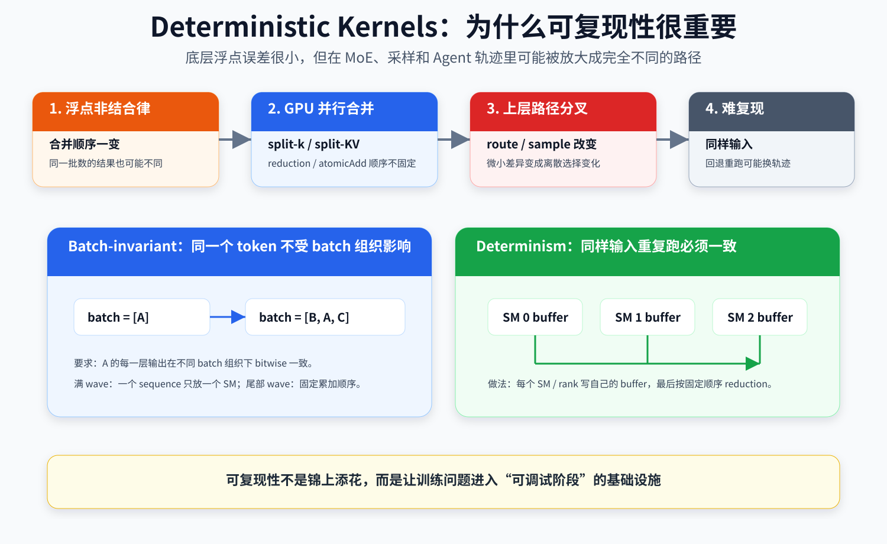
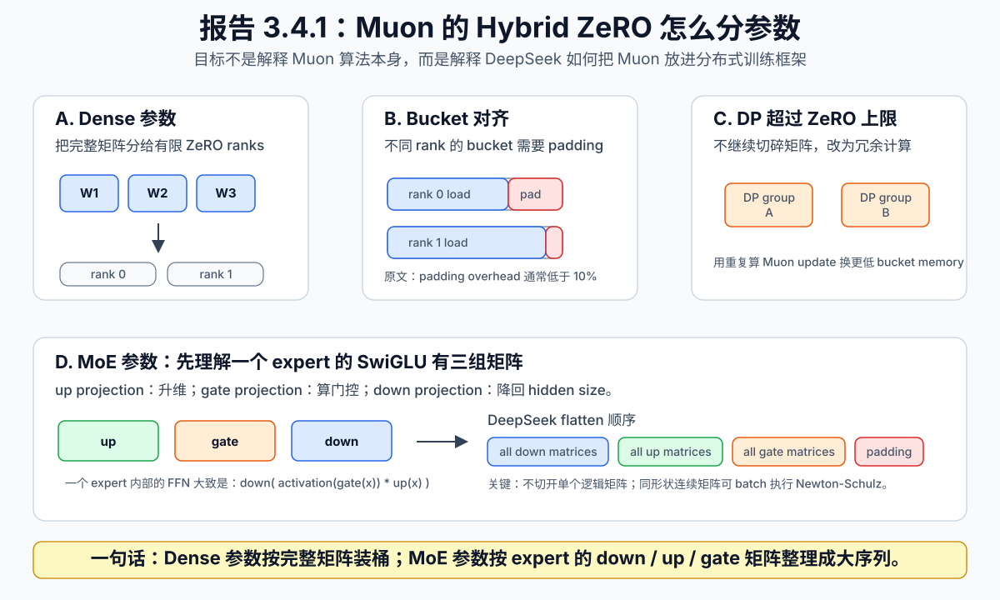

# ⚙️ 第 3 章：General Infrastructure，1M 上下文的系统工程

---

## 🧭 章节导读

算法的创新和进步不能只停留在数学上，如果算法在数学上能证明有效但在 GPU 上训不动或者训不好，带来的大概率是负收益。

从 DeepSeek V3 开始就采用的 MoE 架构沿用到了 V4，但 MoE 在训练上天生就要比 Dense 架构解决更多的工程问题，包括动态稀疏计算和路由分发。

这一章主要介绍的，就是 DeepSeek 如何把这些算法真正落地到 GPU 上，并围绕训练与推理构建起一整套基础设施。

和第二章相比，第三章的重点不再是“模型结构本身是什么”，而是“这些结构怎样才能在真实系统里跑得起来、跑得稳、跑得便宜”。

### 📚 本章阅读结构

| 部分 | 内容 | 说明 |
|---|---|---|
| 3.1 Expert Parallelism | MoE 中的时间组织 | 把 all-to-all 通信成本尽量藏进执行波次 |
| 3.2 TileLang | DeepSeek 自己的 kernel 平台 | 在研发效率和执行性能之间取平衡 |
| 3.3 Deterministic Kernels | 可复现性与稳定性 | 约束浮点误差放大后的行为偏移 |
| 3.4 Training Framework | 训练框架适配 | 把 Muon、mHC、CSA/HCA 等创新接进分布式训练 |
| 3.5 Inference Framework | 推理缓存系统 | 适配长上下文下多形态的 KV cache 管理 |

---

## 🌊 3.1 Expert Parallelism：MoE 中的时间组织

这一节关注的是 MoE 训练里最直接、也最昂贵的工程问题之一：专家路由带来的 GPU 间通信。

## 🖼️ 直观图


## 📌 问题背景

如果仔细看 MoE 模型的参数，除了总参数量标注之外，往往都会带另外一个参数，也就是激活参数量。

- DeepSeek V3.2：全参数 671B，激活参数 37B
- Kimi k2.6：全参数 1T，激活参数 32B
- DeepSeek V4 flash：284B，激活 13B
- DeepSeek V4 pro：1.6T，激活 49B

MoE 的优势很清楚：每个 token 只激活少量 expert，所以 activated FLOPs 更低。

但真正上线到大规模训练或推理系统后，专家路由和分发带来的 GPU 之间通信成本非常大。token 要被分发给不同 expert，expert 结果还要再聚合回来。这个过程中，大量 all-to-all 通信会直接拖住吞吐。

为了解决这个问题，DeepSeek 提出了 Expert Wave，在一波一波的波次中把通信成本隐式地消解在计算中。

## 🔧 工程理解

最核心的工程论：

> 计算时间并非显著大于通信时间;
> 系统总时间应当最优化于计算时间和通信时间的最大值

Expert Wave 的核心就是把专家执行拆成小波次：某一波 token 一到就开始算，而不是等全部通信完成再统一处理。这样系统总时间就更接近 **通信时间和计算时间的最大值**，而不是把几段时间直接相加。

做这个优化的必要性在于：很多场景下，**计算时间并非显著大于通信时间**。真实的 GPU 训练和推理负载有时可能是细碎的，长度也明显不齐，计算时间有时甚至能和通信时间打平。

通信带来的不仅是延时，还是 GPU 的空转和资源浪费。通信不只是网络延迟问题，还会造成计算流等待，并挤压计算资源。

对于 GPU，其实 **batch 越大越好**，因为可以把矩阵乘法做大，利用率更高。最不想看到的其实是一堆小矩阵计算，或者一批里混入某些很慢的长尾请求。

小矩阵计算会带来 GPU 空转和资源浪费，长尾请求会让一批里的其他请求一起等待。然而在实际后训练中，这种小计算和长尾效应非常普遍。

---

## 🛠️ 3.2 TileLang：DeepSeek 自己的 kernel 平台

## 📌 问题背景

DeepSeek V4 的热点路径里，有很多并不是标准算子能自然处理好的东西。

传统 Transformer 中，PyTorch 和 CUDA 已经提供了大量调试优化好的算子可以直接拿来用，但对于 DeepSeek 而言，为了成本妥协和工程化需要，很多路径已经和传统 Transformer 训练不同。

如果完全依赖默认算子，这些路径会被拆成大量细碎 operator；而全部手写 CUDA 底层算子在工程上既无必要也不实惠。

## 🔧 工程理解

在 GPU 编程里，**kernel** 是在 GPU 上跑的一段计算函数，包括矩阵乘法、激活函数、softmax 等等。

对于 PyTorch + CUDA 而言，它的底层有一套算子库，每个算子在底层都使用一个又一个 operator 来完成计算。每个 operator 调用都有开销，而且中间结果可能要反复读写显存，读写显存本身也有很高成本。

TileLang 在这里承担的是中间层角色：一方面保留研究侧迭代速度，另一方面又能通过 fused kernels、host codegen 和形式化整数分析，把复杂结构逐步压到足够高的执行效率。

### Fused Kernels

把多个小算子尽可能合并整合到一起，变成一个大算子，并且在 DeepSeek 架构里可以复用。这样可以做到读一次显存完成多步运算，再一口气写回显存，技术思路上和模块化编程是一致的。

### Host Codegen

kernel 的计算本身发生在 GPU 上，但发起 kernel 这个动作实际上由 CPU 来做。也就是说，每次发起一次 kernel，CPU 自己都要做一些前置工作。

当 GPU 的性能越来越强之后，CPU 的这些前置工作开销反而占比越来越大，有的时候甚至 CPU 喊 GPU 干活这个过程比 GPU 把活干完还要慢。

Host Codegen 负责在 kernel 编译的时候就提前生成这些前置代码，后续不再在运行时做前置工作，而是直接走预编译好的路径。

如果和 Java 代码做一个对比，原来每次请求都要动态反射检查参数、解析 schema、构造调用对象；现在则根据接口定义提前生成 stub，运行时直接走生成好的强类型调用路径。

这样优化后，DeepSeek 发现这部分耗时可以从几十到几百微秒直接降低到不到一微秒。虽然单次看似不大，但对于大规模训练和常见细碎 kernel 运算来说，累计起来仍然非常可观。

### SMT Solver Assisted Formal Integer Analysis

这部分涉及比较抽象的数学解释。从尽可能通俗的角度来说，**kernel 的编译器需要证明：这个运算是安全的**。如果运算的安全性能够被数学证明，那么编译器就可以更大胆地做优化。

一个 Java 代码的类比：

```java
int length = 100
int[] a = new int[length]
int[] b = new int[length]
for (int i = 0; i < 10; i++) {
    if (i*4 + 3 < length && i < length) {
        a[i * 4 + 3] = b[i];
    }
}
```

这段代码做了边界防护，但我们一眼就能看出来这个边界防护并无必要，因为根本不会越界。编译器看到这段代码之后，就可以先委托整数分析器分析这个边界防护是不是真的有必要；如果没有必要，编译器就会直接无视这段 `if`，执行里面的逻辑。

这个的重要性在于： kernel 运算里包含大量索引计算，会带来越界、转换等价性、地址冲突等问题，必须要一个求解器来做整数分析，判断优化是不是安全的。如果不安全，就只能保守处理；反之就可以做更激进的优化。

---

## 🎯 3.3 Deterministic Kernels：确保可复现性并约束对模型行为的影响

这一节讨论的问题并不新，但在 MoE、长上下文和 Agent 轨迹场景下会被显著放大：浮点误差如何从底层数值差异演变成上层行为差异。

## 📌 问题背景

> 计算机系统的浮点数运算中，实数的加法结合律并不成立。

```python
a = 1e20 + (-1e20) + 1
b = 1e20 + 1 + (-1e20)

print(a)
print(b)
```

运行上面这段 Python 代码，`a` 的值是 `1`，而 `b` 的值是 `0`。这就是 **计算机浮点数加法不满足结合律**。也就是说，在浮点数运算里，即使是同一批数，顺序位置不同，最后的结果也可能完全不同。

这其实也是很多人疑惑“temperature 已经设为 0 了，大模型为什么还是每次可能给出不同结果”的根因之一。

为什么这件事会这么麻烦又要命？

为了追求 GPU 性能，系统常常会做这些事：

- `split-k`
- `split-KV`
- `parallel reduction`
- `atomicAdd`

这些技术本身都是合理的，但一旦 partial results 的合并顺序依赖 batch 组织、SM 调度或线程先后顺序，浮点非结合律就会把这些底层差异一点点放大。

在 Dense 模型里，很多时候它只是小扰动；但在 MoE 模型里，这个问题就会变得更严重。

从最简单的一个方面说，MoE 模型需要根据用户的输入 query 路由到正确的专家并激活参数进行推理，但实际上有的时候不同专家之间的路由选择评分差距并不是很大。这样一来，即使只是浮点数运算带来的误差，也可能带来专家路由的变化。除此之外，采样生成、RL rollout、Agent 轨迹里，微小差异也可能很快变成离散路径变化。

一个 token 采样错了，后面整条轨迹就可能换世界；一个 route 变了，专家路径就变了。于是训练和推理中经常会出现：发现了问题，回退重置之后却复现不出来错误路径，调试和优化都变得非常困难。

## 🔧 工程理解



DeepSeek V4 的应对思路可以拆成两个层次来看。

### 1. Batch-invariant

某个 token 的输出应该和它在 batch 里的位置无关。

```plaintext
请求 A: prompt = "1+1="
请求 B: prompt = "巴黎是法国的..."
请求 C：prompt = "pip install -r requirements.txt"

batch = [A]
batch = [B, A]
batch = [A, B]
batch = [A, B, C]

batch-invariant 要求：
A 的每一层输出在以上各种 batch 组织下 bitwise 完全一样（每个 bit 都一样）
```

普通的 kernel 运算很难保证这一点。原因在于，假如一个长序列 attention，GPU 往往会进行 `split kv` 或 `split reduction`。

```plaintext
一个长序列的 KV
↓
SM 0 算前一段 KV 的 attention
SM 1 算后一段 KV 的 attention
↓
再把 partial result 合并
SM 0 和 SM 1 哪个先算完是无法预知的，合并过程中顺序一不一样就会出现不一致
```

DeepSeek 在工程上的策略是设计两个计算 kernel：

- **First kernel**：多段 prompt 经过 Transformer 处理后会形成多个 attention sequence。假设一块 GPU 上有 120 个 SM，而这一轮 wave 进来也正好有 120 个 sequence，处于满 wave 状态，那么一个 sequence 只在 GPU 的一个 SM 上做计算，不再做 `split kv`。
- **Second kernel**：如果一个 wave 里打不满所有 SM，假设只来了 30 个 sequences，那么允许一个 sequence 分配到多个 SM 上来降低尾部延迟，但会强制指定不同 SM 的累加顺序，不允许自由组合。

### 2. Determinism

Batch-Invariant 关注的是：**同一个 token 放在不同 batch 位置，输出是否一样**。

Determinism 关注的则是：**同样输入、同样配置，重复跑多次是否一样**。

普通做法里常见的问题包括：

- 多个 SM 同时 `atomicAdd` 到同一个梯度 KV buffer，无法保证先后顺序。
- MoE 多个专家的权重梯度和 token 输入梯度在写回 combine 阶段时，多个 expert 的写回顺序并不固定。

DeepSeek 的改进方式包括：

- 在注意力的反向传播阶段，不同的 SM 只写自己的那块 buffer，不同 SM 之间的 buffer 区域隔离，最后按照固定顺序把 buffer 中的内容累加。
- 在 MoE 的反向传播阶段，GPU 分为了不同的 rank。每个 rank 不再是谁先算完谁先写回，而是写回时先把顺序固定，而且每个 rank 都有自己固定的 buffer。rank A 先算完，也只能写回 buffer A，不能写进留给 rank B 的 buffer B。
- 对于第二章 `Architecture` 中提到的 mHC，由于 mHC 运算的矩阵维度太小，只有 24 维，不得不做 `split k`。但每个 split 计算完之后不直接合并，而是单独输出，再由独立的 kernel 做 determinism reduction。

Deterministic 对 debug 硬件或软件问题意义极大。当训练出现 `loss spike` 之类异常时，determinism 可以让研究人员更容易定位数值原因并改进模型设计。

但这么做也带来了额外的显存和计算开销。这一点报告中没有显式提到，但从工程逻辑上是可以推理出来的。

---

## 🏗️ 3.4 Training Framework：将算法创新纳入训练框架

> 前置知识：第 2 章 `Architecture` 的所有内容

这一节是第三章的一个汇总节点。前面几节讲的是单点基础设施，这一节开始回答一个更大的问题：当 Muon、mHC、CSA/HCA 这些创新同时出现时，训练框架如何承接它们。

## 📌 问题背景

DeepSeek V4 前面已经引入了很多非标准结构：Muon、mHC、CSA/HCA、复杂 kernel。

算法上的创新、kernel 的重写，最终都还要在 GPU 上能高效训练，并接入现有的分布式训练框架。

范式更改带来的问题如下：

| 范式更改 | 原形态 | 更改后的问题 |
| --- | --- | --- |
| AdamW -> Muon | AdamW 逐参数更新，可以直接切块并分布式并行（具体方法名为 ZeRO，具体做法可自行查阅，此处不展开） | Muon 开始引入权重矩阵更新方向的全矩阵正交化，必须保持原矩阵的整体行列结构。AdamW 的切块方式会丢失矩阵的方向感知 |
| HC -> mHC | 传统 residual 的工程成本最低；普通 HC 已经引入额外连接状态和映射 | 使用双随机矩阵，引入了额外的归一化 / 投影等小算子的计算和显存开销，这些小算子会显著增加 GPU 的对齐和优化成本 |
| 200K context -> 用 CSA/HCA 支持 1M context | 上下文本身较短，没有相关优化正常训练也 ok | 为了适配 1M context 的训练和推理，设计出了 CSA/HCA，这些新范式需要在 GPU 并行训练上做适配优化 |

## 🔧 工程理解

### Muon

Muon 的难点在于：它需要完整梯度矩阵来计算参数更新，而传统 ZeRO 更适合 AdamW 这类逐元素优化器。

DeepSeek 为 Muon 设计了 hybrid ZeRO bucket assignment。核心处理包括：



可以先把问题想成一个仓库调度问题：每个权重矩阵都是一个不能随便拆开的货箱，ZeRO rank 是仓库货架。传统 AdamW 更像是散装零件，切成很多小块分别处理也容易成立；但 Muon 的 Newton-Schulz 正交化要保持矩阵的整体结构，所以 DeepSeek 不能只按元素平均切分，而是要重新设计“哪些矩阵放在哪个 rank 上”。

对 dense 参数，DeepSeek 的思路是：限制参与 Muon 状态切分的 ZeRO 并行规模，然后用 knapsack algorithm 把完整参数矩阵分配给这些 rank，让每个 rank 管的矩阵总量尽量接近。分完以后，不同 rank 的 bucket 大小仍可能不完全一致，于是会 padding 到最大 bucket 尺寸，方便后续 reduce-scatter。这个 padding 会带来少量额外显存，但报告说在他们的设置里通常低于 10%。

当整体 data parallelism 大于这个 ZeRO 上限时，DeepSeek 没有继续把矩阵切得更碎，而是在额外 data-parallel groups 中冗余计算 Muon update。也就是说，这里主动用更多计算换更少的 bucket memory，避免为了省计算把 Muon 需要的矩阵结构打碎。

对 MoE 参数，DeepSeek 的处理又不一样。这里需要先理解一个 expert 里的 SwiGLU FFN 大致有三组矩阵：

- **up projection**：把 hidden state 投到更宽的中间维度，提供候选特征。
- **gate projection**：也投到中间维度，但它负责产生门控信号，决定哪些候选特征被放大或抑制。
- **down projection**：把经过门控和激活后的中间表示投回 hidden size。

可以非常粗略地写成：

```plaintext
candidate = up(x)
gate = activation(gate(x))
output = down(candidate * gate)
```

因为 expert 数量极多，DeepSeek 以 expert 为单位独立优化，并把所有层所有专家的 SwiGLU projection matrix 按逻辑顺序 flatten：先把所有 down projection matrix 排在一起，再排所有 up projection matrix，最后排所有 gate projection matrix。关键点是：分发时不切开逻辑上独立的矩阵。这样既能把大量 expert 参数摊到 rank 上，又不破坏单个矩阵做 Muon 更新时需要的结构。

最后，DeepSeek 还做了两类工程优化：第一，形状相同的连续参数会自动合并，从而 batched 执行 Newton-Schulz 迭代，提高硬件利用率；第二，MoE 梯度在 data-parallel ranks 间同步时会随机舍入到 BF16，减少一半通信量，然后用 all-to-all 交换到本地后做 FP32 sum，避免低精度加法累积出更大的数值误差。

在报告原文的参考文献里，引用了一篇 2025.02 kimi 团队的论文：Muon is Scalable for LLM Training （https://arxiv.org/abs/2502.16982） 。论文里的技术路径与 DeepSeek 的不同，放在这里做一个参考对比
1. 仍然把惯性更新矩阵切片放在不同 rank 里。
2. 但每个 rank 做 Newton-Schulz 正交化时，要通过 rank 间通信把所有 rank 之间的参数 gather 起来再算，也就是说算的时候仍然是全矩阵计算。
3. 算完之后，每个 rank 只保留自己 rank 的 update，其余的全部丢掉。

### mHC

#### Fused kernel

利用前面提到的聚合 kernel 计算方式，把多个小型运算打包在一起，降低显存读写开销，增大单次计算负载。

#### Recomputation

传统的前向计算中会保留大量中间层，并在反向传播时直接利用这些已经算好的中间层来计算梯度，比如 `hidden state`、`layer input`、`normalized layer input`、各类 tensor 等等。这样的好处是节省计算成本，但代价是消耗更多显存，尤其这些中间层往往非常庞大。

DS 的优化方案是：不要保存所有中间层，而是把大量计算成本不太高的中间层丢弃，只保留那些一旦丢弃就要重新做高成本计算的中间层，同时保留 checkpoint 以便恢复中间状态。

在反向传播时，如果需要这些中间层，就局部重放一段前向计算。总的来说，传统方案是用显存换计算，DS 的方案则是用计算换显存，属于典型的 memory-compute tradeoff。

### CSA / HCA

CSA / HCA 处理过的 attention，经过了滑动窗口、中等比例压缩后 top-k 筛选分块、全局高比例压缩等步骤。这一系列步骤会让 attention 的规模不规整，计算也不规整。

规模上的不规整会带来：

- 切分后不同块大小不一样。
- 压缩后的 KV cache 块本身可能跨越不同 rank。

这部分并行计算需要特殊设计，被称为 `Two-stage`，也就是把并行计算分成两个阶段：

1. 把因为规模不规整带来的跨 rank 的未压缩 KV cache 传递到下一个 rank，然后做本地的 HCA/CSA 压缩，生成和管理压缩后的 KV cache。
2. 在多个 rank 之间通信，gather 已经压缩好的 KV cache 并作重组和对齐，之后再在对齐好的结果上继续做 HCA 的后续 dense attention 运算，或者 CSA 的 `qk scoring + top-k select + 选中块的后续运算`。

### 1M context 带来的大量 activation memory

这一部分的问题和 mHC 面临的问题非常类似，本质上都是前向计算中间产物过于庞大带来的。

mHC 中提到，中间点 checkpoint 本身需要保留；但在 1M context 下，这个 checkpoint 本身占用也非常庞大，带来了大量 activation memory。

解决思路也很像，被称为 `Tensor-Level Checkpoint`。本质上就是把 checkpoint 切得更细，细到 Tensor 维度，在 Tensor 维度决定哪些丢弃、等到反向传播时重放，哪些需要保留。技术本质仍然是以计算换显存。

## 📌 本节总结

这一节相较于前几节值得单独拉出一个总结，因为它真正开始解决第二章提到的技术，在 GPU 中要如何并行训练，并且如何在显存和计算上做取舍，同时也利用到了第三章前几节铺垫的 GPU 维度基础设施。

| 问题 | 解决方案 |
| --- | --- |
| Muon 需要矩阵级全局更新，但 ZeRO 要切分状态 | 自定义的 Hybrid ZeRO |
| mHC 表达力增强但实现碎片化 | recomputation + fused kernels |
| CSA / HCA 不规整处理和并行计算 | Two-stage |
| activation memory 爆炸 | tensor-level checkpointing |

---

## 📦 3.5 Inference Framework：适配长上下文的推理缓存

如果说 3.4 解决的是“怎么把创新结构训起来”，那么 3.5 解决的就是“怎么把这些结构稳定地服务出去”。重点落在 KV cache 的组织与命中率上。

## 📌 问题背景

DS 从算法到工程做了各种优化，虽然带来了推理过程中的成本节省，但对于现代大模型而言，成本会被划分为 input、output、命中缓存、未命中缓存等不同情况。KV Cache 早已成为成本优化的重中之重。

从 2025 年 Manus 的博客中就已经极度强调 KV Cache 的命中率，因为命中缓存和未命中缓存的成本差距至少是整数倍。

但对于 DeepSeek V4 而言，混合注意力同时引入了：

- CSA 中度压缩 KV
- HCA 重度压缩 KV
- Sliding Windows 的滑动局部窗口 KV
- 尚未凑满压缩块的尾部状态
- 稀疏选择器依赖的额外 indexer 状态

这些压缩后的 KV Cache 已经不再像普通 Transformer 那样规整。这一点在上一节已经做了说明。这使得原来基于传统 Transformer 的 PageAttention 构建的缓存系统，不能再把所有层的 KV cache 简单统一到同一种分页块管理模型里。

## 🔧 解决方案

DS 的方案在数学上听起来非常直接：

1. CSA 假设压缩系数是 `m`，HCA 假设压缩系数是 `n`，那么就计算 `m` 和 `n` 的最小公倍数，或者最小公倍数的任意倍数，把这个数量的原始 token 打包成一个 block。这样一个 block 就会自然生成整数个 CSA KV Cache 和 HCA KV Cache，让两种压缩粒度在同一个原始 token block 边界上对齐。
2. 把滑动窗口 KV 和尾部状态统一打包成 `state cache`。对于这些 state cache，每次请求都分配一块固定大小的缓存 block。
3. 除此之外的其他部分，仍然继续沿用传统的 KV cache 块。

除了以上三点，DS 还引入了 `on-disk KV Cache storage` 的概念。粗略地类比到Agent系统中，就是把系统提示词、MCP tool 连接信息、git 代码仓库等这类具有固定前缀的 KV Cache 直接落到磁盘；prefill 的时候直接激活磁盘中的这些 KV Cache，避免 agent 过程中这类高度重复前缀的重复计算。
