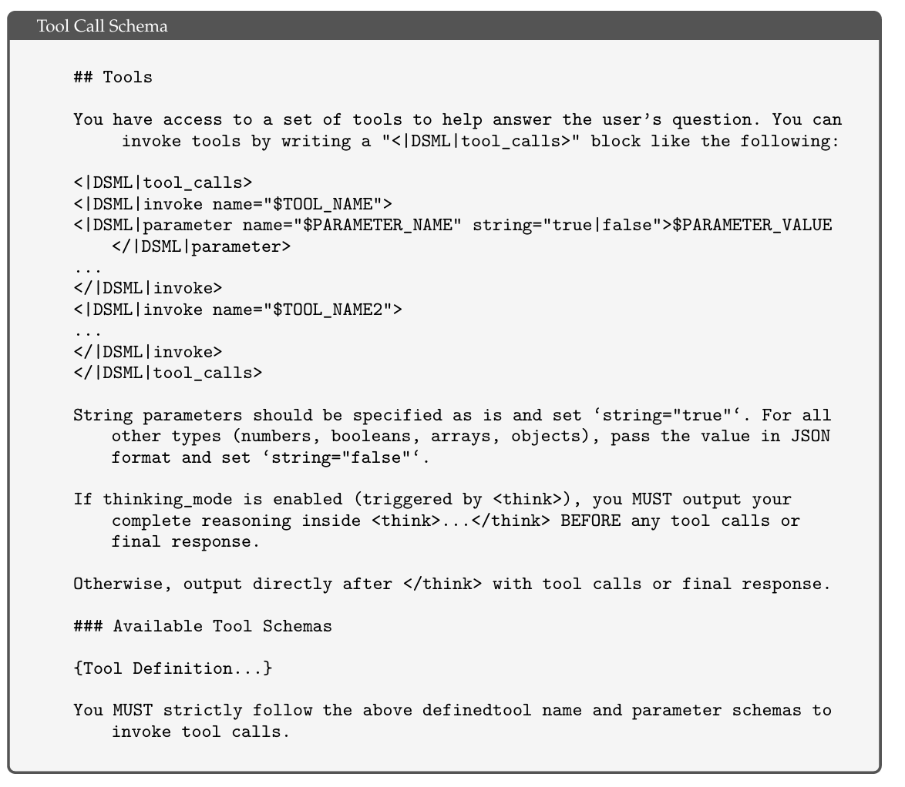
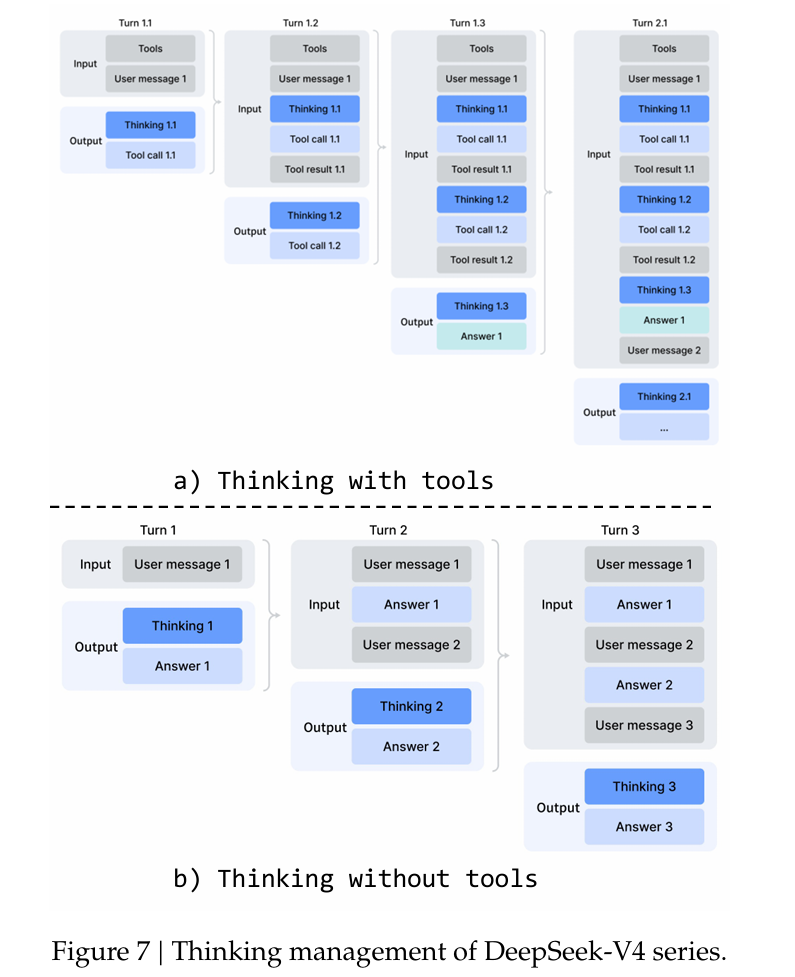
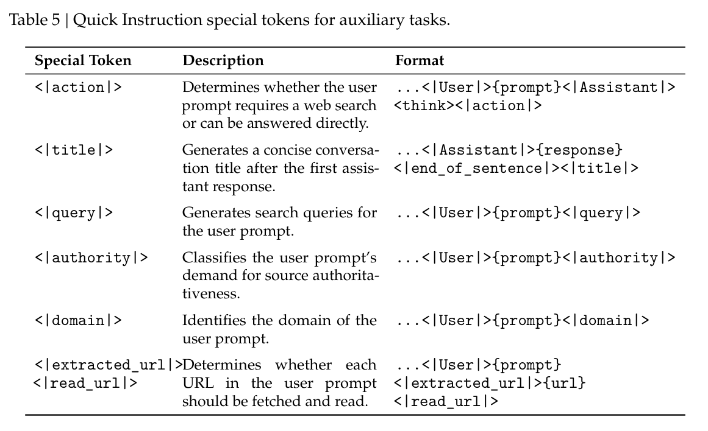
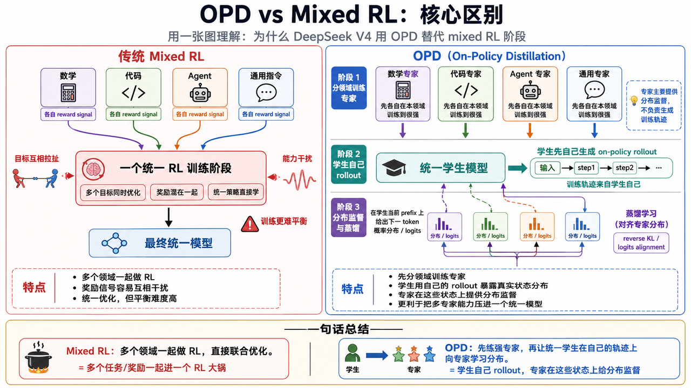
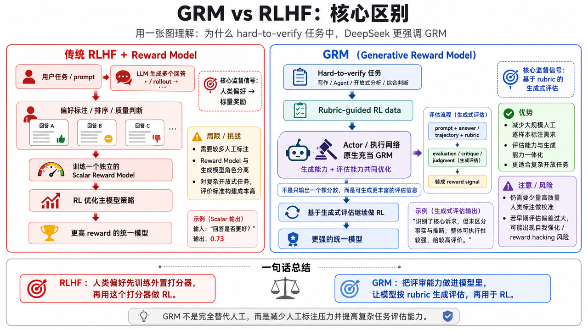
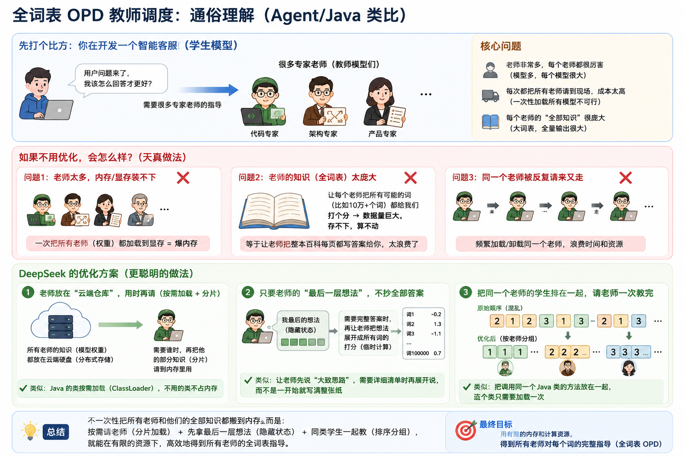

# 🧪 第 5 章：Post-Training 后训练，Agent 行为对齐和 RL 范式转变

---

## 🧭 章节导读

本章前两节聚焦于 V4 的后训练工程。5.1 和 5.2 的逻辑关系类似于第二章和第三章之间的关系，都是先讲技术路径，再讲工程实操。后两节 5.3 和 5.4 的内容主要在做 benchmark 评测，本身不是我们关注的重点。

5.1.1 这部分不仅在训练工程上做了很多阐述，还提到了很多和 agent 使用 / agent 开发有关的内容，可以说是所有 Agent 开发者都值得一读的部分。因此在这一节导读中，尽可能忠于报告原文，不做过度概念简化。

> 本节中所有 `一些思考` 的小节，都是我个人的理解和推测，可能不完全准确，欢迎大家批评指正。


### 📚 本章阅读结构

| 部分 | 内容 | 说明 |
|---|---|---|
| 5.1 Post-Training Pipeline | 后训练总管线 | 技术路径 |
| 5.1.1 Specialist Training | 专家模型训练 | 很多处理与 Agent 工程强相关 |
| 5.1.2 On-Policy Distillation | 基模与专家的对齐和跟随 | 能力整合 |
| 5.2 RL and OPD Infrastructure | RL 和 OPD 的训练框架 | 工程实操 |
| 5.3 / 5.4 Evaluation | 模型评测 | 不是本文重点 |
| Final Discussion | 限制和未来展望 | 报告整体判断 |

---

# 🧬 5.1 Post-Training Pipeline：后训练范式的变化

报告这一节中的逻辑组织有些分散，可以大致划分为两个部分：

1. **面向 Agent 推理、工具使用和代码任务的行为对齐**
2. **后训练过程中 RL 范式转变**

前者更偏模型行为和 Agent 工程，后者更偏后训练策略本身。

---

## 🤖 5.1.1 面向 Agent 推理、工具使用和代码任务的行为对齐

这一部分相对庞杂，报告中提到了多个点，而这些均可以为 Agent 工程提供启发。

---

## 🧠 Reasoning Effort：推理强度

### 📌 报告做法


DS 把 Flash 和 Pro 两个版本均设置了三档推理强度：

| 推理档位 | 说明 |
|---|---|
| Non-think | 不显式展开 reasoning |
| Think High | 较高强度 reasoning |
| Think Max | 最大强度 reasoning |

在后训练过程中，DS 对三种不同推理强度给予了不同的推理上下文预算，但都使用 `<think></think>` 来包裹推理文本。

特别地，对于 Think Max 模式，**DS 在开头注入了一段特殊的系统提示词**，这段系统提示词的报告原文如下：

```plaintext
Reasoning Effort: Absolute maximum with no shortcuts permitted.
You MUST be very thorough in your thinking and comprehensively decompose the problem to resolve the root cause, rigorously stress-testing your logic against all potential paths, edge cases, and adversarial scenarios.
Explicitly write out your entire deliberation process, documenting every intermediate step, considered alternative, and rejected hypothesis to ensure absolutely no assumption is left unchecked

推理努力：绝对达到最大值，不允许任何捷径。
你必须非常彻底地思考，全面分解问题以解决根本原因，严格地对你的逻辑进行压力测试，考察所有潜在路径、边界情况和对抗性场景。
明确写出你整个审议过程，记录每一个中间步骤、考虑过的替代方案和被否定的假设，以确保没有任何假设被放过
```

### 💡 一些思考

这一做法其实已经和 Claude / GPT 系列模型相仿，都是提供不同档位的推理强度，用推理预算来换取思维强度并提高复杂任务实现能力。

GPT 系列模型的推理内容通常是内化的，也就是说 Chain of Thought 本身不会暴露给外部作为 message 吐出。Claude 系列模型虽然会展示 thinking 的过程，但也不是把原始 CoT 直接暴露出来，而是通过受控的 extended thinking / thinking blocks 机制呈现或管理。

相反地，国内模型如 kimi / qwen / deepseek 往往会用不同格式显式吐出 reasoning 过程。这对普通聊天未必是问题，但在 Agent loop、tool call、历史裁剪、会话恢复中会带来明显的工程复杂度。

---

## 🛠️ Tool Call Schema and Special Token：工具调用格式

### 📌 报告做法

V4 中，DS 引入了一种新的工具调用模式，该模式使用特殊的 `|DSML|` 标记，并采用基于 XML 的格式进行工具调用。

报告中提到，经过实验，XML 格式能够减轻转义失败问题，并降低工具调用错误，为模型与工具的交互提供更稳健的接口。



### 🔍 工程理解与一些思考

这一点与 Claude Code 官方推荐的 prompt 撰写方式有相似之处。Anthropic 的官方文档中长期推荐使用 XML 格式组织提示词，以获得更好的指令跟随能力。

如果我们注意看非常著名也非常好用的 superpowers 的提示词撰写，里面也使用了 `<hard-gate></hard-gate>` 这样的 XML 模式组装，大大提高了 agent 使用 skill，并依据 skill 做事的指令跟随能力。

同时 DS 用 `|DSML|` 这种特殊的标记来强化 tool call schema 的稳定性，可能隐含的是：我们使用 V4 模型在**某些使用非官方 tools 参数**的场景下，**使用 `|DSML|` 这个标记可能对 tool call 的稳定性和指令跟随有正向作用，因为模型和 tokenizer 在训练时就天然地更“认识”这样一个标记，并且做过大规模的指令对齐。**

这部分内容以个人推测为主，大家可以自行测试。

---

## 🔁 Interleaved Thinking：交错推理模式

### 📌 报告做法

这一部分在我看来是最值得 Agent 开发工程师看的一小节。下面直接给出翻译后的报告原文：

```plaintext
DeepSeek-V3.2 引入了一种上下文管理策略，该策略在工具结果回合之间保留推理痕迹，但在新的用户消息到来时会丢弃它们。虽然有效，但在复杂的智能代理工作流中，这仍然会导致不必要的 token 浪费——每一个新的用户回合都会清空所有累积的推理内容，迫使模型从头重建其问题解决状态。利用 DeepSeek-V4 系列扩展的 1M token 上下文窗口中，我们进一步完善了这一机制，以最大化代理环境中交错思维的有效性：

• 工具调用场景。整个对话过程中所有推理内容都完全保留。不同于 DeepSeek-V3.2 在每个新用户轮次时会丢弃思维痕迹，DeepSeek-V4 系列在所有轮次中保留完整的推理历史，包括跨用户消息边界的内容。这使得模型能够在长期代理任务中保持连贯、累积的思维链。

• 一般对话场景。原策略被保留：当新用户消息到来时，会丢弃前一轮的推理内容，以在持续推理痕迹提供有限收益的情况下保持上下文简洁。

与 DeepSeek-V3.2 一样，通过 user message 来模拟工具交互的 Agent 框架（例如 Terminus）可能不会触发工具调用的上下文路径，因此可能无法从增强的推理持久性中受益。我们仍然建议针对这种架构使用非思考模型。
```



### 🔧 工程理解

这一部分最有价值的点在于：**reasoning content 已经不再仅仅是模型自己的思考，而是已经被整合进 tool call 这个行为本身之中。**

DeepSeek V4 API 文档中明确提到：如果 thinking mode 下发生了 tool call，那么该轮 assistant 产生的 `reasoning_content` 必须完整参与后续上下文拼接，并在之后所有用户交互轮次里回传给 API；否则会 400 报错。

事实上这也不是 DeepSeek 的专利。Kimi 和 Qwen 也有类似的 reasoning state 回传要求。现在很多开箱即用的 Agent 框架，例如 dify / LangChain / DeepAgents / CrewAI，往往都需要通过 provider / proxy 层面的特殊处理，才能兼容这类强依赖 `reasoning_content` 回传的模型。

### 💡 一些思考

即使通过 proxy、LiteLLM provider 或 CustomLLM，可以在请求层补齐 `reasoning_content` 回传，也不等于 Agent 框架原生支持 thinking model。

现有 Agent 框架的 ReAct loop 往往没有把 `reasoning_content` / `thinking_blocks` 当作一等状态建模。于是 proxy 只能在框架外维护旁路状态。一旦发生历史裁剪、流式中断、subagent 派发、会话恢复或工具调用结构变化，仍然可能丢失 reasoning state，或者只能通过丢弃旧上下文恢复。

这本身是对旧 ReAct loop 范式越来越大的挑战：模型的 thinking state 正在从“可丢弃的中间文本”变成“会影响后续工具调用和上下文恢复的运行时状态”。

---

## ⚡ Quick Instruction：快速指令

### 📌 报告做法

下面直接给出翻译后的报告原文：

```plaintext
在聊天机器人场景中，许多辅助任务（例如，确定是否触发网页搜索、意图识别等）必须在生成响应之前执行。

传统上，这些任务由一个独立的小模型处理，需要进行冗余的 prefill，因为它无法重用现有的 KV 缓存。

为了解决这个限制，我们引入了快速指令。我们将一组专用的特殊标记直接附加到输入序列中，每个标记对应一个特定的辅助任务。

通过直接重用已经计算的 KV cache，这种机制完全避免了冗余的 prefill，并允许某些任务（如生成搜索查询以及确定权限和领域）并行执行。因此，这种方法显著减少了用户感知的首次生成 token 时间（TTFT），并消除了维护和迭代额外小模型的工程负担。
```

DS 支持的快速指令标记如图所示：



### 🔧 工程理解

Quick Instruction 的核心不是“多几个特殊 token”，而是：**把一些高频、短输出、强依赖当前上下文的前置判断，放回主模型共享上下文里完成。**

这和很多 Agent 工程里的常见做法相反。很多系统会把意图识别、是否搜索、query rewrite、权限判断、领域分类等前置任务拆给独立小模型或子 Agent。但这种做法有一个明显问题：这些任务往往高度依赖当前上下文，如果拆出去，就需要重新 prefill 一遍上下文。

### 💡 一些思考

这对 Agent 开发的一点启发是：

> 高频 / 短输出 / 强依赖上下文的前置判断，如果本身没有复杂到一定程度，可能不一定适合做成独立子 Agent；更合理的方向可能是让它变成主 Agent 共享上下文下的快速判定过程。

但也要注意，这些 special token 并不意味着在 prompt 中手动加上类似标记就一定能获得原文中的收益。原文中的收益依赖服务端能够复用已经计算好的 KV cache，也依赖模型训练时对这些 token 的行为对齐。普通 prompt 里手动模拟，最多只能验证是否有行为倾向，不能获得完整系统收益。

---

## 🎯 5.1.2 后训练过程中 RL 范式转变

> 前置知识：RL 基础概念，PPO / GRPO 基本思想

传统后训练中使用 RL 时，需要设定一个奖励目标。基模围绕这个奖励目标迭代训练，得到更高的分数。

问题在于，对于一个通用大模型而言，不同领域任务的目标并不一样：

| 任务类型 | 目标差异 |
|---|---|
| 数学任务 | 长推理、严谨、获得唯一的正确解 |
| 代码任务 | UT 通过率、测试 case 通过率、代码可读性、可维护性 |
| Agent 任务 | 多轮规划、工具调用、指令跟随、环境反馈闭环 |
| 普通对话 | 简洁、稳定、低延迟 |
| 写作 / 设计任务 | 适应作者、读者自己想要的难以标准化的个人喜好和个人风格 |

我们已经可以看到，并不是所有任务都有明确正确答案。数学计算有对错，代码任务可以通过测试用例验证，但写作、页面设计、审美判断这类任务没有固定答案，千人千面见仁见智，很难设计一个通用奖励目标。

> 这里可以提一个例子：前阿里Qwen负责人林俊旸在一篇文章中表示，Qwen曾经很有野心的想把instant模式和thinking模式结合成一种模式一个模型。
> 通过模型自己的能力，看用户的问题是简单还是复杂，简单的就instant模式回答，复杂的就thinking。
> 但林俊旸表示他们失败了，原因就是这两种模式的奖励目标相差太大，很难设计奖励模式。这就是一个非常有说服力的现实例子。

所以这里有两个核心问题：

1. 通用大模型需要调和极大规模的异质目标，调和不好就容易出现能力冲突和互相污染。
2. 通用大模型面对的很多任务没有标准答案，难以构造简单 reward。

对于第一个问题，DS 的方案是 **On-Policy Distillation（OPD）**；对于第二个问题，DS 的方案是 **Generative Reward Model（GRM）**。

---

## 🧑‍🏫 OPD：On-Policy Distillation

### 📌 报告做法

相比把多个领域、多种奖励信号混在同一个 RL 阶段里联合优化，DS 采用 OPD。

核心思路是：不同领域的专家模型先各自在自己的领域上训练到极强，然后使用蒸馏方式，让专家模型作为老师，基模作为学生模型。

对于一个特定输入，基模自己先生成 rollout。随后，系统拿基模自己的 rollout 作为上下文状态，再在这些上下文状态上读取专家模型的 next-token distribution / logits distribution。

也就是说，专家不一定要生成完整 rollout，也可以对学生 rollout 的每一步给出概率分布标签。在 OPD 中，专家不一定负责重新走一遍完整路径，而是负责在基模已经走出的路径上给监督信号。



### 🔧 工程理解

OPD 的关键不是普通意义上的“把大模型蒸馏成小模型”，而是：**把多个专家策略的能力，重新压回一个统一的通用模型里。**

它避免了一个很现实的问题：如果所有任务都混在一个 RL 阶段里直接优化，数学、代码、agent、普通对话这些目标之间很可能互相干扰。

OPD 更像是先让不同 expert 在各自赛道里变强，再让统一模型学习这些专家在不同上下文状态下的 token 分布。

---

## 🧪 GRM：Generative Reward Model

### 📌 报告做法

GRM 专门应用于 hard-to-verify 任务。原先这些难以直接评价的任务，常使用 RLHF 策略，依赖大量人工标注数据。

DS 在后训练阶段摒弃了这一做法，设计了基于评分标准的 RL 数据，并使用 GRM 来评估策略轨迹。报告中提到，这样只需要少量人类标注数据就可以获得相当好的性能。

关键点在于：强化学习优化直接应用于 GRM 本身。在这种范式下，执行网络原生地充当 GRM，使模型的评估能力可以与标准生成能力共同优化。



### 🧑‍💻 日常开发场景类比

> 我们用一个平时非常常见的 code review 场景来类比一下 GRM 和 RLHF 的区别：

传统 RLHF + reward model 更像一个单纯打个分：

```plaintext
LLM 为了实现同一个功能，在 10 个 session 里写了 10 段不同的代码
->
code reviewer 根据自己的偏好，对这 10 段做了偏好标注、排序，选了一个自己觉得最好的，给它打了个最高分，其他的都打了个分数
->
这些偏好和排序分数，用于训练一个独立的 scalar reward model
->
后续 RL 阶段中，reward model 给 policy trajectory 输出一个分数奖励
->
主模型再通过 RL 学习如何提高这个奖励分数
```

GRM 则是一个自己会给自己写评语的评审：

```plaintext
输入：
  task description + code + rubric

输出：
  evaluation / critique / judgment
  可能再转成 reward signal

可能生成：
  这段代码完成了用户的基本诉求；
  但第 x 行没有做 NPE 保护；
  整个设计没有做多线程并发保护；
  整体可执行性不足，对复杂生产场景适配不足，还存在 NPE 风险，不能及格，给 0.55。
```

### 💡 一些思考

GRM 的思路天生带有自增强效果。如果早期自评审过程没有做好，可能带来的不是进化，而是自坍缩。

因此，GRM 可以减少人工标注工作量，但不能完全替代人类反馈。尤其是在 hard-to-verify 任务里，模型自评如果对用户真实意图理解错了，后续优化就可能沿着错误方向加强。

---

# 🏗️ 5.2 RL and OPD Infrastructure：后训练框架

> 从 5.1 到 5.2 的逻辑顺序，和第二章到第三章类似：先谈方法论，再谈工程落地。

---

## 🔢 5.2.1 FP4 Quantization Integration：FP4 量化集成

### 📌 报告做法

第三章已经详细提及了 FP4 量化在整个框架中的作用，以及多种类型的精度在不同层之间的流转。

在后训练这里，报告原文明确说：后训练阶段所有 rollout 轨迹的生成，也就是仅推理阶段，全部采用 FP4 量化。这里的 rollout 不仅包括专家教师模型，也包括基模。

这说明 DS 在后训练阶段进一步强化了 FP4 低精度使用。后训练阶段本身就是让模型更加适应真实环境和现实任务的过程，因此 rollout 阶段使用 FP4，也是在让模型更早适应未来部署形态。

对于反向传播，也如第三章所说，使用无损的 FP4 到 FP8 反量化来模拟，无缝使用成熟的 FP8 混合精度框架。

### 🔧 工程理解

这部分可以理解成：**后训练 runtime 尽量向真实部署 runtime 对齐。**

如果模型最终大量部署在 FP4 或低精度环境中，那么后训练 rollout 如果仍然完全活在高精度环境里，模型可能会学到一些低精度部署时不稳定的行为。

---

## 🚚 5.2.2 Efficient Teacher Scheduling for Full-Vocabulary OPD：全词表 OPD 教师调度

### 📌 报告做法

这部分可以用一张比较通俗的图来介绍：



报告强调，真实训练中教师极其之多，几乎可以认为是无限的。而每个教师模型可能都有万亿级别参数，每次都全量加载这些权重参数并不现实。

DS 的做法是：把教师模型的参数卸载到分布式存储中，在推理时按需加载，并使用第三章提及过的 ZeRO 进行切片加载，降低 IO 和 DRAM 压力。

同时，即使分片加载，对于词表较大的教师模型来说，逐个固化 logits 也不现实。为解决这一问题，工程上的方案是：只缓存最后一层教师模型的 hidden state。当需要 logits 时，再从这些 hidden state 临时做一遍前向计算得到 logits。

这部分思路与第三章 mHC 优化中的 recomputation 很相似：不把所有中间结果都存下来，而是在需要时重算其中一部分。报告中也提到，这种临时前向计算的代价几乎可以忽略不计，但省下了大量显存。

DS 还对教师模型 prediction head 在 GPU 上的占用进行了优化，使用索引对训练样本排序，使得一个 batch 中每个教师模型的 prediction head 只加载一次，而不会重复加载。

大体示意如下：

```python
# 一个 batch 里有 100 个样本
batch = [x1, x2, x3, ..., x100]

# 每个样本需要参考的 teacher id 初始时是乱的
teacher = [t1, t2]
batch_teacher_index = [1, 1, 2, ..., 1]

# 把 batch 按 teacher_index 排序
sorted_batch = [x1, x2, x100, ..., x3]

# 排序后可以按 teacher 分组顺序处理：
# 先加载 teacher1 的 prediction head，处理所有需要 teacher1 的样本，然后卸载；
# 再加载 teacher2 的 prediction head。
# 这样一个 mini-batch 内每个 teacher head 只加载一次，
# 而且同一时刻显存中最多只保留一个 teacher head。
```

### 🔧 工程理解

这部分本质是在解决一个非常工程化的问题：**OPD 需要很多老师，但 GPU 不可能同时把所有老师都完整装进来。**

所以 DS 做了三层取舍：

1. teacher weights 放到分布式存储，按需加载；
2. teacher hidden states 缓存，logits 按需重算；
3. batch 按 teacher id 排序，减少 prediction head 重复加载。

---

## 🧯 5.2.3 Fault-Tolerant Rollout Service：可抢占和容错的 rollout 服务

### 📌 报告做法

这一节主要解决分布式 GPU 系统里的资源抢占和故障重放问题。

报告中提到两个现实问题：

1. DS 的 GPU 集群设计了全集群维度的抢占式任务调度器，而在训练中可能因为调度器派发资源的资源租约到期，或者有更高优先级任务需要资源，而被强制回收资源导致中断。原文没有具体解释中断发生的机制，这里只能做工程侧推测。因此，对 rollout service 来说，资源被抢占不是边缘异常，而是必须支持的基础场景。
2. 大规模 GPU 集群中，硬件故障极为常见。一个 task 可能上一步还在某个 GPU 上训练，下一步这个 GPU 就因为硬件故障变成不可用。

对于这两个问题，DS 的技术方案和数据库 binlog 恢复思路一致，被称为 Write-Ahead Log：先记日志，再改数据。

```plaintext
每个 generation request
->
每生成一个新 token
->
立刻 append 到这个 request 的 WAL
```

如果资源被抢占了，KV cache 仍然还在，可以配合 WAL 恢复：

```plaintext
暂停推理
->
保存未完成请求的 KV cache
->
恢复时用 WAL + KV cache 继续 decode
```

如果机器挂了，KV cache 也丢了，但 WAL 仍记录着已经生成的 token。此时可以利用已经生成的 token 重新 prefill，重建 KV cache，然后继续任务：

```plaintext
取得 WAL 里已经生成的 tokens
->
重新跑 prefill
->
重建 KV cache
->
继续生成
```

### 🔧 工程理解

如果从仅工程视角上，我们只是觉得这个办法好，但更妙的地方在于，DS 不仅意识到了这是个工程问题，还意识到了这个工程方案本身会引入新的模型行为偏差。

报告原文的大意是：

```plaintext
从零重新生成未完成请求在数学上是不正确的，因为这样会引入长度偏差。
由于较短的响应更有可能在中断中存活，从零重新生成会使模型在每次发生中断时更容易生成较短的序列。
```

解释一下就是：

- 一个序列越长，越容易在中途遇到抢占或硬件故障；
- 短回答更不容易被中断；
- 如果每次中断都从头采样，长回答更容易被丢弃或重来；
- 训练系统会在概率上更容易保留短回答；
- 长期看，模型会被这种工程偏差推向更短的输出。

### 💡 一些思考

这部分非常有提示意义：解决工程问题时，不仅要考虑系统是否能跑，还要考虑工程方案本身是否会引入新的模型行为偏差。

对 Agent 系统也是一样。如果失败重试策略总是丢弃长轨迹、保留短轨迹，或者总是让某些工具失败后被静默跳过，那么最终优化出来的 Agent 行为会偏向短路径、少工具调用和规避复杂任务。

---

## 📦 5.2.4 Million-Token RL Framework：1M token 上下文 RL 框架

### 📌 报告做法

这一节讨论的是 1M context 下，RL / OPD 数据如何搬运和加载，才能更便宜地做训练。

1M context 的后训练不只有 GPU 计算问题，还有数据系统问题。比如一个连续跑了几个小时甚至超过一天的大长尾 coding task rollout，可能包含非常长的上下文和逐 token 数据；类似 rollout 可能有成千上万条。

DS 的做法是把 rollout data format 拆成两类：

| 数据类型 | 作用 | 处理方式 |
|---|---|---|
| Lightweight metadata | 用于全局 shuffle 和 packing 布局 | 更轻，可以频繁搬运 |
| Heavy per-token fields | 逐 token 的重型数据 | 通过 shared-memory data loader 加载，用完即释放 |

Heavy per-token fields 通过 shared-memory data loader 加载，可以避免节点内数据重复，并且在 mini-batch 消费完毕后立即释放，从而降低 CPU / GPU 内存压力。

### 🔧 工程理解

这本质是把“调度需要的信息”和“训练真正需要的重数据”拆开。

metadata 用来做全局组织和索引，heavy fields 则只在真正训练时按需进入内存。

### 💡 一些思考

这个设计可以部分类比到 Agent 的 Skills：

- CPU / GPU 内存类似 Agent 的上下文窗口，非常珍贵；
- metadata 类似 skill 的 name 和 description，可以在初始化时装载；
- `SKILL.md`、`references/`、`samples/`、`scripts/` 这类重内容则应该放在硬盘上，由 Agent 按需读取；
- 只有当前任务真正需要的重内容，才应该进入上下文窗口。

当然，这个类比也有不恰当的地方：训练框架可以明确释放 heavy fields，但很多 Agent 框架没有成熟的“卸载已经读入上下文的 Skill 内容”的机制。

---

## 🧱 5.2.5 Sandbox Infrastructure：面向 Agentic AI 的沙箱基础设施

### 📌 报告做法

有过生产级 Agent 搭建经验的人，都能意识到沙箱基础设施的意义，这里不再多做阐述。

报告提到，DS 搭建了一个生产级沙箱平台：**DeepSeek Elastic Compute（DSec）**。

DSec 由三个 Rust 组件组成：

| 组件 | 作用 |
|---|---|
| Apiserver | API 网关 |
| Edge | per-host 级别 agent |
| Watcher | 集群监控器 |

这些组件通过自定义 RPC 协议互连，并在 3FS 分布式文件系统之上水平扩展。在生产环境中，单个 DSec 集群可管理数十万个并发沙箱实例。

报告还特别提到 DSec 做了四个设计：

1. 统一接口下的四种执行基座。
2. 通过分层存储实现快速镜像加载。
3. 减少重复页面缓存占用并及时回收内存，缓解容器运行时的自旋锁竞争。
4. 轨迹记录与可抢占安全恢复。

> 这一部分工程性其实很强，限于篇幅和阐述重点，这部分没有详细解释，感兴趣的可自行查阅报告原文

### 💡 一些思考

整个后训练阶段其实不仅仅是模型的自我进化，也可以是一个 agent 的自我进化。我们经常谈的所谓 RL 飞轮，就是这么一套观测-评估-改进的循环。

这意味着一个真正能自我改进或长期优化的 Agent 系统，不能只存聊天记录，还需要存：

- 执行环境；
- 文件系统变化；
- 工具调用轨迹；
- stdout / stderr；
- 中间状态；
- 失败恢复点；
- 资源用量；
- 沙箱安全边界。

否则，后续无论是人类复盘、自动评估、PPO / DPO / SFT 数据构造，都会缺少最关键的环境证据。

---

# 📊 5.3 + 5.4 Evaluation：Benchmark 与真实世界评测

一个模型发布之后，大家往往喜欢直接看参数量和 benchmark 分数，判断这个模型是不是很强。

但在这份导读中，benchmark 分数本身不是重点，只能作为参考。理由主要有四个：

1. 公开 benchmark 可能存在训练数据污染风险，也可能被模型厂商针对性优化。大规模蒸馏工程大行其道后，SWE Verified 这类易验证、应用广泛、适合反复蒸馏优化的 benchmark，作为前沿能力判断依据的参考价值已经明显下降。
2. 现代 agent harness 工程本身会改良模型输出质量。评测结果并不总是裸模型能力。
3. 大量内部部署版本的开源模型，可能为了降低成本而使用较低精度部署，这会带来难以量化的能力劣化。
4. 不同团队的私有测试集差异很大，因此“领先几个月 / 落后几个月”这类说法，本质上依赖评测集分布。

所以 5.3 和 5.4 更适合用来看技术判断，而不是只看排名。

---

## 🧑‍💻 Coding Agent 测试方式

### 📌 报告做法

报告中说，他们把 Agent 测试分成了几种范式：

- 代码仓库修复；
- 终端任务；
- 搜索任务；
- 多工具 / MCP 服务调用；
- 办公任务。

所有模型的 code agent 对比评测不是裸模型答题，而是使用内部 evaluation framework。工具集非常克制，只给了最小工具集：

- bash tool；
- file-edit tool。

同时限制：

- 最大交互步数 500；
- 最大上下文 512K。

### 💡 一些思考

由于这套 framework 的形态不可知，工具集又采用了极简化设计，因此这套评测分数未必能直接推广到 Claude Code、Codex 这类 coding agent 上。

Agent 评测不是只测模型，还测：

- harness 设计；
- 工具抽象；
- 文件编辑能力；
- 终端反馈；
- 上下文管理；
- 错误恢复；
- 最大步数和预算。

因此看 agent benchmark 时，必须同时看模型和评测 harness。

---

## 🎚️ 推理强度对 Benchmark 的影响

### 📈 报告现象

先给出 benchmark 完整评分图：


大体上，开大推理预算对模型性能几乎都是正面影响，但仍然存在反例。

例如 MCPAtlas Public 上，Think Max 不一定比 Think High 更好。MCPAtlas Public 是 Scale AI 做的真实 MCP 工具调用 benchmark，用真实 MCP servers 测试 LLM agent 的工具使用能力。

更进一步，在部分 agent 任务评测集上，可以观察到 Think Max 和 Think High 之间的差距并不总是很大。比如 SWE Verified 和 SWE Pro：

| 评测集 | 更接近什么 |
|---|---|
| SWE Verified | 修复 GitHub issue |
| SWE Pro | 更专业的软件开发任务 |

### 💡 一些思考

这说明一个重要问题：推理预算不是越大越好。

在复杂 coding / agent 任务中，从最高档推理预算下降到略次一档，模型表现未必明显劣化，但 token 成本会真实下降。

对真实业务系统来说，合理策略可能不是默认开最高 reasoning，而是：

- 普通任务使用较低 reasoning；
- 复杂任务使用 high；
- 高价值 / 高风险 / 长链路任务才使用 max；
- 根据工具失败、测试失败、路径不确定性动态提升 reasoning effort。

---

## 🔎 Agentic Search vs RAG

### 📌 报告做法

报告原文提到，在 DS 的 Web 端和 App 中：

| 模式 | 搜索策略 |
|---|---|
| Non-think mode | RAG |
| Thinking mode | Agentic Search |

DS 的判断是：agentic search 在复杂任务上明显优于 RAG，并且成本只比标准 RAG 略高。

### 🔍 工程理解与一些思考

RAG 和 agentic search 之间的争论早已是 agent 工程中的显学，这里不再泛泛比较二者优劣，也不再详细介绍二者的思路。

笔者坚持认为，Agentic Search 固然好处多多，RAG 能长久存在到现在也有其成本考量和使用场景。不得不承认的是，生产级 RAG 系统的调优非常痛苦，而且的确很难覆盖网状的复杂搜索路径和知识图谱式的知识结构。

Agentic Search 的本质实际上是把 RAG 的调优复杂度转嫁到了模型的推理能力上，寄希望于模型自己决定检索什么内容、检索多少轮。这不是消灭复杂度，而是转移复杂度，并且较大依赖模型本身的推理能力。

---

## ⚠️ V4 不擅长的场景

### 📈 报告现象

DS 还评测了日常办公场景下 V4 的表现，覆盖金融、教育、法律、技术等 13 个行业，工具包括 Bash 和 web search。

这部分评估由人来做评分，评估维度包括：

1. 任务完成度；
2. 指令跟随；
3. 文本质量；
4. 格式美学。

DS 坦率承认，V4-Pro Max Thinking 仍然存在以下不足：

- 偶尔忽略具体格式约束；
- 不擅长把长文本压成简短摘要；
- PPT 视觉设计仍有明显提升空间。

---

# 🔭 Final Discussion：限制和未来展望

在全文小结部分，DS 提出了当前的几个限制，以及未来的一些展望。

## 1️⃣ 架构复杂度过高

为了让 1M context 在工程上可落地，DS 做了大量很重的工程设计，也使用了一些目前只在工程上证明有效、但缺乏完整理论证明的 trick。

这使得整体架构非常复杂。未来他们打算做更系统、更原则化的研究，把架构 “distill down to its most essential designs”，在不损失性能的情况下让架构更优雅。

## 2️⃣ MoE loss spike 机制仍不够清楚

第四章中提到的 MoE loss spike 解决方案虽然工程上有用，但机制仍然主要是推测。

未来 DS 会研究训练稳定性的基础问题，加强内部指标监控，走向更原则化、可预测的大规模训练稳定方法。

## 3️⃣ 探索新的稀疏维度

除了 MoE 和稀疏注意力，未来 DS 还会探索新的稀疏维度，比如 “more sparse embedding modules”，以进一步提升计算和内存效率，同时不牺牲能力。

## 4️⃣ 继续优化低延迟长上下文吞吐

V4 的很多设计都是围绕 1M context 展开的，但长上下文真正好用，不只是能放下 1M token，还要有低延迟、高吞吐和可承受成本。

所以 DS 未来会继续研究低延迟的长上下文吞吐，让长上下文交互更友好。

## 5️⃣ 继续押注长周期 Agent 任务

DS 明确继续押注长周期、多轮、工具化、状态化 agent 任务。

这也是 V4 报告中非常重要的一条主线：长上下文、KV cache、interleaved thinking、沙箱、rollout service、agentic search，本质上都在服务更长周期的 Agent runtime。

## 6️⃣ 未来展开多模态研究

报告最后也提到，未来会展开多模态研究。

这意味着后续 DeepSeek 的能力扩展，很可能不只是文本和代码，还会继续进入视觉、文档、PPT、UI、视频等更复杂的输入输出形态。

---

# ✅ 本章总结

可以看到 DS 在这一章中的阐述已经展示了一个趋势，就是大家都已经把 Agent 能力、长程能力、工具调用能力、环境交互能力，作为大模型后训练的核心目标了。后训练不再是单纯的“给模型更多偏好数据”，而是一个围绕真实 Agent runtime 构建完整训练系统的过程。

> **后训练正在从给模型更多偏好数据变成围绕真实 Agent runtime 构建完整训练系统。**

对于 Agent 工程而言，笔者认为这一章里最重要的几个信号是：

1. 后训练过程中，厂商的自我偏好，数据倾斜，训练模式会深刻影响模型的自身行为；
2. thinking state 正在成为 Agent runtime 的一等公民，不能再被当成可丢弃的对象；
3. 高频上下文相关判断不一定适合拆成小模型；
4. 后训练已经开始同时处理多专家能力整合和难验证任务评价两个问题；对于 hard-to-verify 的任务，需要进一步思考 Agent 工程中如何把评估、反馈和改进飞轮真正转起来；
5. 后训练已经高度依赖真实工程系统。
