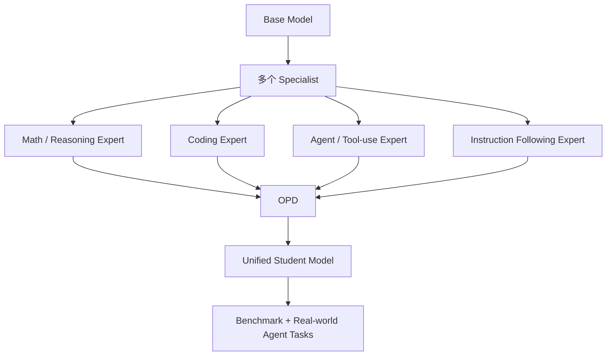
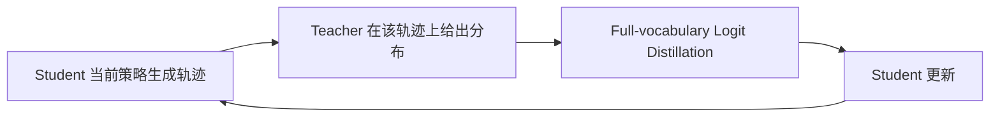
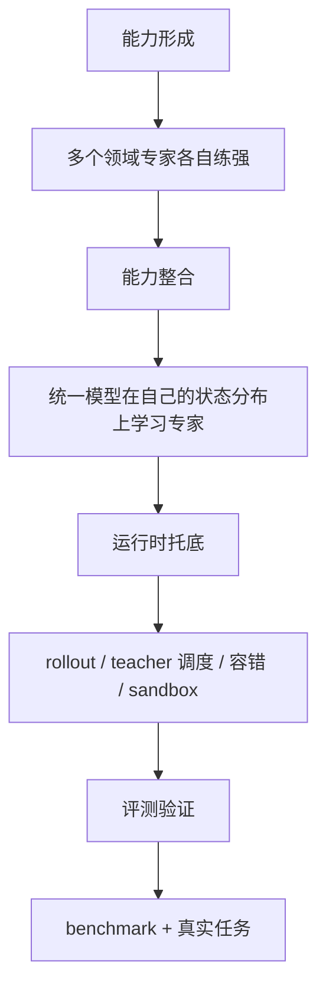

# 🧪 第 5 章 Post-Training：把多个强专家变成一个可用统一模型

> 第五章的核心不是某个单独算法，而是 DeepSeek V4 如何组织后训练：先把不同专家练强，再把这些能力整合回统一模型。

---

## 🧭 本章速览

| 模块 | 核心问题 | 关键词 |
|---|---|---|
| 5.1 后训练路线 | 为什么不继续 mixed RL | Specialist Training、OPD |
| Specialist Training | 能力如何分赛道形成 | SFT、RL / GRPO、GRM、tool-call schema |
| OPD | 专家能力如何回到统一模型 | on-policy、full-vocabulary logit distillation |
| 5.2 后训练基础设施 | 这套路线如何跑得动 | rollout、teacher scheduling、WAL、KV resume、sandbox |
| 5.3 / 5.4 评测 | 如何谨慎阅读 benchmark | 看任务形态，不只看分数 |

---

# 1️⃣ 一句话结论

第五章最关键的变化，是 DeepSeek V4 不再试图用一个混杂的 RL 阶段直接把所有能力揉出来，而是选择了：

> **先训练多个领域专家，再通过 OPD 把这些能力合并回统一模型。**

---

# 2️⃣ 5.1 的核心路线为什么重要

第五章一开头最值得抓住的问题是：

> 为什么要从 `mixed RL` 转向 `specialist training + OPD`？

因为数学、代码、agent、指令跟随这些方向，并不是天然同向的目标。

| 能力方向 | 目标倾向 | 可能冲突点 |
|---|---|---|
| 数学任务 | 长推理、严谨、可验证 | 可能牺牲简洁性和速度 |
| 代码任务 | 通过测试、可执行、可修复 | 可能偏向工程 trial-and-error |
| Agent 任务 | 多轮规划、工具调用、环境反馈闭环 | 轨迹长、反馈复杂、状态依赖强 |
| 普通指令跟随 | 简洁、稳定、低延迟 | 可能不希望过度推理 |

如果这些目标在一个统一 RL 锅里同时拉扯，reward 冲突和能力互相污染几乎是必然结果。

所以 DeepSeek V4 的判断是：

> **先让专家各自练强，再让统一模型学习这些专家在不同任务上下文里的行为分布。**

---

# 3️⃣ Specialist Training：能力形成被拆成独立赛道

5.1.1 真正展示的是一种后训练分工方法，而不是单个算法名称。

它把 base model 之后的能力形成拆成多个领域赛道：

- 领域 SFT；
- 领域 RL / GRPO；
- reasoning effort 档位设计；
- hard-to-verify task 的 GRM 评价；
- tool-call schema；
- interleaved thinking；
- quick instruction 等产品化行为设计。

这说明 V4 的后训练目标已经不只是“让回答更好听”，而是在训练一组更接近运行时协议的模型行为。

## 🧩 它实际在训练什么

| 训练对象 | 含义 |
|---|---|
| 不同深度的推理模式 | 模型需要知道什么时候长思考、什么时候快速回答 |
| 稳定工具调用协议 | tool call 的 schema、时机、参数都要更可靠 |
| 长链路工具使用中的 continuity | 多轮工具调用后仍能保持 reasoning continuity |
| 面向 agent runtime 的辅助决策能力 | 模型行为要能嵌入真实 agent runtime |

这一点很像把“模型行为”当作产品协议和运行时协议的一部分来训练，而不只是语言风格微调。

---

# 4️⃣ OPD：为什么比简单蒸馏和权重合并更值得重视

第五章真正的主线仍然是 `OPD`。

它的重要性在于：

> 学生模型不是只模仿老师已经生成好的答案，而是在 `自己生成的轨迹` 上学习多个 teacher 的完整分布。

## 🔁 为什么 on-policy 重要

最终上线运行的是 student，不是 teacher。

如果 student 只在 teacher 自己走出来的轨迹上学习，它到了自己的状态分布里反而可能学不好。

OPD 强调 on-policy，正是在避免这一点。

## 🧠 full-vocabulary logit distillation

DeepSeek V4 还强调 `full-vocabulary logit distillation`。

这说明它想保留的不是某个 top-1 token，而是 teacher 对整个输出空间的偏好结构。

这么做更稳，但工程代价极高，也因此直接引出了 5.2 的基础设施章节。

---

# 5️⃣ 5.2：为什么后训练已经变成一整套运行时系统

如果 5.1 讲的是“后训练算法路线”，那 5.2 讲的就是“这套路线怎样在工程上跑得动”。

这一节最值得带走的判断是：

> **后训练已经不是只靠普通 RLHF pipeline 就能支撑的轻量流程，而是一套完整的分布式运行时系统。**

## 🧱 5.2 的五个重点

| 基础设施 | 解决什么问题 |
|---|---|
| FP4 rollout / teacher / reference forward | 让海量 inference-only forward 跑得更便宜 |
| Teacher Scheduling for Full-Vocabulary OPD | 让十多个 teacher 的 full-vocab 蒸馏在显存和 I/O 上可承受 |
| Fault-Tolerant Rollout Service | 通过 token-granular WAL 和 KV resume，避免中断改变 rollout 数据分布 |
| Million-Token RL Framework | 拆分 metadata 和 heavy fields，避免 CPU / GPU 内存爆炸 |
| Sandbox Infrastructure for Agentic AI | 为 agent RL 和评测提供真实、隔离、可恢复的执行环境 |

## 🧠 这一节说明了什么

当模型开始追求 agent、长上下文和复杂 reasoning 能力时，训练环境本身就必须像一个大规模 runtime。

它不再是一条简单的监督学习流水线，而是包含：

- 大规模 rollout；
- 多 teacher 调度；
- 容错恢复；
- KV 级别状态续跑；
- sandbox 执行环境；
- 长轨迹数据管理。

---

# 6️⃣ 如何更谨慎地读 5.3 / 5.4 评测

评测章节不值得当作“谁分高谁厉害”的广告表来读。

更有价值的读法，是看 DeepSeek 想用哪些任务形态来证明第五章前面提出的路线确实有效。

## 🧪 5.3 vs 5.4

| 小节 | 更像在回答什么 |
|---|---|
| 5.3 | 标准 benchmark 上的分数如何 |
| 5.4 | 真实 coding、tool-use、agent、long-context 任务是否好用 |

真正值得关注的不是具体排行榜名次，而是这些问题：

- 它是不是只在容易刷榜的可验证任务上特别强？
- 它是否真的用任务验证了 interleaved thinking、tool-call schema、sandbox 和 long-context RL 的价值？
- 它有没有展示失败边界，而不只是成功样例？

## ⚠️ 关于 benchmark 的提醒

第三方外部评测和发布方自述之间出现差异，本身就是有意义的。

它说明 benchmark 叙事常常只能证明：

> **在这套题、这套设置下表现如何。**

但它并不等于对真实世界 agent 任务形成了无可争议的结论。

---

# 7️⃣ 从第五章带走什么

第五章最值得记住的，不是 GRPO、GRM、OPD 这些缩写本身，而是这套路线的组织方式。

可以概括为四步：

1. 先把不同领域能力在各自赛道里练强。
2. 再让统一模型在自己的状态分布上学习这些专家。
3. 同时建设能支撑 rollout、teacher 调度、容错和 sandbox 的完整基础设施。
4. 最后用 benchmark 和真实任务去验证哪些能力真的落到了产品和运行时层面。

---

## 🧠 一句话总结

从工程视角看，第五章其实是在把“后训练”从一次单一优化过程，升级成：

> **能力形成 + 能力整合 + 运行时托底 + 评测验证**

这一整套完整体系。
