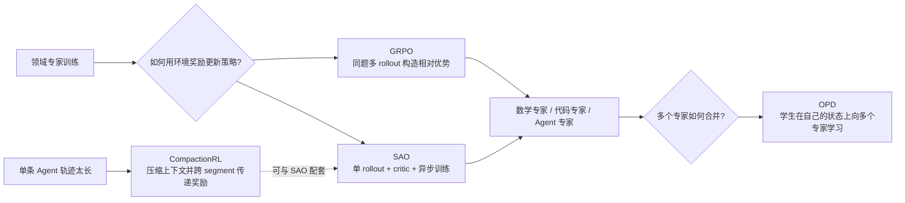
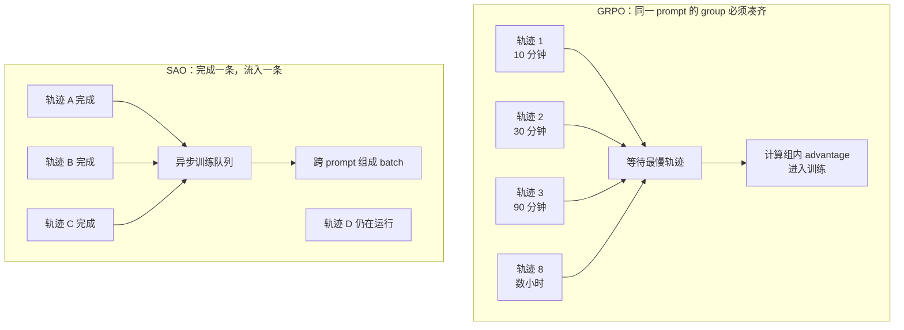
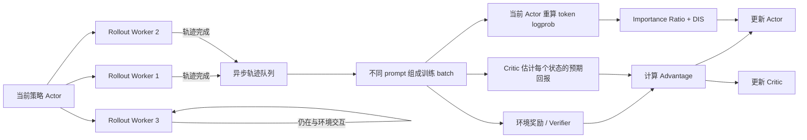
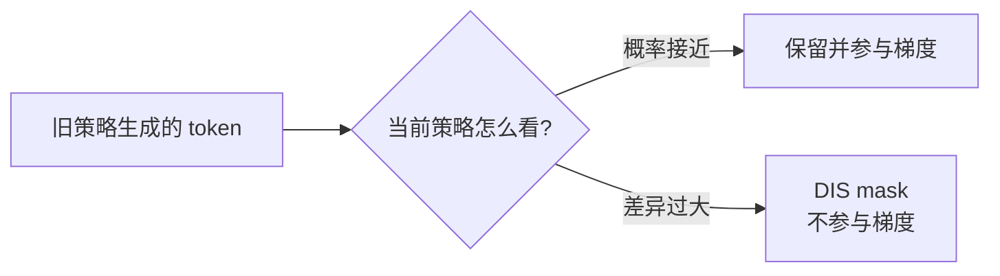
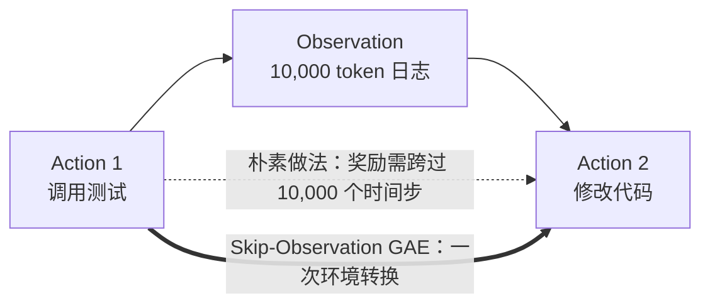
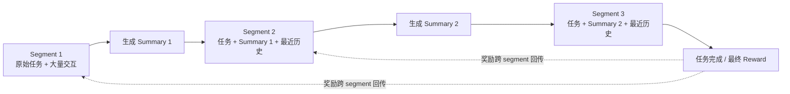
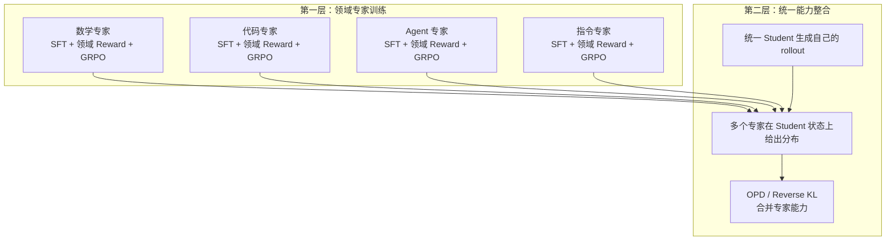
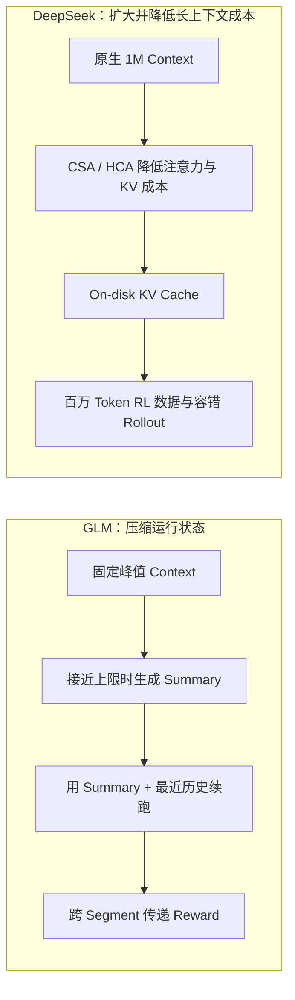

# GLM SAO 框架导读：为什么长程 Agent RL 不再适合“同题八连抽”

> 本文是 [《第 5 章：Post-Training 后训练，Agent 行为对齐和 RL 范式转变》](./04-%E7%AC%AC%E4%BA%94%E7%AB%A0%20Post-Training.md) 的补充阅读。
>
> 面向读者：理解 Agent、工具调用和基本训练概念，但不要求熟悉 PPO、GAE 或 importance sampling。
>
> 事实边界：SAO 与 CompactionRL 的公开材料目前均为 2026 年 7 月发布的 arXiv v1。本文会尽量明确区分论文披露、工程化解释与个人判断。

---

## 先用三句话说清楚

1. **SAO 解决的是“长程 Agent 的强化学习怎么高效跑起来”**：一条任务轨迹完成后就进入训练，不再等待同一道题的其他 rollout。
2. **OPD 解决的是“多个领域专家怎么合并回一个通用模型”**：它和 SAO 不在同一层，不能简单理解成 GLM 选 SAO、DeepSeek 选 OPD。
3. **SAO 的代价不是消失，而是转移**：它省掉了同 prompt 多次采样和 group 等待，却重新引入了 critic/value model 的训练成本与稳定性问题。

只想掌握主线的读者，可以重点阅读：

- [一、先看全局：四个名字分别解决什么问题](#一先看全局四个名字分别解决什么问题)
- [二、SAO 为什么出现](#二sao-为什么出现)
- [三、SAO 到底怎么工作](#三sao-到底怎么工作)
- [八、与 DeepSeek V4 的关系](#八与-deepseek-v4-的关系)
- [十、最终判断](#十最终判断)

公式和算法细节被放进折叠区，不影响主线阅读。

---

# 一、先看全局：四个名字分别解决什么问题

SAO、GRPO、OPD、CompactionRL 经常出现在同一组讨论中，但它们解决的不是同一个问题。



| 方法 | 它回答的问题 | 所处层次 |
|---|---|---|
| **GRPO** | 同一道题生成多条答案后，哪些行为相对更好？ | 单个领域的 RL 优化 |
| **SAO** | 一次只得到一条昂贵、长短不一的 Agent 轨迹时，怎样异步而稳定地训练？ | 单个领域的 RL 优化 |
| **OPD** | 数学、代码、Agent、写作等多个专家已经训练好，怎样合并为统一模型？ | 多专家能力整合 |
| **CompactionRL** | Agent 任务超过上下文窗口后，怎样压缩、续跑并继续做 credit assignment？ | 长程轨迹与上下文组织 |

因此，更准确的比较关系是：

> **SAO 应与 DeepSeek V4 训练领域专家时使用的 GRPO 比较；OPD 位于后续的多专家整合阶段；CompactionRL 则补充 SAO 的超长轨迹处理能力。**

一个完全可能的组合是：

```text
代码专家：SAO + CompactionRL
数学专家：GRPO 或 SAO
写作专家：GRM / LLM Judge 提供奖励

最后：所有专家通过 OPD 合并进统一模型
```

这只是根据公开方案做出的组合推演，并不是 GLM 或 DeepSeek 已公布的实际联合方案。

---

# 二、SAO 为什么出现

## 2.1 先理解 GRPO 的“同题八连抽”

GRPO 常见的数据组织方式是：对同一个 prompt 生成多条 rollout，再用组内奖励的相对高低计算 advantage。

例如：

```text
16 个 prompt
每个 prompt 生成 8 条 rollout
总训练 batch = 16 × 8 = 128 条
```

这里有两个容易混淆的概念：

- **group**：同一个 prompt 的 8 条 rollout；
- **batch**：一次参数更新使用的全部 128 条 rollout。

SAO 并不是把 batch size 降到 1，而是把 **group size 降到 1**：

```text
128 个 prompt
每个 prompt 只生成 1 条 rollout
总训练 batch 仍然是 128 条
```

也就是说：

> 一条 rollout 完成后，不需要等待“同题的另外七条”；它可以直接进入训练队列，learner 再把不同 prompt 的轨迹拼成 batch 更新参数。

## 2.2 为什么长程 Agent 特别怕 group barrier

数学题的一组答案，通常几十秒内都能完成。Coding Agent 的一组轨迹却可能是：

```text
rollout 1：查看两个文件，10 分钟完成
rollout 2：修改代码并跑测试，30 分钟完成
rollout 3：多轮排查，90 分钟完成
rollout 8：环境故障，数小时后才结束
```



GRPO 在这里会遇到四类问题：

1. **慢任务拖住整组**：已经完成的七条轨迹必须等待最后一条；
2. **训练与 rollout 难以形成流水线**：learner 会周期性“断粮”；
3. **旧数据越来越旧**：短轨迹生成时使用的是旧模型，真正训练时模型已经更新多轮；
4. **真实线上任务通常不可重复八次**：用户的一次操作、一次沙箱修改或一次真实交易流程，往往只产生一条真实轨迹。

因此，SAO 的核心并不是一句“PPO 又比 GRPO 好了”，而是：

> **真实 Agent 数据不是整齐的“同题多答案”，而是持续到达、成本昂贵、长度高度不均衡的一次性任务流。训练方法必须适应这种数据形态。**

---

# 三、SAO 到底怎么工作

可以把 SAO 理解成一套面向 Agent 的异步 actor-learner 训练协议。



从工程流程看，主要是五步：

1. **多个 worker 并行执行 Agent 任务**：调用工具、读写文件、运行测试、获得环境反馈；
2. **轨迹完成后立即入队**：不等待同 prompt 的其他轨迹；
3. **learner 跨 prompt 拼 batch**：batch 仍然可以很大；
4. **critic 判断“这个结果比原本预期好多少”**；
5. **用 importance ratio 和 DIS 处理异步造成的旧策略数据，再更新 actor 与 critic。**

Rollout 阶段至少需要保存：

- 实际生成的 token；
- 这些 token 在 rollout policy 下的 log probability；
- action 与 observation 的边界；
- 环境 reward；
- trajectory / segment 和模型版本信息。

不需要保存每个 token 对完整词表的全部 logits，只需要保存实际采样 token 的 logprob。

---

# 四、Critic：不是裁判，而是“赛前预期”

这是非算法读者理解 SAO 的关键。

## 4.1 Reward 与 Critic 分工不同

假设 Coding Agent 的执行过程是：

```text
查看代码 → 修改文件 → 运行测试 → 修复失败 → 全部测试通过
```

最终 reward 可以来自：

- 单元测试是否通过；
- SWE-Bench patch 是否正确；
- 数学答案是否正确；
- 环境反馈；
- reward model 或 LLM judge。

**Critic 不负责判定任务成功与否。**它估计的是：

> 在当前状态下，按照现有策略继续执行，最终大概能得到多少回报？

可以把它类比成比赛前的胜率预测：

| 当前状态 | Critic 预期最终得分 | 实际最终得分 | Advantage 直觉 |
|---|---:|---:|---|
| Agent 已定位正确文件 | 0.4 | 1.0 | 比预期好很多，应奖励后续行为 |
| Agent 反复修改无关代码 | 0.8 | 0.0 | 比预期差很多，应惩罚相关行为 |
| Agent 处于普通中间状态 | 0.5 | 0.6 | 略好于预期，小幅正向更新 |

最简化地看：

```text
Advantage ≈ 实际结果 - Critic 的预期结果
```

GRPO 用“同题其他 rollout 的平均表现”作为 baseline；SAO 没有同题 group，只能重新引入 critic。

## 4.2 SAO 把成本从哪里搬到了哪里

| 方案 | 省掉的成本 | 新增或保留的成本 |
|---|---|---|
| GRPO | 不需要 critic | 同题多 rollout、等待最慢样本、group 同质化风险 |
| SAO | 不需要同题多 rollout，也没有 group barrier | critic 显存、value 预训练、critic 更新与稳定性维护 |

因此 SAO 不是免费午餐。它更像是一次成本置换：

> **用 critic 的训练成本，换取 single-rollout、异步流水线和真实一次性反馈的适配能力。**

<details>
<summary><strong>算法细节：Value 与 Advantage 的最简公式</strong></summary>

Critic 估计状态价值：

\[
V_\phi(s_t)
\]

极简情况下：

\[
A_t \approx R - V_\phi(s_t)
\]

实际 SAO 使用 GAE，不是简单地把最终 reward 减去 value。GAE 会结合相邻状态的 value estimate，在 bias 与 variance 之间折中。

</details>

---

# 五、异步训练为什么需要 Importance Ratio 与 DIS

## 5.1 一条轨迹可能由“旧模型”生成

假设某个 rollout worker 开始执行任务时使用策略版本 `v100`。

任务执行很久。在此期间，learner 已根据其他完成的轨迹把 actor 更新到 `v108`。

```text
轨迹由 v100 生成
训练时当前模型已经是 v108
```

这就是 **policy lag**。它不是 bug，而是异步训练的自然结果。

问题在于：v100 产生的某个 token，在 v108 看来可能已经非常不自然。若不加修正地学习，旧经验可能会误导当前策略。

## 5.2 Importance Ratio 像“旧经验的汇率”

SAO 会比较同一个 token 在当前策略与 rollout 策略下的概率：

```text
当前策略仍认为该 token 很合理
→ 这条旧经验仍有参考价值

当前策略与旧策略已严重分歧
→ 这条经验需要降权或丢弃
```



DIS（Direct Double-Sided Importance Sampling）可以理解为“经验保质期过滤器”：

- ratio 落在可信区间：token 参与训练；
- ratio 过大或过小：说明新旧策略差异过强，token 被 mask；
- 它判断的不是 token 内容好坏，而是这条经验是否已经过时到不值得学习。

这种做法牺牲部分数据利用率，换取异步训练的稳定性。

<details>
<summary><strong>算法细节：Importance Ratio</strong></summary>

对实际生成 token：

\[
r_t =
\frac{\pi_{\text{current}}(a_t\mid s_t)}
{\pi_{\text{rollout}}(a_t\mid s_t)}
\]

工程上通常通过 logprob 计算：

\[
r_t = \exp\left(
\log \pi_{\text{current}}(a_t\mid s_t)
-
\log \pi_{\text{rollout}}(a_t\mid s_t)
\right)
\]

因此 rollout 时保存旧 logprob；训练时对已有 token 序列做 teacher forcing，用当前 actor 重算 current logprob。这个过程不会重新执行工具或沙箱。

极简更新直觉是：

\[
\text{update signal}
\approx
\underbrace{A_t}_{\text{结果比预期好或差多少}}
\times
\underbrace{r_t}_{\text{旧经验对当前策略还有多大参考价值}}
\]

</details>

---

# 六、Skip-Observation GAE：不是丢掉工具结果

Agent 轨迹和普通聊天最大的不同，是 action 与 observation 交错出现：

```text
Action 1：调用测试工具
Observation：返回 10,000 token 日志
Action 2：根据报错修改代码
```

这里必须区分三件事：

1. 工具结果仍然保存在 trajectory 中；
2. 工具结果仍然是下一次 action 的输入上下文；
3. 工具结果不是模型生成的 action，不应像模型 token 一样进入 policy loss。

朴素 token-level GAE 还会遇到另一个问题：它可能把 10,000 个日志 token 当成 10,000 个 RL 时间步。



这会产生荒谬的长度偏差：

```text
工具返回 10 个 token
→ 前一个 action 获得较强 credit

工具返回 10,000 个 token
→ 前一个 action 的 credit 被严重衰减
```

但工具日志变长，不代表 Agent 多做了 9,990 次决策。

Skip-Observation GAE 的核心是：

> **Observation 会改变下一状态的内容和价值判断，但不会仅仅因为文本很长，就被当成大量新的决策时间步。**

它“跳过”的是 RL 时间轴上的非决策 token，不是上下文中的工具结果。

---

# 七、SAO 最难的地方：让 Critic 跟得上 Actor

Single-rollout 的最大风险是方差更大。没有同题多样本平均后，一旦 critic 预测不准，advantage 就可能变成高噪声甚至错误信号。

SAO 论文披露了三项很工程化的措施：

| 措施 | 做法 | 目的 |
|---|---|---|
| **Critic 更新更频繁** | 每个 batch 中 critic 更新 2 次，actor 更新 1 次 | 让 value model 更快追上不断变化的策略分布 |
| **冻结 critic attention** | 冻结 full-attention，只更新 MoE projection | 抑制论文实验中观察到的 critic 梯度不稳定 |
| **扩大 value pretraining** | 用更多数据预训练 value model | 避免 critic 冷启动阶段输出错误 baseline |

这里需要特别谨慎：

- “冻结 attention”更像针对其 MoE 模型和实验现象的工程正则化；
- 它不应被直接推广为所有 critic 都应该遵循的普适定律；
- 社区复现真正需要盯住的是 value initialization、explained variance、critic loss 和 policy shift，而不是只照抄 DIS 公式。

从这个角度看，SAO 的真正瓶颈很可能不是 actor objective，而是：

> **能否训练出一个持续跟得上 actor、又不会自我震荡的 critic。**

---

# 八、CompactionRL：一条任务为什么会被切成多个 Segment

SAO 与 CompactionRL 是两项不同但配套的工作。SAO 处理异步 single-rollout；CompactionRL 处理任务长到超过上下文窗口的问题。

当上下文接近上限时，模型先生成 summary，再用 summary 与最近历史继续执行：



从业务任务看，这仍然是一条 rollout；从模型真实看到的上下文看，它已经被切成多个 segment。

CompactionRL 需要解决两类问题：

1. **样本权重问题**：segment 更多、文本更长的轨迹不能仅因 token 多就占据更大训练权重；
2. **奖励距离问题**：早期 segment 离最终成功很远，不能把最终 reward 简单复制到每个 segment 末尾。

因此它引入：

- **token-level loss normalization**：避免 segment 数量与长度扭曲样本权重；
- **cross-trajectory GAE**：在 segment 边界之间传递最终 reward，并按真实可训练 token 距离进行折扣；
- **summary policy training**：summary 本身也是模型行为，也需要被训练，而不是外部固定预处理。

这进一步说明：长程 Agent RL 的难点不再只是“选哪个 loss”，而是轨迹如何存储、切分、压缩和回传奖励。

---

# 九、与 DeepSeek V4 的关系

## 9.1 SAO 真正应该和谁比较

DeepSeek V4 的后训练可以简化为两层：



DeepSeek V4 报告所说的“mixed RL stage entirely replaced by OPD”，并不是完全取消 GRPO。

它表达的是：

- 各领域 specialist 仍通过 SFT 与 GRPO 训练；
- 被 OPD 取代的是最终把数学、代码、Agent、写作等异质 reward 混在一起优化的 mixed RL 阶段。

因此：

> **SAO 的直接对照物是 DeepSeek V4 专家训练阶段的 GRPO，而不是后面的 OPD。**

## 9.2 SAO 与 DeepSeek V4 专家 GRPO

| 维度 | GLM SAO | DeepSeek V4 专家训练中的 GRPO |
|---|---|---|
| 数据形态 | 每个 prompt 一条 rollout，持续异步到达 | 同 prompt 多条 rollout 组成 group |
| Advantage baseline | Critic / value model / GAE | 同 prompt 组内奖励均值与标准差 |
| 是否需要 critic | 需要 | 通常不需要 |
| 是否等待最慢样本 | 不需要 | 需要等待 group 完成 |
| 异步 policy lag | 保存 rollout logprob，并用 ratio + DIS 处理 | 报告未披露同等级别的 SAO 式方案 |
| 适合场景 | 长程 Agent、一次性反馈、轨迹长短差异巨大 | 可验证 reward、同题可低成本生成多解 |
| 主要成本 | Critic 与异步 actor-learner 系统 | 多 rollout 生成与 group barrier |
| 主要风险 | Critic 不准导致错误 advantage | Straggler、group 同质化、重复执行成本 |

## 9.3 SAO 与 OPD

| 维度 | SAO | DeepSeek V4 OPD |
|---|---|---|
| 方法类型 | 强化学习优化方法 | 多教师 on-policy 蒸馏 |
| 输入监督 | 环境 reward + critic advantage | 多个专家的完整 next-token distribution |
| 目标 | 提高单个策略的环境回报 | 将多个领域专家合并进统一 student |
| 解决异步等待 | 是 | 不是主要目标 |
| 解决多领域冲突 | 不是主要目标 | 核心目标 |
| 主要昂贵资源 | Value model 与 rollout 系统 | 多个大 teacher 的推理与 full-vocabulary logits |

OPD 之所以叫 on-policy，是因为 student 先按当前策略生成自己的 rollout，专家再在 student 实际到达的状态上提供分布监督。它主要缓解 student distribution drift。

这里的 on-policy 与 SAO 的“单次真实环境反馈”也不是同一个概念：

- OPD：训练状态由当前 student policy 产生；
- SAO：环境任务一次只返回一条 trajectory 和 reward，策略持续从异步反馈中更新。

## 9.4 GLM 与 DeepSeek 的长上下文路线



GLM 的优先级是：不提高单窗口峰值，也尽量延长有效任务 horizon。

DeepSeek 的优先级是：尽量在一个超长上下文中保留完整历史，同时降低 FLOPs、KV cache、存储与加载成本。

两者并不排斥：

- 1M context 仍可能被更长任务耗尽；
- compaction 会丢失细节，长窗口可以降低压缩频率；
- 最现实的长程 Agent 很可能同时需要长上下文、外部结构化状态和阶段性 compaction。

---

# 十、实验结果与边界

SAO 的公开可控实验主要基于 Qwen3-30B-A3B，而不是直接公开 GLM-5.2 750B-A40B 的完整消融。

论文报告：

| 方法 | AIME2025 | BeyondAIME | HMMT | IMOAnswerBench | SWE-Bench Verified |
|---|---:|---:|---:|---:|---:|
| GRPO + DIS | 93.5 | 70.8 | 84.0 | 70.0 | 27.0 |
| SAO | **97.3** | **74.8** | **88.3** | **74.0** | **29.8** |

这些结果说明 SAO 在论文设定下优于经过 DIS 改进的 GRPO，但不能直接推出“SAO 已全面替代 GRPO”。

需要保留的边界包括：

1. 论文主要验证 coding agent 与工具增强数学推理；
2. single-rollout 的效果高度依赖 critic 质量；
3. value model 大体增加了一套模型级训练开销；
4. token-level importance ratio 不能完整修正整条 trajectory 的状态分布变化；
5. DIS 会丢弃一部分偏离过大的 token；
6. GLM-5.2 规模上的完整训练预算、曲线和消融尚未完全公开；
7. 当前论文仍是 arXiv v1，独立复现证据有限。

因此，更稳妥的结论是：

> **SAO 证明了 critic-based single-rollout PPO 在长程、异步、工具化 Agent RL 中很有吸引力；它并没有证明 GRPO 在短程 RLVR、低成本多采样或同步训练中已经过时。**

---

# 十一、怎样判断自己的任务更适合哪条路线

| 任务条件 | 更自然的方向 | 原因 |
|---|---|---|
| 数学题、短代码题，同题可低成本采样多次 | GRPO / group-based RL | 组内相对奖励便宜，且不需要维护 critic |
| 长程 Coding Agent，轨迹长度差异巨大 | SAO / asynchronous PPO | 避免 group barrier，完成一条就训练一条 |
| 真实用户任务，一次只有一条环境反馈 | Single-rollout RL | 训练数据形态更接近线上执行 |
| 上下文会在任务中被压缩或重建 | CompactionRL 类方法 | 需要 segment-aware credit assignment |
| 已拥有多个能力很强的领域专家 | OPD / multi-teacher distillation | 重点变成能力合并，而非继续混合奖励 |
| 多领域 reward 混训会互相污染 | Specialist training + OPD | 先隔离冲突，再合并能力 |
| 没有资源训练和维护 critic | GRPO 更现实 | SAO 的稳定性高度依赖 value model |
| 没有资源长期运行多个超大 teacher | OPD 成本可能不可接受 | Full-vocabulary teacher inference 很昂贵 |

真正决定选型的不是算法名字，而是六个问题：

1. 一个 prompt 能否重复执行很多次？
2. rollout 是否昂贵？
3. 轨迹是否长且高度不均衡？
4. reward 是否可验证？
5. 是否存在多个相互冲突的领域目标？
6. 是否有能力维护 critic 或多个 teacher？

---

# 十二、最终判断

## 12.1 SAO 最值得关注的不是“PPO 回归”

它真正有价值的部分是：

- 将 group size 与 batch size 解耦；
- rollout 完成后立即进入训练数据流；
- 显式处理异步 policy lag；
- 对严重过时的 token 做双侧 mask；
- 为 Agent observation 重新定义 RL 时间轴；
- 围绕 critic 设计专门的训练频率、预训练和正则化。

所以 SAO 更像一套 **面向长程 Agent 的训练协议**，而不只是一个新的 loss 名称。

## 12.2 GLM 与 DeepSeek 选择了不同的“昂贵部分”

| 路线 | 试图省掉什么 | 愿意支付什么成本 |
|---|---|---|
| GLM SAO | 同 prompt 多 rollout 与 group 等待 | Critic、value pretraining、异步 RL 基础设施 |
| GLM CompactionRL | 无限扩张单窗口 context | Summary policy 与跨 segment credit assignment |
| DeepSeek OPD | 最终 mixed RL 中的多目标冲突 | 多个 teacher 与 full-vocabulary distillation |
| DeepSeek 1M Context | 频繁压缩导致的信息损失 | 注意力、KV cache、存储、容错和数据加载系统 |

这不是谁找到了免费午餐，而是两家公司把成本放在了不同位置。

## 12.3 对 Agent 工程最重要的启发

训练方法应尽量匹配最终 runtime：

- 线上一次只执行一条任务，训练就不应默认必须同题运行八次；
- 线上存在工具返回，就必须正确区分 action 与 observation；
- 线上会裁剪、总结或重建上下文，训练中也应暴露这种状态变化；
- 线上任务目标高度异质，就要考虑专家隔离与能力合并，而不只是继续调 reward 权重；
- 线上 rollout 与 learner 并行，policy lag、容错、存储和调度就是算法的一部分。

换句话说：

> **后训练应该学习真实 Agent runtime 中会发生的事情，而不是只在一个方便计算的离线数据结构中优化漂亮的 loss。**

---

# 附录：术语速查

| 术语 | 非算法化解释 |
|---|---|
| **Rollout** | 模型从接到任务到任务结束的一整段实际执行轨迹 |
| **Trajectory** | 与 rollout 基本同义，包含 action、observation、reward 等 |
| **Group** | 同一个 prompt 生成的多条 rollout 集合 |
| **Batch** | 一次参数更新共同使用的样本集合，可以包含不同 prompt |
| **Actor / Policy** | 真正负责生成 action 的模型 |
| **Critic / Value Model** | 预测当前状态未来大概能获得多少回报的模型 |
| **Reward** | 环境或评估器对最终结果给出的反馈 |
| **Advantage** | 实际表现相对原本预期好或差多少 |
| **Policy Lag** | 数据由较旧版本模型生成，但训练时模型已经更新 |
| **Importance Ratio** | 衡量旧经验对当前策略还有多大参考价值的概率比 |
| **DIS** | 对新旧策略差异过大的 token 直接 mask |
| **GAE** | 将最终 reward 更稳定地分配到中间决策上的方法 |
| **Observation** | 工具、环境、测试或外部系统返回给模型的内容 |
| **Segment** | 上下文压缩后，一条长 rollout 被切分出的训练片段 |
| **OPD** | 学生在自己的状态上接受多个专家分布监督的蒸馏方法 |

---

# 原始资料

1. GLM / Z.AI，**Single-Rollout Asynchronous Optimization for Agentic Reinforcement Learning**  
   https://arxiv.org/abs/2607.07508

2. GLM / Z.AI，**CompactionRL: Reinforcement Learning with Context Compaction for Long-Horizon Agents**  
   https://arxiv.org/abs/2607.05378

3. Z.AI，**GLM-5.2: Built for Long-Horizon Tasks**  
   https://z.ai/blog/glm-5.2

4. DeepSeek AI，**DeepSeek-V4: Towards Highly Efficient Million-Token Context Intelligence**  
   https://huggingface.co/deepseek-ai/DeepSeek-V4-Pro/blob/main/DeepSeek_V4.pdf

5. Schulman et al.，**Proximal Policy Optimization Algorithms**  
   https://arxiv.org/abs/1707.06347

6. Schulman et al.，**High-Dimensional Continuous Control Using Generalized Advantage Estimation**  
   https://arxiv.org/abs/1506.02438
