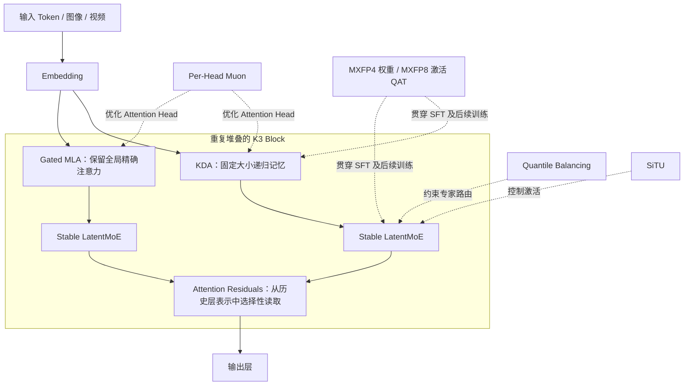
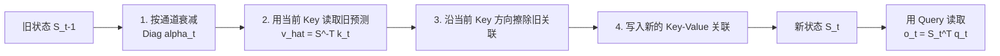
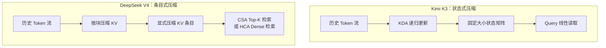
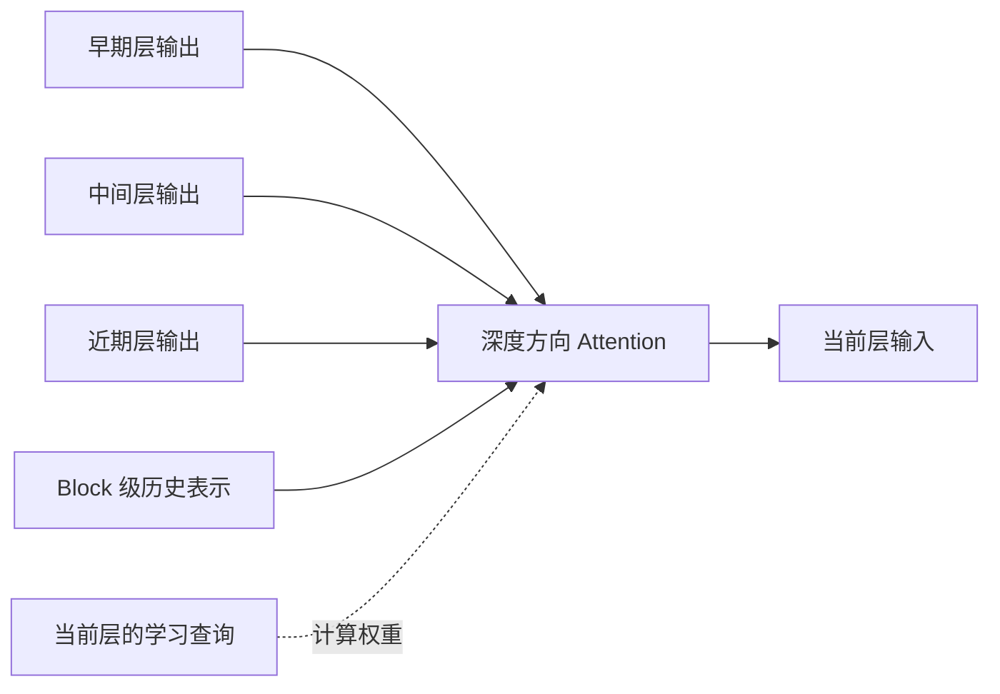
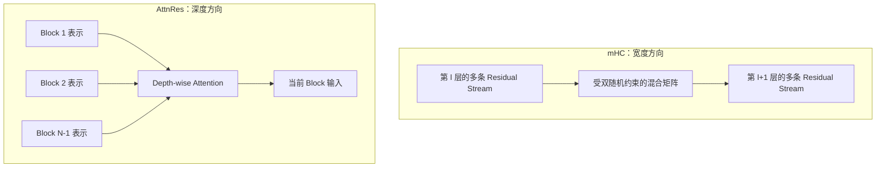
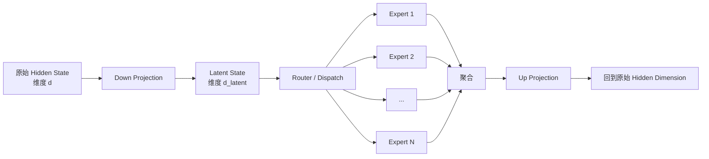
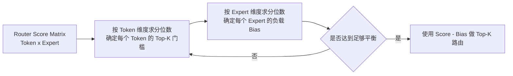

# 🌙 Kimi K3 已披露技术导读：从 KDA 到 2.8T 超稀疏 MoE

> 本文是 [《第 2 章 Architecture：DeepSeek V4 的算法设计》](./01-%E7%AC%AC%E4%BA%8C%E7%AB%A0%20Architecture.md) 的扩展对照阅读。
>
> 截至 **2026 年 7 月 17 日**，Kimi K3 已公开发布并提供 API，但完整模型权重计划在 2026 年 7 月 27 日前发布，完整 Technical Report 尚未公开。因此，本文会严格区分三类信息：
>
> - ✅ **官方确认**：来自 Kimi K3 发布博客；
> - 📄 **前序论文可确认**：来自 Kimi Linear、Attention Residuals、LatentMoE、Quantile Balancing 等公开材料；
> - ⚠️ **仍待确认**：K3 的具体实现尚未披露，本文只说明合理联系，不把推测写成事实。

---

## 🧭 先给结论：K3 与 DeepSeek V4 正在解决同一组规模化问题

Kimi K3 的核心新闻不是单纯把总参数量扩展到了 **2.8T**，而是它围绕超长上下文、超深网络、超稀疏 MoE 和低精度部署，组织了一套相当统一的技术路线。

| 规模化问题 | Kimi K3 | DeepSeek V4 | 两者的关键差异 |
|---|---|---|---|
| 1M 上下文如何降低注意力成本 | KDA + Gated MLA | CSA + HCA + Sliding Window | 固定大小递归状态 vs 显式压缩 KV 条目 |
| 深层网络如何传递信息 | Attention Residuals | mHC | 沿深度跨层检索 vs 沿宽度扩展多条残差流 |
| 极稀疏 MoE 如何均衡负载 | Quantile Balancing | Loss-Free Dynamic Bias + 轻量序列级均衡 | 分位数近似最优分配 vs 固定步长反馈调节 |
| Muon 如何适配复杂矩阵结构 | Per-Head Muon | 逻辑矩阵级 Muon + Hybrid Newton-Schulz | 改变优化单元粒度 vs 改进求解和分布式实现 |
| 如何控制异常激活 | SiTU，细节未披露 | SwiGLU Clamping；另提出低成本激活建议 | 当前无法判断是否同构 |
| 如何部署 FP4 模型 | 从 SFT 开始 MXFP4 / MXFP8 QAT | 后训练阶段对 Expert 和 Indexer 做 FP4 QAT | 思路高度一致，量化覆盖范围不同 |

可以用一张图概括 K3 当前已经披露的技术拼图：



> **本文最重要的理解主线：**
>
> - KDA 解决的是**序列长度方向**的记忆成本；
> - AttnRes 解决的是**模型深度方向**的信息流；
> - LatentMoE + Quantile Balancing 解决的是**专家数量方向**的容量与负载；
> - Per-Head Muon 和 QAT 解决的是**优化与部署方向**的可扩展性。

---

# 一、K3 的基本规格：2.8T 到底意味着什么

## ✅ 官方已经确认的规格

| 项目 | Kimi K3 当前披露值 |
|---|---|
| 总参数量 | 2.8T |
| 模型类型 | 超稀疏 MoE |
| Routed Expert 总数 | 896 |
| 每个 Token 激活 Expert | 16 |
| 上下文长度 | 1M Token |
| 注意力主体 | KDA + Gated MLA |
| 深度连接 | Attention Residuals |
| MoE 结构 | Stable LatentMoE |
| 负载均衡 | Quantile Balancing |
| 优化器扩展 | Per-Head Muon |
| 量化训练 | 从 SFT 开始，MXFP4 权重 + MXFP8 激活 |
| 模态 | 原生文本、图像和视频理解 |
| 推荐部署 | 64 张或更多加速卡组成的高带宽 Supernode |

## ⚠️ 2.8T 不能直接换算成 50B 激活参数

最容易出现的粗略计算是：

\[
2.8T \times \frac{16}{896} \approx 50B
\]

但这个结果不能当作 K3 的真实激活参数量，因为 2.8T 还可能包含：

- Attention、Embedding、Norm 等非 Routed Expert 参数；
- Shared Expert；
- LatentMoE 的降维和升维投影；
- Router；
- 原始隐藏维度中运行的其他模块；
- KDA、Gated MLA、AttnRes 和多模态部分参数。

因此，在完整配置文件发布之前，准确说法只能是：

> **K3 每个 Token 在 896 个 Routed Expert 中选择 16 个，但官方尚未披露完整的 Activated Parameter Count 和单 Token FLOPs。**

---

# 二、KDA：把不断增长的 KV Cache 改成可编辑的固定状态

> 前置知识：Attention、KV Cache、线性注意力、递归状态。
>
> 本节是理解 K3 最重要、也最容易被误读的一部分。

## 2.1 普通 Attention 保存的是“所有历史条目”

普通自回归 Attention 的直觉是：

```text
Token 1 -> 保存 K1 / V1
Token 2 -> 保存 K2 / V2
Token 3 -> 保存 K3 / V3
...
Token N -> 保存 KN / VN
```

生成新 Token 时，Query 会回到这些历史 KV 条目中重新检索。

它的优势是：

- 每个历史位置仍然有独立地址；
- 可以精确查询很久以前的某个 Token；
- 不同 Query 可以读取不同历史位置。

代价则是 KV Cache 会持续增长。上下文越长、输出越长，显存和带宽压力越大。

## 2.2 KDA 保存的不是历史列表，而是一张“关联状态表”

KDA 延续 DeltaNet 的思路：不保存所有历史 KV，而是维护一个固定大小的状态矩阵 \(S_t\)。

KDA 的递推可以写成：

\[
S_t =
\left(I - \beta_t k_t k_t^\top\right)
\operatorname{Diag}(\alpha_t)S_{t-1}
+ \beta_t k_t v_t^\top
\]

最终读取：

\[
o_t = S_t^\top q_t
\]

公式看起来比较抽象，可以拆成四个连续动作：



令：

\[
S_t^- = \operatorname{Diag}(\alpha_t)S_{t-1}
\]

并令当前状态对 \(k_t\) 的旧预测为：

\[
\hat v_t = {S_t^-}^\top k_t
\]

则更新可以直观地重写为：

\[
S_t = S_t^- + \beta_t k_t(v_t - \hat v_t)^\top
\]

这揭示了 Delta Rule 的核心：

> **不是直接把新 Value 叠加进去，而是先读取当前记忆已经预测了什么，再写入“新值与旧预测之间的误差”。**

## 2.3 “精细遗忘”具体精细在哪里

KDA 相比 Gated DeltaNet 的重要改动，是把遗忘控制从一个标量扩展成逐通道向量：

\[
\alpha_t = (\alpha_{t,1}, \alpha_{t,2}, \ldots, \alpha_{t,d_k})
\]

于是不同状态通道可以拥有不同衰减速度：

| 通道状态 | 可能的 \(\alpha\) | 直观含义 |
|---|---:|---|
| 需要长期保留的信息 | 接近 1 | 很慢遗忘 |
| 只对近期有用的信息 | 中等 | 逐步衰减 |
| 已经过时或干扰性信息 | 接近 0 | 快速清除 |

这就是 KDA 论文中 **fine-grained gating / fine-grained forgetting** 的准确含义。

### ⚠️ 它不是 Token 级精确删除

KDA 的精细是：

> **State Channel 级别的连续衰减。**

它不是：

> “找到第 28471 个历史 Token，并把它单独删掉。”

多个历史 Token 已经叠加进同一状态矩阵。一旦压缩完成，它们就不再具有完全独立的地址。因此 KDA 存在固定状态模型普遍面对的容量与干扰问题。

此外，KDA 中 \(\beta_t\) 同时参与擦除旧关联和写入新关联，擦除与写入强度并未彻底解耦。后续 Gated DeltaNet-2 正是针对这个边界进一步拆分了 Erase Gate 和 Write Gate。

## 2.4 为什么 K3 仍然保留 Gated MLA

如果纯 KDA 已经足够，就没有必要再插入完整 Attention。

Kimi Linear 的公开实验采用大致 **3:1 的 KDA 与 MLA 混合结构**：多数层使用 KDA，少量层使用全局 MLA。K3 的发布架构图也显示 KDA 与 Gated MLA 混合，但具体层数比例尚未正式披露。

两者的分工可以理解为：

| 机制 | 更擅长什么 |
|---|---|
| KDA | 低成本持续更新状态；长输出；固定大小记忆；连续遗忘和覆盖 |
| Gated MLA | 精确全局检索；保留独立历史位置；缓解有限状态干扰 |

KDA 不是要证明“所有 Softmax Attention 都应该消失”，而是试图让昂贵的全局注意力从主体计算变成少量精确补丁。

---

# 三、KDA 与 DeepSeek V4 的 CSA / HCA：目标一致，记忆形态不同

K3 与 V4 都在回答同一个问题：

> **1M 上下文中，如何避免每层、每步都完整处理全部历史 Token？**

但它们选择了两种不同的记忆形态。



## 3.1 CSA：中等压缩 + 稀疏检索

DeepSeek V4 的 CSA 大致执行：

```text
多个原始 KV
    -> 学习式压缩成一个 KV Entry
    -> Lightning Indexer 为当前 Query 打分
    -> 选 Top-K 压缩条目
    -> 再做 Softmax Attention
    -> 同时保留近期 Sliding Window
```

它仍然保留一串显式历史条目，只是条目数量减少，而且 Query 只访问其中一部分。

## 3.2 HCA：重压缩 + 全局 Dense 检索

HCA 使用更高压缩比例，把大量历史 Token 压成少量粗粒度条目，然后对这些条目做 Dense Attention。

它更像一层长期摘要记忆：

- 历史条目数量大幅减少；
- 每次仍然能访问全部粗粒度历史；
- 近期细节由 Sliding Window 补足。

## 3.3 谁更“精细”取决于比较维度

| 比较维度 | KDA | CSA / HCA |
|---|---|---|
| 历史如何保存 | 叠加到固定大小状态矩阵 | 保存为一串显式压缩条目 |
| 状态更新 | 每个 Token 连续衰减、擦除、写入 | 新增或生成新的压缩 KV Entry |
| 遗忘粒度 | 状态通道级 | 压缩条目级或由上下文窗口自然淘汰 |
| 检索粒度 | 对整体状态做线性读取 | Query 对具体压缩条目打分 |
| 历史位置是否可寻址 | 较弱 | 较强 |
| Cache 是否持续增长 | KDA 层近似固定 | 仍随上下文增长，但增长更慢 |
| 长输出潜力 | 很强 | 仍需维护压缩 KV Cache |
| 精确 Needle Retrieval | 依赖有限状态容量与 MLA 补丁 | 显式条目更自然 |

所以更准确的判断是：

> **KDA 在“如何编辑压缩记忆”上更精细；CSA 在“如何定位历史内容”上更精细。**

一句话总结：

```text
KDA：Compress into state, then update.
CSA/HCA：Compress into entries, then retrieve.
```

---

# 四、Attention Residuals：把“层层累加”改成“沿深度检索”

> 前置知识：PreNorm Transformer、Residual Connection。

## 4.1 普通残差连接的问题不是没有历史，而是历史权重全都固定

普通 PreNorm Transformer 可以展开为：

\[
h_l = h_0 + \sum_{i < l} F_i(h_i)
\]

它相当于把之前每一层的输出都以固定权重 1 加进来。

这样做非常稳定，但网络越深，会逐渐出现：

- Hidden State 幅度随深度增长；
- 早期层贡献被大量后续残差稀释；
- 不同层的输出幅度和梯度分布不均；
- 当前层无法明确地说“我现在更需要第 8 层而不是第 72 层的信息”。

## 4.2 AttnRes 把网络深度本身当成一个可检索序列

Attention Residuals 将固定累加替换成：

\[
h_l = \sum_{i < l}\alpha_{i \rightarrow l}v_i
\]

其中 \(\alpha\) 通过 Softmax Attention 得到。



当前层不再被迫接收一个已经混在一起的巨大残差和，而是可以选择性读取前面层或 Block 的表示。

## 4.3 Block AttnRes 为什么更适合大模型

Full AttnRes 需要保存大量历史层输出，并在 Pipeline Parallel 中传输这些表示，成本很高。

Block AttnRes 的处理方式是：

1. 把若干相邻层组成一个 Block；
2. Block 内仍然使用较普通的累加；
3. Block 之间做 Attention Residual；
4. 配合 Cache-based Pipeline Communication 和两阶段计算降低通信成本。

它牺牲了一些逐层寻址精度，换取更现实的训练内存和通信开销。

### ⚠️ AttnRes 不是严格稀疏路由

AttnRes 使用 Softmax 对历史层或 Block 做加权，数学上通常仍是 Dense Mixture：

- 没有明确 Top-K；
- 没有 Hard Routing；
- 没有显式 Sparse Mask。

因此更准确的说法不是“把深层残差稀疏化”，而是：

> **把深度方向的固定均匀累加，改成内容相关的归一化寻址。**

---

# 五、AttnRes 与 DeepSeek V4 mHC：确实解决残差连接的两个不同维度

你的直觉可以进一步形式化为：



| | DeepSeek V4 mHC | Kimi K3 AttnRes |
|---|---|---|
| 主要操作轴 | Residual Stream 宽度 | 网络深度 |
| 连接范围 | 主要在相邻层之间递推 | 当前层可读取更早层或 Block |
| 核心能力 | 多条残差流之间动态混合 | 从历史深度表示中选择性聚合 |
| 稳定手段 | Sinkhorn 投影到近似双随机矩阵 | Softmax 归一化深度权重 |
| 主要风险 | HC 混合矩阵连乘导致信号放大或抵消 | 保存历史层表示导致内存与通信开销 |
| 核心目标 | 保留 HC 表达力，同时限制发散 | 缓解 PreNorm 的统一累加和层贡献稀释 |

mHC 可以抽象成：

\[
X_{l+1} = B_lX_l + C_lF_l(A_lX_l)
\]

其中 \(X_l\) 包含多条 Residual Stream，而 \(B_l\) 被约束为近似双随机矩阵，使跨层映射尽量保持 Non-expansive。

因此可以这样总结：

> **mHC 是 Depth-local、Width-expanded Residual Dynamics。**
>
> **AttnRes 是 Width-normal、Depth-nonlocal Residual Retrieval。**

两者理论上不互斥，甚至可以组合。但同时使用会显著增加 Activation Memory、状态组织和 Pipeline Communication 的复杂度。

---

# 六、Stable LatentMoE：为什么 K3 能做到 896 个 Expert、每次激活 16 个

## 6.1 标准 MoE 的通信对象通常是完整 Hidden State

标准 MoE 中，Token 在模型 Hidden Dimension 上被发送给不同 Expert：

```text
Hidden State
   -> Router
   -> All-to-All Dispatch
   -> Expert FFN
   -> All-to-All Aggregate
   -> Hidden State
```

当激活 Expert 数 \(k\) 增加时，通信量、权重读取和调度压力也会增加。

## 6.2 LatentMoE 先降维，再做 Expert 路由和计算

公开的 LatentMoE 结构是：



它降低的是 Routed Expert 处理和通信的输入维度，而不是简单缩小整个模型。

节省出的预算可以用于：

- 增加 Expert 总数；
- 增加每 Token 激活的 Expert 数；
- 扩大 Expert 组合空间；
- 在近似相同通信和推理成本下提高表达能力。

这正好解释了 K3 的结构特征：

> **896 个 Expert 并不只是为了让单个 Expert 更专门，也是在扩大每个 Token 可选择的 Expert 组合空间。**

## 6.3 Stable LatentMoE 目前仍缺少什么信息

K3 官方使用的是 **Stable LatentMoE**，但尚未说明相对公开 LatentMoE 增加了哪些稳定化机制。

目前仍不知道：

- Latent Dimension 和原始 Hidden Dimension 的比例；
- Shared Expert 是否仍在原始 Hidden Dimension 中计算；
- Router 使用原始表示还是 Latent 表示；
- 16 个激活 Expert 是否全部是 Routed Expert；
- Stable 具体指初始化、归一化、路由、优化器还是通信稳定性；
- 是否采用 Multi-Head LatentMoE 或 Kimi 自研变体。

所以当前可以确认的是 LatentMoE 的整体设计动机，但不能直接把公开论文中的所有细节等同于 K3 实现。

---

# 七、Quantile Balancing：从“慢慢调 Bias”转向“按分位数求分配”

> 前置知识：MoE Router、Top-K Expert、Load Balancing。

## 7.1 DeepSeek 的 Loss-Free Balancing 是一个反馈控制器

DeepSeek V3 / V4 的无辅助损失路由可以简化为：

\[
e \in \operatorname{TopK}(s_{t,e} + b_e)
\]

其中：

- \(s_{t,e}\) 是 Token 与 Expert 的真实匹配分数；
- \(b_e\) 是用于路由决策的动态偏置；
- Expert 过载时降低 Bias；
- Expert 欠载时提高 Bias。

它的直觉类似：

```text
上一批 Expert 7 太忙
    -> 下一批稍微降低 Expert 7 的路由 Bias
上一批 Expert 12 太闲
    -> 下一批稍微提高 Expert 12 的路由 Bias
```

这种方案成本低，但需要一个 Bias Update Speed。步长太小，收敛慢；步长太大，可能震荡。

DeepSeek V4 仍保留了很轻的 Sequence-wise Balance Loss，用来避免单条序列内部出现极端不均衡。

## 7.2 Quantile Balancing 把问题写成约束最优分配

Quantile Balancing 想解决的是：

\[
\max_{x_{i,e}\in\{0,1\}}
\sum_{i,e} x_{i,e}s_{i,e}
\]

同时满足：

\[
\sum_e x_{i,e}=k
\]

\[
\sum_i x_{i,e}=\frac{mk}{n}
\]

也就是：

1. 每个 Token 必须选择 \(k\) 个 Expert；
2. 每个 Expert 接收的 Token 数量尽量相同；
3. 在完全均衡的约束下，总 Router Score 尽量高。

QB 使用 Token Threshold 和 Expert Bias 两组对偶变量，交替根据行分位数和列分位数更新：



相比固定地对 Bias 加减一个小步长，QB 直接从 Router Score 分布中估计更合适的 Bias。

## 7.3 QB 与 DeepSeek Dynamic Bias 的联系

| | DeepSeek Dynamic Bias | Quantile Balancing |
|---|---|---|
| 视角 | 在线反馈控制 | 约束最优分配 / 对偶坐标更新 |
| 更新依据 | 上一批实际负载 | Router Score 的行列分位数 |
| Bias 更新幅度 | 固定步长 | 由当前分数分布估计 |
| 是否需要 Update Speed | 需要 | 原始 QB 不需要 |
| 平衡精度 | 渐进纠偏 | 更接近每批目标负载 |
| 额外成本 | 很低 | 需要 Quantile / Selection 计算 |
| 主要风险 | 滞后、震荡、步长敏感 | Batch 统计噪声、因果性、分布式 Quantile 成本 |

从数学角度看，DeepSeek 的固定步长 Dynamic Bias 可以视为 QB 对偶目标的一种低成本 Sign Gradient 近似。

### ⚠️ K3 的具体 QB 版本尚未披露

K3 可能使用：

- 原始 Batch-level QB；
- Moving Quantile Balancing；
- 面向 896 Expert 和超大 EP Domain 的分布式近似；
- 与 Static Shape Dispatch 联合设计的工程版本。

官方只确认了：

> 根据 Router Score Quantile 推导 Expert Allocation，去除启发式更新和敏感的平衡超参数。

因此本文不把公开 QB 博客中的全部实现细节直接等同于 K3 代码。

---

# 八、Per-Head Muon：改变的是“什么算一个独立矩阵”

## 8.1 普通 Muon 可能把多个 Attention Head 拼在一起优化

以 Query Projection 为例，多个 Head 往往拼接在一个大权重矩阵中：

\[
W_Q = [W_Q^{(1)}, W_Q^{(2)}, \ldots, W_Q^{(H)}]
\]

如果对整个 \(W_Q\) 做一次 Muon 正交化，那么所有 Head 会共享同一个矩阵奇异值结构。

这意味着：

- 不同 Head 的梯度会在同一次矩阵正交化中相互影响；
- 大梯度 Head 可能改变其他 Head 的更新尺度；
- 优化器看到的是一个大矩阵，而不是多个具有独立功能的 Attention Head。

## 8.2 Per-Head Muon 分别优化每个 Head

Per-Head Muon 的直觉是：

```text
传统方式：Muon([Head 1 | Head 2 | ... | Head H])

Per-Head：
Muon(Head 1)
Muon(Head 2)
...
Muon(Head H)
```

每个 Head 可以拥有更独立的谱结构和更新尺度，更符合 Multi-Head Attention 的功能分解。

## 8.3 与 DeepSeek V4 Muon 的区别

DeepSeek V4 报告的重点是：

- 对每个 Logically Independent Weight 单独应用 Muon；
- 使用 Hybrid Newton-Schulz 迭代；
- 前若干轮快速逼近，后若干轮稳定收敛；
- 对相同 Shape 的矩阵做批量 Newton-Schulz；
- 矩阵级分配到不同 Rank，避免把一个逻辑矩阵随意切碎；
- Expert Weight 作为独立矩阵优化；
- 结合分布式通信和 ZeRO 风格状态组织。

两者的创新层次不同：

| | K3 Per-Head Muon | DeepSeek V4 Muon |
|---|---|---|
| 重点 | Attention 内部的优化粒度 | Newton-Schulz 算法与大规模分布式实现 |
| 核心问题 | 一个大 Projection 是否应该拆成多个 Head | 1.6T MoE 上如何高效、稳定地执行 Muon |
| 改变了什么 | “逻辑独立矩阵”的定义 | 每个逻辑矩阵如何求解、分配和通信 |
| 能否组合 | 可以 | 可以 |

最自然的组合方式正是：

> **先把每个 Attention Head 当作独立矩阵，再使用 DeepSeek 式 Batched Hybrid Newton-Schulz 和矩阵级分布式分配。**

### ⚠️ Per-Head 不一定是严格上位方案

Head 拆得越细：

- 各 Head 的 Whitening 越独立；
- 但整体更新范数和局部曲率也可能变化；
- Head 之间的联合几何信息会减少；
- 小矩阵 Newton-Schulz 的硬件效率可能下降。

因此还需要 K3 Technical Report 的消融实验，才能判断它是普遍更优，还是针对 K3 Attention 结构的特定选择。

---

# 九、SiTU 与 Gated MLA：当前最应该克制推测的两项

## 9.1 SiTU 目前只披露了名称和目标

K3 官方只说明：

- 名称是 **Sigmoid Tanh Unit**；
- 目标是改善 Activation Control。

尚未披露：

- 数学公式；
- 是否替换 SwiGLU；
- 是否是双分支门控；
- 位于 Expert FFN、Attention、KDA Gate 还是其他路径；
- 是否主要为了限制异常值；
- 是否具有硬件效率收益。

从名称推测类似 \(\sigma(x)\) 和 \(\tanh(x)\) 的组合是合理联想，但目前没有足够证据写出确定公式。

## 9.2 它与 DeepSeek V4 的激活控制“可能目标相近，但不能画等号”

DeepSeek V4 实际模型仍然使用 SwiGLU，并通过 Clamping 控制 Linear Branch 和 Gate Branch 的异常激活，以降低 MoE Loss Spike 风险。

V4 报告还提出未来可以使用不包含 Exp 和 Division 的低成本逐元素激活，避免 Post-GEMM Activation 阻塞流水线，但这是工程建议，不等于 V4 已经替换了 SwiGLU。

值得注意的是：Sigmoid 和 Tanh 通常本身就涉及较昂贵的超越函数。因此 SiTU 甚至未必与 V4 的“无 Exp 低成本激活”方向一致。

## 9.3 Gated MLA 的细节同样不足

K3 官方将 Gated MLA 描述为提高 Attention Selectivity，但尚未说明 Gate 作用于：

- Query；
- KV Latent；
- Attention Output；
- Head；
- Token；
- KDA 与 MLA 的层间切换。

因此当前只能确认：K3 没有放弃精确全局 Attention，并且给 MLA 增加了某种选择性控制。

---

# 十、从 SFT 开始做 MXFP4 / MXFP8 QAT：量化成为训练分布的一部分

## 10.1 为什么 2.8T 模型不能依赖训练结束后的普通 PTQ

2.8T 参数即使按纯 4 Bit 裸权重估算：

\[
2.8 \times 10^{12} \times 0.5\text{ Byte}
\approx 1.4\text{ TB}
\]

这还没有包含：

- Scale 和量化元数据；
- Non-FP4 参数；
- Activation；
- KDA State；
- MLA KV Cache；
- AttnRes 历史 Block 表示；
- Router 和通信 Buffer；
- 并行运行时冗余。

对这种规模的模型，低精度格式不是发布后的附加压缩，而是部署可行性的前提。

## 10.2 K3 与 V4 的共同思想

两者都在后训练阶段让模型提前适应未来真正部署时的数值格式：

| | Kimi K3 | DeepSeek V4 |
|---|---|---|
| 开始阶段 | 从 SFT 开始 | Post-Training QAT |
| 权重格式 | MXFP4 | Expert Weight 使用 FP4 QAT |
| 激活格式 | MXFP8 | Indexer QK 等关键路径低精度化 |
| 主要目标 | 广泛硬件兼容和整体部署 | Expert GEMM、CSA Indexer 与线上 Rollout 一致性 |
| 当前披露粒度 | 高层描述 | 报告提供了更具体的模块和训练流程 |

它们共同承认一个事实：

> **如果线上真正运行的是 FP4 模型，那么 SFT / RL 看到的策略分布就应该尽量接近 FP4，而不是先训练一个 BF16 模型，再期待 PTQ 无损转换。**

## 10.3 K3 的 Fully Balanced Expert Parallel Training

K3 还披露了：

- Expert Parallel 训练保持完全均衡；
- 使用 Static Shape；
- 关键路径不需要 Host Synchronization；
- 推理建议使用 64 张以上加速卡的高带宽通信域。

这说明 Quantile Balancing 可能不仅服务于模型质量，也服务于系统吞吐：

```text
路由均衡
  -> 每张卡获得近似固定 Token 数
  -> Dispatch / Expert GEMM Shape 更稳定
  -> 更容易使用 Static Shape Kernel
  -> 减少 Host 参与动态调度
  -> 降低慢 Expert / 慢 Rank 拖累整个 EP Group
```

这部分与 DeepSeek V4 的 Expert Wave、通信计算重叠、确定性 Kernel 属于相似的系统目标，但 K3 的完整通信拓扑和 Kernel 设计尚未公开。

---

# 十一、KDA Prefix Cache：线性注意力并不自动兼容传统缓存

传统 Prefix Cache 保存的是某个共享前缀对应的 KV Cache。多个请求拥有同一前缀时，可以直接复用这些 KV 条目。

KDA 的状态是递归演化的：

\[
S_t = f(S_{t-1}, x_t)
\]

理论上可以缓存前缀结束时的 \(S_t\)，但实际系统还要处理：

- Chunk Boundary；
- 不同 KDA Layer 的状态；
- 与 Gated MLA KV Cache 的混合；
- 多请求 Prefix 匹配；
- State Layout 和量化格式；
- Prefill 与 Decode 分离；
- Cache Eviction 和复用粒度。

K3 官方表示已为 vLLM 提供对应的 KDA Prefill Cache 实现，并计划随模型发布。

这点非常关键：

> **KDA 的固定状态降低了长 Decode 的 Cache 增长，但要在真实服务中获得低价格，还必须重新设计 Prefix Cache 和调度系统。**

---

# 十二、对 Agent 和长任务的实际含义

## 12.1 KDA 更直接受益于长输出，而不只是长输入

很多长上下文技术主要优化 Prefill，但 Agent 任务还会产生长时间 Decode：

```text
读取仓库
-> 调工具
-> 获得结果
-> 修改代码
-> 运行测试
-> 继续分析
-> 再调用工具
-> ...
```

如果历史状态大小近似固定，KDA 对这种长轨迹可能比“只降低一次 Prefill 成本”更有价值。

## 12.2 Gated MLA 仍然承担精确回溯

Coding Agent 经常需要：

- 精确复制某个变量名；
- 找回很久前的错误日志；
- 对照某次 Tool Result；
- 重新定位某段代码；
- 保持格式、ID、路径和约束不漂移。

这些任务对显式地址和精确 Recall 要求很高。K3 保留 MLA，说明它并不认为固定状态可以完全解决长程精确检索。

## 12.3 AttnRes 试图防止深模型把早期局部特征冲淡

超大模型不只是层数更多，每层还承担不同抽象层级。AttnRes 让后层重新访问早期表示，可能有利于：

- 保留词法和格式信息；
- 复用早期视觉特征；
- 在深度推理后重新取回低层细节；
- 缓解深层网络统一累加造成的信息稀释。

但这些 Agent 收益目前主要是结构推断，仍需 K3 报告中的消融实验确认。

---

# 十三、K3 与 DeepSeek V4 的完整对照表

| 技术轴 | Kimi K3 | DeepSeek V4 | 当前判断 |
|---|---|---|---|
| 总参数 | 2.8T | Pro 1.6T；Flash 284B | K3 总容量更大 |
| 激活参数 | 未披露 | Pro 49B；Flash 13B | 暂时无法严谨比较计算量 |
| Expert | 896，激活 16 | Pro / Flash 使用 DeepSeekMoE 配置 | K3 极端提高 Expert 数和组合稀疏性 |
| Attention | KDA 主体 + Gated MLA 补丁 | CSA / HCA 交替 + Sliding Window | 状态式记忆 vs 条目式分层记忆 |
| Cache | KDA 固定状态 + MLA KV | 压缩 KV 仍随长度增长 | KDA 对长 Decode 潜力更大 |
| 精确检索 | 依赖少量 MLA 层补足 | CSA 显式 Top-K 压缩条目 | V4 机制更容易解释检索位置 |
| 残差 | AttnRes / Block AttnRes | mHC | 深度寻址 vs 宽度多流稳定传递 |
| MoE 结构 | Stable LatentMoE | 细粒度 Routed Expert + Shared Expert | K3 更强调 Latent Dimension 和超多 Expert |
| 负载均衡 | Quantile Balancing | Dynamic Bias + 轻量 Sequence Loss | QB 数学目标更直接，工程成本也更高 |
| 训练稳定 | SiTU、Stable LatentMoE、QB 等 | mHC、Clamp、Anticipatory Routing 等 | 两边都将稳定性视为架构一等公民 |
| Muon | Per-Head Muon | Hybrid NS + 分布式矩阵级 Muon | 粒度创新 vs 算法和系统创新 |
| 低精度 | SFT 起 MXFP4 / MXFP8 QAT | 后训练 FP4 QAT | 路线高度趋同 |
| 服务系统 | KDA Prefill Cache、64+ Supernode | 压缩 KV、Expert Wave、确定性 Kernel | K3 细节暂少，V4 报告更完整 |

---

# 十四、目前最关键的未知项

在完整 K3 Technical Report 和模型配置发布前，以下问题不能靠架构图准确回答：

1. **准确 Activated Parameter Count 和单 Token FLOPs；**
2. 层数、Hidden Size、Head 数、KDA State Size；
3. KDA 与 Gated MLA 的真实层比例；
4. K3 是否沿用 Kimi Linear 的 3:1 结构；
5. Stable LatentMoE 相对公开 LatentMoE 的具体改动；
6. Latent Dimension 压缩比例；
7. Shared Expert 数量和运行维度；
8. Quantile Balancing 的具体版本、迭代轮数和分布式实现；
9. Per-Head Muon 对 Q / K / V / O 哪些矩阵生效；
10. SiTU 的准确公式和所在模块；
11. Gated MLA 的 Gate 位置；
12. QAT 覆盖全部权重还是主要覆盖 Expert；
13. KDA State、MLA KV 和 AttnRes Cache 的精度格式；
14. 预训练 Token 数、数据组成、视觉与视频数据比例；
15. 训练集群、并行策略、训练耗时和总计算量；
16. 1M Context 下的真实 Needle Retrieval、TTFT、TPOT 和吞吐；
17. 量化模型相对高精度 Checkpoint 的能力损失；
18. Base、Instruct、Thinking 等 Checkpoint 和许可证安排。

---

# 十五、最终判断：K3 不是 V4 的同构版本，而是另一条趋同路线

K3 和 V4 的确展现了明显的整体趋同：

- 都认为 1M Context 不能继续依赖全量 Attention；
- 都认为普通 Residual Connection 在超深模型中需要升级；
- 都认为超大 MoE 的路由均衡必须减少 Auxiliary Loss 干扰；
- 都把 Muon 扩展到万亿参数训练；
- 都从后训练阶段开始适配 FP4；
- 都把通信拓扑、Static Shape、Cache 和 Kernel 视为模型设计的一部分。

但它们的架构“性格”不同。

## DeepSeek V4：显式分层存储与检索

```text
近期细节：Sliding Window
中期历史：CSA 压缩后 Top-K 检索
长期历史：HCA 高压缩后 Dense 检索
残差状态：mHC 多流局部递推
```

它更像一套层级化存储系统：历史条目仍然存在，只是被压缩、分层和有选择地访问。

## Kimi K3：状态化记忆与跨深度寻址

```text
序列维度：KDA 把历史压进可编辑状态
精确补丁：Gated MLA 保留全局检索
深度维度：AttnRes 对历史层表示做 Attention
专家维度：LatentMoE 扩大专家组合空间
路由维度：Quantile Balancing 直接逼近平衡分配
```

它更像一套多维状态空间系统：不仅序列历史被状态化，网络深度本身也变成了可检索对象。

> **最简洁的总结：DeepSeek V4 在显式 KV 世界里做压缩、索引和稳定传递；Kimi K3 则进一步把序列记忆和深度记忆都状态化、注意力化。**

---

## 📚 主要资料

### Kimi K3 官方资料

- [Kimi K3: Open Frontier Intelligence](https://www.kimi.com/blog/kimi-k3)

### Kimi 架构前序论文与实现

- [Kimi Linear: An Expressive, Efficient Attention Architecture](https://arxiv.org/abs/2510.26692)
- [MoonshotAI/Kimi-Linear](https://github.com/MoonshotAI/Kimi-Linear)
- [Attention Residuals](https://arxiv.org/abs/2603.15031)
- [Gated DeltaNet-2: Decoupling Erase and Write in Linear Attention](https://arxiv.org/abs/2605.22791)
- [LatentMoE: Toward Optimal Accuracy per FLOP and Parameter in Mixture of Experts](https://arxiv.org/abs/2601.18089)

### MoE 负载均衡

- [MoE 环游记 6：最优分配促均衡](https://www.spaces.ac.cn/archives/11619)
- [MoE 环游记 8：强制序列级均衡](https://www.spaces.ac.cn/archives/11760)

### DeepSeek V4 对照资料

- [DeepSeek V4 Technical Report](https://huggingface.co/deepseek-ai/DeepSeek-V4-Pro/blob/main/DeepSeek_V4.pdf)
- [本仓库：第 2 章 Architecture](./01-%E7%AC%AC%E4%BA%8C%E7%AB%A0%20Architecture.md)
- [本仓库：模型参数配置表与导读的对照关系](./%E6%A8%A1%E5%9E%8B%E5%8F%82%E6%95%B0%E9%85%8D%E7%BD%AE%E8%A1%A8%E4%B8%8E%E5%AF%BC%E8%AF%BB%E7%9A%84%E5%AF%B9%E7%85%A7%E5%85%B3%E7%B3%BB.md)

---

## 免责声明

- 本文基于 K3 发布日已经公开的技术博客和相关前序论文，不是 K3 完整 Technical Report 的翻译或替代品。
- KDA 和 AttnRes 的原理可以从论文确认；Stable LatentMoE、Quantile Balancing、Per-Head Muon、SiTU、Gated MLA 在 K3 中的具体配置仍可能与公开前序方案存在差异。
- 文中对 Agent、训练系统和推理系统影响的部分判断属于工程推断，后续应以 K3 Technical Report、配置文件、权重和公开实现为准。
