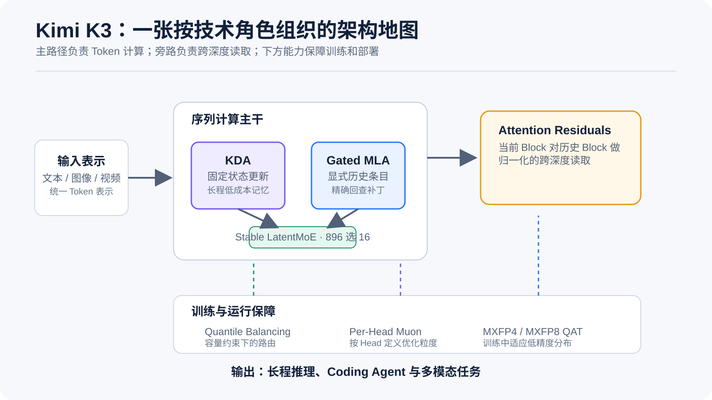
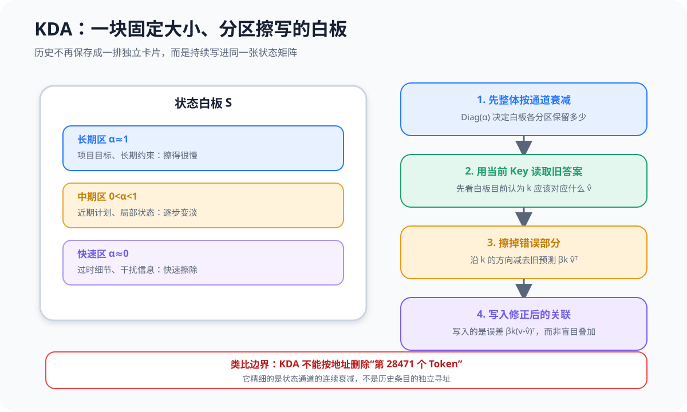
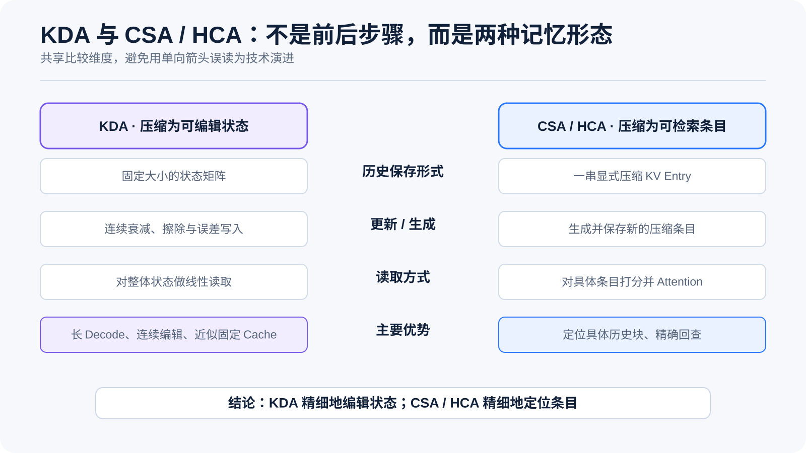
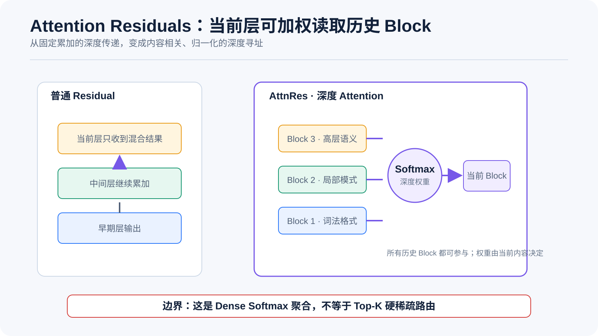
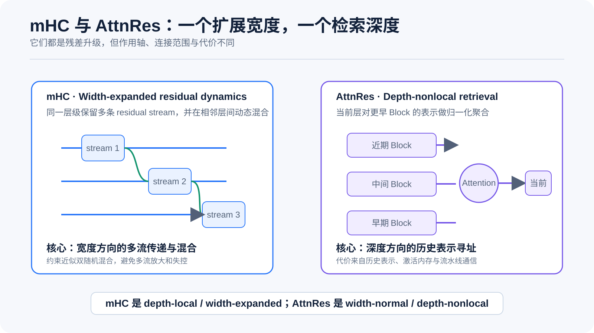
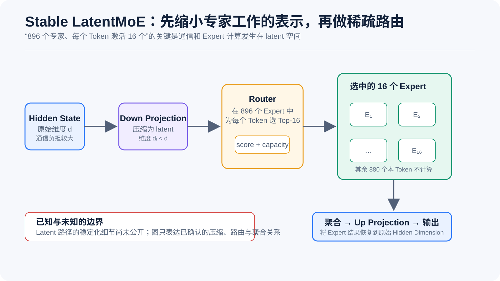
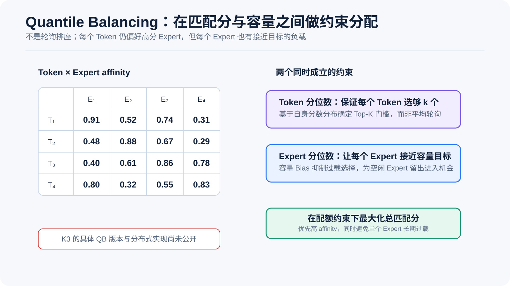
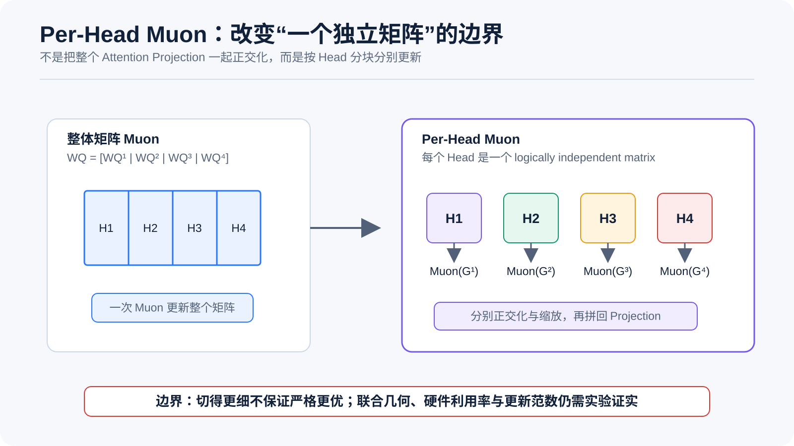

# 🌙 Kimi K3 已披露技术导读：从 KDA 到 2.8T 超稀疏 MoE

## K3 与 DeepSeek V4 在同一组规模化问题上的不同解法

| 规模化问题 | Kimi K3 | DeepSeek V4 | 核心差异 |
|---|---|---|---|
| 1M 上下文成本 | KDA + Gated MLA | CSA + HCA + Sliding Window | 固定大小递归状态 vs 显式压缩 KV 条目 |
| 深层信息流 | Attention Residuals | mHC | 沿深度跨层检索 vs 沿宽度扩展多条残差流 |
| MoE 负载均衡 | Quantile Balancing | Dynamic Bias + 轻量序列均衡损失 | 分位数近似约束分配 vs 固定步长反馈控制 |
| Muon 扩展 | Per-Head Muon | 逻辑矩阵级 Muon + Hybrid Newton-Schulz | 改变优化粒度 vs 改进求解与分布式实现 |
| 激活控制 | SiTU，细节未披露 | SwiGLU Clamping | 当前只能确认目标可能相近 |
| FP4 部署 | 从 SFT 开始 MXFP4 / MXFP8 QAT | 后训练阶段 FP4 QAT | 思路高度一致，覆盖范围尚不同 |



这张图把 K3 类比为一座面向长程任务的智能园区：

- **KDA 白板室**负责持续更新固定大小的状态；
- **Gated MLA 档案室**保留能够精确回查的历史条目；
- **Stable LatentMoE 专家工坊**在 latent 空间组织大量专家；
- **Attention Residuals 跨层电梯**允许当前层直接读取早期层；
- **Quantile Balancing、Per-Head Muon 和 QAT**属于保证园区高效稳定运行的基础设施。

> 类比边界：真实 K3 仍然是重复堆叠的神经网络层，不存在物理意义上的白板、档案柜或电梯。

---

# 一、K3 当前已经确认的基本规格

| 项目 | Kimi K3 当前披露值 |
|---|---|
| 总参数量 | **2.8T** |
| 模型类型 | 超稀疏 MoE |
| Routed Expert 总数 | **896** |
| 每个 Token 激活 Expert | **16** |
| 上下文长度 | **1M Token** |
| 注意力主体 | KDA + Gated MLA |
| 深度连接 | Attention Residuals |
| MoE 结构 | Stable LatentMoE |
| 负载均衡 | Quantile Balancing |
| 优化器扩展 | Per-Head Muon |
| 量化训练 | 从 SFT 开始，MXFP4 权重 + MXFP8 激活 |
| 模态 | 文本、图像和视频理解 |
| 推荐部署 | 64 张或更多加速卡组成的高带宽 Supernode |

---

# 二、KDA：把不断增长的历史列表改成固定大小的可编辑状态

> 前置知识：Attention、KV Cache、线性注意力、递归状态。

普通 Attention 会保存每个历史 Token 的 K / V。历史越长，KV Cache 越大；但优势是每个历史位置仍有独立地址，可以被 Query 精确访问。

KDA 采用另一种思路：不在 KDA 层保存完整历史列表，而是维护固定大小的状态矩阵 \(S_t\)。



## 2.1 KDA 的四个动作

1. **按通道遗忘**：不同状态通道乘以不同的 alpha，也就是把不同通道的信息以不同的速度进行遗忘；
2. **读取旧预测**：先判断当前记忆认为这个 Key 对应什么 Value；
3. **擦除错误关联**：沿当前 Key 的方向减去旧预测；
4. **写入误差修正**：将关联预测残差修正后的结果写回，而不是盲目叠加新 Value。

读取旧预测 -> 擦除错误记忆（严格来说是关联预测残差） -> 修正记忆的这个过程，可以非常粗略的理解为：模型一边推理，一边在对自己做compaction，这里的compaction不再是压缩context window，而是不断的折叠处理自己的 KV Cache，使其不再是一个线性膨胀的过程

## 2.2 “精细遗忘”具体精细在哪里

KDA 将遗忘率从一个标量扩展成逐通道向量，因此不同通道可以拥有不同的时间尺度：

| 通道状态 | 可能的 alpha | 直观含义 |
|---|---|---|
| 长期约束 | 接近 1 | 缓慢遗忘 |
| 近期计划 | 中间值 | 逐步衰减 |
| 过时细节 | 接近 0 | 快速清除 |

但需要特别注意：

> **KDA 精细的是 State Channel 级连续衰减，不是 Token 地址级删除。**

多个历史 Token 一旦叠加进状态矩阵，就不再具有完全独立的地址。因此它仍存在固定状态容量和记忆干扰问题。

## 2.3 为什么 K3 仍保留 Gated MLA

如果纯 KDA 能够无损保存和检索全部历史，就没有必要插入 MLA。但 KDA 这个过程显然不是无损的，也不能直接逆向得到原始的KV

Kimi Linear 的公开实验采用 KDA 和 MLA 混合结构。KDA 负责低成本持续更新，MLA 则提供少量精确全局检索通道。

| 机制 | 更擅长什么 |
|---|---|
| KDA | 固定状态、长输出、连续遗忘与覆盖 |
| Gated MLA | 精确回查、保留独立历史位置、缓解有限状态干扰 |

K3 的具体 KDA / MLA 层比例目前尚未披露，但已知之前 Kimi Linear 是 3 层 KDA + 1 层 MLA。

---

# 三、KDA 与 DeepSeek V4 CSA / HCA：目标相同，记忆形态不同

K3 与 V4 都试图避免在 1M 上下文中，每层、每步都完整处理全部历史。



## 3.1 KDA：历史压进状态，再持续修改

KDA 将历史叠加进固定大小状态：

```text
历史 Token 流
  → 递归衰减 / 擦除 / 写入
  → 固定大小状态矩阵
  → Query 线性读取
```

它更像一块持续擦写的白板，重点是**如何编辑压缩后的记忆**，但整个信息也就是在这一块白板上了，不会出现随着板书越来越多不停的加白板的情况。

## 3.2 CSA：中等压缩后做稀疏检索

DeepSeek V4 的 CSA 保留一串显式压缩 KV Entry。Lightning Indexer 根据当前 Query 选择 Top-K 条目，再执行 Attention。

它仍然保留历史地址，只是：

- 多个原始 Token 被压缩为较少条目；
- 每个 Query 只访问其中部分条目；
- 最近的原始 Token 由 Sliding Window 补足。

## 3.3 HCA：高度压缩后全局读取

HCA 使用更高压缩率，将长历史变成少量粗粒度条目，然后对这些条目执行 Dense Attention。

它更像长期档案摘要层。

## 3.4 两种路线的准确比较

| 维度 | KDA | CSA / HCA |
|---|---|---|
| 历史保存形式 | 固定大小状态矩阵 | 显式压缩 KV 条目 |
| 状态更新 | 连续衰减、擦除、写入 | 生成和保存新的压缩 Entry |
| 检索方式 | 对整体状态做线性读取 | 对具体条目打分和 Attention |
| 历史是否可寻址 | 较弱 | 较强 |
| Cache 增长 | KDA 层近似固定 | 仍随上下文增长，但更慢 |
| 主要优势 | 长 Decode、持续编辑 | 精确定位历史块 |

最简洁的总结是：

```text
KDA：Compress into state, then update.
CSA/HCA：Compress into entries, then retrieve.
```

因此不能简单说 KDA 全面“更精细”：

- KDA 在**状态编辑**上更精细；
- CSA 在**历史定位**上更精细。

---

# 四、Attention Residuals：把深度方向也变成可检索对象

普通 PreNorm Transformer 基本可认为等价于将前面所有层的输出按固定权重不断累加。

这种结构稳定，但在极深网络中可能带来：

- Hidden State 幅度随深度增长；
- 早期细节被大量后续残差稀释；
- 当前层无法明确重新访问某个早期层；
- 不同层贡献和梯度分布不均。

Attention Residuals 不同在于，他将这种一层一层累加混杂的残差信息，变成一种如同改楼一般的过程，虽然楼是一层一层盖起来的，但仍然能很快找到每一层对应的楼层



## 4.1 这个类比为什么有效

普通 Residual 像混凝土一样一层一层堆积起来，到后期已经分不清某一层的混凝土，而AttnRes 则像是盖楼，给当前楼房一部电梯，使其可以直接读取：

- 早期层的词法和格式细节；
- 中间层的局部模式；
- 近期层的高层语义。

当需要从不同的层，找不同的信息的时候，由于楼层分布明确，又有电梯能直达，可以快速获取需要的层的信息已经融合

## 4.2 Block AttnRes

Full AttnRes 保存全部历史层表示，训练内存和 Pipeline Communication 成本很高。

Block AttnRes 将若干相邻层组成 Block：

- Block 内继续使用普通连接；
- Block 之间做 Attention Residual；
- 减少历史表示数量和跨阶段通信。

## 4.3 AttnRes 不是硬稀疏残差

AttnRes 通常使用 Dense Softmax 加权：

- 没有明确 Top-K；
- 没有 Hard Routing；
- 没有显式 Sparse Mask。

也就是说，虽然在类比上，我们可以认为这是一个盖楼的过程，虽然都有相关性评分，但最终并没有一个“选最相关的第x,y,z层的残差出来”的过程，而是各层根据相关性分配权重

---

# 五、AttnRes 与 DeepSeek V4 mHC：残差系统的两个不同轴



| | DeepSeek V4 mHC | Kimi K3 AttnRes |
|---|---|---|
| 操作方向 | Residual Stream 宽度 | 网络深度 |
| 连接范围 | 相邻层之间递推 | 当前层访问更早层 / Block |
| 核心能力 | 多条状态流动态混合 | 历史深度表示选择性聚合 |
| 稳定手段 | 近似双随机矩阵 | Softmax 归一化 |
| 主要风险 | 混合矩阵连乘导致发散 | 历史表示带来内存和通信成本 |

两者理论上可以组合，但会叠加状态组织、Activation Memory 和 Pipeline Communication 的复杂度。

从粗略和方便理解的角度上说，个人理解 AttnRes 实际上思路和 DS V4 的 CSA + HCA + sliding windows 有精神上的相似之处，不同在于一个的对象是Attention块，一个是残差块

---

# 六、Stable LatentMoE：为什么可以组织 896 个 Expert

标准 MoE 通常将完整 Hidden State 发送到各个 Expert。激活 Expert 越多，All-to-All 通信、权重读取和 Expert FFN 成本越高。

LatentMoE 的核心是：

```text
原始 Hidden State
  → Down Projection
  → 较小 Latent State
  → Router / Expert 计算与通信
  → 聚合
  → Up Projection
  → 回到原始 Hidden Dimension
```



这个设计不是简单地“少算几个专家”，而是先缩小专家计算和通信使用的表示维度。

节省出的预算可以用于：

- 增加 Expert 总数；
- 增加每个 Token 激活的 Expert 数；
- 扩大 Expert 组合空间；
- 在可控通信成本下提升模型容量。

这解释了 K3 为什么能采用 **896 Expert、Top-16** 的极高稀疏结构。

---

# 七、Quantile Balancing：从固定步长反馈转向分位数约束分配

## 7.1 DeepSeek Dynamic Bias

DeepSeek 的无辅助损失路由可以简化为：

- Expert 过载时降低权重；
- Expert 欠载时提高权重；
- 每次调整一个固定步长。

这像一个反馈控制器：看上一批结果，再把 Bias 调一点。

它的优点是成本低，但步长太小会纠偏慢，太大则可能震荡。

## 7.2 Quantile Balancing 的目标

QB 将路由写成约束分配问题：即：

1. 每个 Token 必须选够 k 个 Expert；
2. 每个 Expert 接收的 Token 数接近容量目标；
3. 在均衡约束下，让总匹配分尽量高。



QB 并不是轮询或平均硬分摊，而是：

> **把每个 Token 尽量分给最匹配、同时尚未超载的 Expert。**

## 7.3 与 DeepSeek 方案的联系

| | DeepSeek Dynamic Bias | Quantile Balancing |
|---|---|---|
| 视角 | 在线反馈控制 | 约束最优分配 / 对偶更新 |
| 调整依据 | 上一批实际负载 | Router Score 分位数 |
| 更新幅度 | 固定步长 | 根据当前分布估计 |
| 是否需要 Update Speed | 需要 | 原始 QB 不需要 |
| 计算成本 | 较低 | 需要 Quantile / Selection |

从数学上，可以把 Dynamic Bias 看作 QB 对偶目标的一种低成本、固定步长近似。

K3 使用的是原始 QB、Moving QB，还是面向 896 Expert 的分布式改进版本，目前尚未披露。

---

# 八、Per-Head Muon：改变“什么算一个独立矩阵”

多个 Attention Head 往往拼接在一个大矩阵中，如果对整个矩阵做一次 Muon，所有 Head 会共享同一次矩阵正交化和奇异值结构。

Per-Head Muon 则是把这个大矩阵，切分成多个所谓“逻辑上独立”的矩阵，多个矩阵各自并行计算



## 8.1 与 DeepSeek V4 Muon 的区别

DeepSeek V4 的重点是：

- 对每个 Logically Independent Weight 应用 Muon；
- 使用 Hybrid Newton-Schulz；
- 批量处理相同 Shape 的矩阵；
- 矩阵级分配到不同 Rank；
- 在万亿参数 MoE 上组织优化器状态和通信。

K3 Per-Head Muon 的重点则是：

> **Attention Projection 内部的每个 Head，是否应该被视为独立的逻辑矩阵。**

因此两者可以组合：先按 Head 切分，再使用 V4 式 Batched Hybrid Newton-Schulz 和分布式矩阵分配。

---

# 九、从 SFT 开始进行 MXFP4 / MXFP8 QAT

## 9.1 PTQ 与 QAT 的差别

普通 PTQ 类似：

```text
训练阶段一直使用高精度
  → 训练完成
  → 发布前突然量化为 FP4
```

QAT 则是：

```text
优化器保留高精度 Master Weight
  → Forward 模拟未来的低精度权重和激活
  → SFT / RL 持续适应量化误差
  → 线上策略更接近训练阶段看到的策略
```

## 9.2 K3 与 V4 的共同思路

| | Kimi K3 | DeepSeek V4 |
|---|---|---|
| 开始阶段 | 从 SFT 开始 | Post-Training QAT |
| 权重格式 | MXFP4 | 重点覆盖 Expert Weight |
| 激活格式 | MXFP8 | Indexer QK 等关键路径低精度化 |
| 目标 | 整体部署和广泛硬件适配 | Expert GEMM、Indexer 和线上 Rollout 一致性 |

共同思想是：

> **部署数值格式已经成为模型后训练分布的一部分。**

K3 尚未说明 KDA State、Gated MLA KV、AttnRes 历史表示和 RL Rollout 的具体精度格式。

---

# 十、K3 与 DeepSeek V4 的完整对照

| 技术轴 | Kimi K3 | DeepSeek V4 | 当前判断 |
|---|---|---|---|
| 总参数 | 2.8T | Pro 1.6T；Flash 284B | K3 总容量更大 |
| 激活参数 | 未披露 | Pro 49B；Flash 13B | 暂时无法严格比较计算量 |
| Expert | 896，激活 16 | DeepSeekMoE | K3 更强调极高 Expert 组合空间 |
| Attention | KDA + Gated MLA | CSA / HCA + Sliding Window | 状态式记忆 vs 条目式分层记忆 |
| Cache | KDA 固定状态 + MLA KV | 压缩 KV 持续增长 | KDA 对长 Decode 潜力更强 |
| 精确检索 | MLA 补足 | CSA 显式 Top-K Entry | V4 更容易定位具体历史块 |
| 残差 | AttnRes | mHC | 深度寻址 vs 宽度多流稳定传递 |
| MoE 结构 | Stable LatentMoE | 细粒度 Routed + Shared Expert | K3 更强调 latent 空间计算 |
| 负载均衡 | Quantile Balancing | Dynamic Bias + Sequence Loss | QB 数学目标更直接，成本也更高 |
| Muon | Per-Head Muon | Hybrid NS + 分布式 Muon | 粒度创新 vs 求解和工程创新 |
| 低精度 | SFT 起 MXFP4 / MXFP8 QAT | Post-Training FP4 QAT | 路线高度趋同 |

---

# 十一、最终判断：趋同问题，不同世界观

K3 与 V4 已经明显趋同于同一组结论：

- 1M Context 不能继续完全依赖全量 Attention；
- 普通 Residual Connection 在超深模型中需要升级；
- 超大 MoE 的均衡不能只靠强 Auxiliary Loss；
- Muon 必须重新定义矩阵粒度并适配分布式训练；
- FP4 必须进入 SFT / RL 分布，而不是最后再压缩；
- Cache、通信拓扑和 Kernel 是模型架构的一部分。

但两者的技术性格不同。

## DeepSeek V4：显式分层存储与检索

```text
近期细节：Sliding Window
中期历史：CSA 压缩后 Top-K 检索
长期历史：HCA 高压缩后全局读取
残差状态：mHC 多流局部递推
```

它更像一套层级存储系统：历史条目仍然存在，只是被压缩、分层和有选择地访问。

## Kimi K3：状态化记忆与跨深度寻址

```text
序列维度：KDA 将历史压进可编辑状态
精确补丁：Gated MLA 保留全局回查
深度维度：AttnRes 对历史层表示做 Attention
专家维度：LatentMoE 扩大专家组合空间
路由维度：Quantile Balancing 逼近平衡约束分配
```

最简洁的总结是：

> **DeepSeek V4 在显式 KV 世界中做压缩、索引和稳定传递；Kimi K3 则进一步把序列记忆和深度记忆状态化、注意力化。**

---

## 免责声明

- 本文基于 K3 发布日公开博客和相关前序论文，不是 K3 Technical Report 的替代品。
- KDA 与 AttnRes 的原理可以从论文确认；Stable LatentMoE、Quantile Balancing、Per-Head Muon、SiTU 和 Gated MLA 在 K3 中的实际配置仍可能不同。
- 插图用于帮助建立正确直觉，不对应模型中的真实物理组件和精确张量布局。
- 后续应以 K3 Technical Report、配置文件、权重和公开实现为准。
