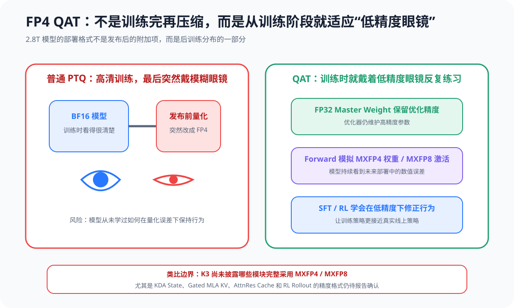

# 🌙 Kimi K3 已披露技术导读：从 KDA 到 2.8T 超稀疏 MoE

> 本文是 [《第 2 章 Architecture：DeepSeek V4 的算法设计》](./01-%E7%AC%AC%E4%BA%8C%E7%AB%A0%20Architecture.md) 的扩展对照阅读。
>
> 截至 **2026 年 7 月 17 日**，Kimi K3 已公开发布并提供 API，但完整模型权重和 Technical Report 尚未公开。因此，本文严格区分：
>
> - ✅ **官方确认**：来自 Kimi K3 发布博客；
> - 📄 **前序论文可确认**：来自 Kimi Linear、Attention Residuals、LatentMoE、Quantile Balancing 等公开资料；
> - ⚠️ **仍待确认**：K3 的具体参数和实现细节尚未披露。
>
> 文中的插图采用“技术结构 + 工程类比”的方式帮助理解。每张图都会说明类比边界，避免把类比当成真实算法实现。

---

## 🧭 先给结论：K3 与 DeepSeek V4 正在解决同一组规模化问题

Kimi K3 的核心新闻并不只是 **2.8T 总参数量**。它围绕超长上下文、超深网络、超稀疏 MoE、优化器和低精度部署，形成了一套比较统一的技术路线。

| 规模化问题 | Kimi K3 | DeepSeek V4 | 核心差异 |
|---|---|---|---|
| 1M 上下文成本 | KDA + Gated MLA | CSA + HCA + Sliding Window | 固定大小递归状态 vs 显式压缩 KV 条目 |
| 深层信息流 | Attention Residuals | mHC | 沿深度跨层检索 vs 沿宽度扩展多条残差流 |
| MoE 负载均衡 | Quantile Balancing | Dynamic Bias + 轻量序列均衡损失 | 分位数近似约束分配 vs 固定步长反馈控制 |
| Muon 扩展 | Per-Head Muon | 逻辑矩阵级 Muon + Hybrid Newton-Schulz | 改变优化粒度 vs 改进求解与分布式实现 |
| 激活控制 | SiTU，细节未披露 | SwiGLU Clamping | 当前只能确认目标可能相近 |
| FP4 部署 | 从 SFT 开始 MXFP4 / MXFP8 QAT | 后训练阶段 FP4 QAT | 思路高度一致，覆盖范围尚不同 |


这张图把 K3 类比为一座面向长程任务的智能园区：

- **KDA 白板室**负责持续更新固定大小的状态；
- **Gated MLA 档案室**保留能够精确回查的历史条目；
- **Stable LatentMoE 专家工坊**在 latent 空间组织大量专家；
- **Attention Residuals 跨层电梯**允许当前层直接读取早期层；
- **Quantile Balancing、Per-Head Muon 和 QAT**属于保证园区高效稳定运行的基础设施。

> 类比边界：真实 K3 仍然是重复堆叠的神经网络层，不存在物理意义上的白板、档案柜或电梯。

---

# 一、K3 当前已经确认的基本规格

| 项目 | Kimi K3 当前披露值 |
|---|---|
| 总参数量 | **2.8T** |
| 模型类型 | 超稀疏 MoE |
| Routed Expert 总数 | **896** |
| 每个 Token 激活 Expert | **16** |
| 上下文长度 | **1M Token** |
| 注意力主体 | KDA + Gated MLA |
| 深度连接 | Attention Residuals |
| MoE 结构 | Stable LatentMoE |
| 负载均衡 | Quantile Balancing |
| 优化器扩展 | Per-Head Muon |
| 量化训练 | 从 SFT 开始，MXFP4 权重 + MXFP8 激活 |
| 模态 | 文本、图像和视频理解 |
| 推荐部署 | 64 张或更多加速卡组成的高带宽 Supernode |

## 1.1 为什么不能直接把 K3 说成“50B 激活参数”

一个很自然的粗算是：

\[
2.8T \times \frac{16}{896} \approx 50B
\]

但这个数字不能直接当作真实 Activated Parameter Count，因为总参数还包括：

- Attention、Embedding、Norm 等非 Routed Expert 参数；
- 可能存在的 Shared Expert；
- LatentMoE 的 Down / Up Projection；
- Router；
- KDA、Gated MLA、AttnRes 和多模态模块。

准确说法只能是：

> **每个 Token 在 896 个 Routed Expert 中选择 16 个，但真实激活参数量和单 Token FLOPs 尚未披露。**

---

# 二、KDA：把不断增长的历史列表改成固定大小的可编辑状态

> 前置知识：Attention、KV Cache、线性注意力、递归状态。

普通 Attention 会保存每个历史 Token 的 K / V。历史越长，KV Cache 越大；但优势是每个历史位置仍有独立地址，可以被 Query 精确访问。

KDA 采用另一种思路：不在 KDA 层保存完整历史列表，而是维护固定大小的状态矩阵 \(S_t\)。

其递推形式可以写为：

\[
S_t =
\left(I - \beta_t k_tk_t^\top\right)
\operatorname{Diag}(\alpha_t)S_{t-1}
+ \beta_tk_tv_t^\top
\]

读取为：

\[
o_t = S_t^\top q_t
\]


## 2.1 KDA 的四个动作

令衰减后的状态为：

\[
S_t^- = \operatorname{Diag}(\alpha_t)S_{t-1}
\]

再读取当前状态对 \(k_t\) 的旧预测：

\[
\hat v_t = {S_t^-}^\top k_t
\]

则更新可以重写为：

\[
S_t = S_t^- + \beta_tk_t(v_t-\hat v_t)^\top
\]

这可以拆成四步：

1. **按通道遗忘**：不同状态通道乘以不同的 \(\alpha\)；
2. **读取旧预测**：先判断当前记忆认为这个 Key 对应什么 Value；
3. **擦除错误关联**：沿当前 Key 的方向减去旧预测；
4. **写入误差修正**：写入 \(v_t-\hat v_t\)，而不是盲目叠加新 Value。

## 2.2 “精细遗忘”具体精细在哪里

KDA 将遗忘率从一个标量扩展成逐通道向量：

\[
\alpha_t=(\alpha_{t,1},\alpha_{t,2},\ldots,\alpha_{t,d_k})
\]

因此不同通道可以拥有不同的时间尺度：

| 通道状态 | 可能的 \(\alpha\) | 直观含义 |
|---|---:|---|
| 长期约束 | 接近 1 | 缓慢遗忘 |
| 近期计划 | 中间值 | 逐步衰减 |
| 过时细节 | 接近 0 | 快速清除 |

但需要特别注意：

> **KDA 精细的是 State Channel 级连续衰减，不是 Token 地址级删除。**

多个历史 Token 一旦叠加进状态矩阵，就不再具有完全独立的地址。因此它仍存在固定状态容量和记忆干扰问题。

## 2.3 为什么 K3 仍保留 Gated MLA

如果纯 KDA 能够无损保存和检索全部历史，就没有必要插入 MLA。

Kimi Linear 的公开实验采用 KDA 和 MLA 混合结构。KDA 负责低成本持续更新，MLA 则提供少量精确全局检索通道。

| 机制 | 更擅长什么 |
|---|---|
| KDA | 固定状态、长输出、连续遗忘与覆盖 |
| Gated MLA | 精确回查、保留独立历史位置、缓解有限状态干扰 |

K3 的具体 KDA / MLA 层比例仍待 Technical Report 确认。

---

# 三、KDA 与 DeepSeek V4 CSA / HCA：目标相同，记忆形态不同

K3 与 V4 都试图避免在 1M 上下文中，每层、每步都完整处理全部历史。


## 3.1 KDA：历史压进状态，再持续修改

KDA 将历史叠加进固定大小状态：

```text
历史 Token 流
  → 递归衰减 / 擦除 / 写入
  → 固定大小状态矩阵
  → Query 线性读取
```

它更像一块持续擦写的白板，重点是**如何编辑压缩后的记忆**。

## 3.2 CSA：中等压缩后做稀疏检索

DeepSeek V4 的 CSA 保留一串显式压缩 KV Entry。Lightning Indexer 根据当前 Query 选择 Top-K 条目，再执行 Attention。

它仍然保留历史地址，只是：

- 多个原始 Token 被压缩为较少条目；
- 每个 Query 只访问其中部分条目；
- 最近的原始 Token 由 Sliding Window 补足。

## 3.3 HCA：高度压缩后全局读取

HCA 使用更高压缩率，将长历史变成少量粗粒度条目，然后对这些条目执行 Dense Attention。

它更像长期档案摘要层。

## 3.4 两种路线的准确比较

| 维度 | KDA | CSA / HCA |
|---|---|---|
| 历史保存形式 | 固定大小状态矩阵 | 显式压缩 KV 条目 |
| 状态更新 | 连续衰减、擦除、写入 | 生成和保存新的压缩 Entry |
| 检索方式 | 对整体状态做线性读取 | 对具体条目打分和 Attention |
| 历史是否可寻址 | 较弱 | 较强 |
| Cache 增长 | KDA 层近似固定 | 仍随上下文增长，但更慢 |
| 主要优势 | 长 Decode、持续编辑 | 精确定位历史块 |

最简洁的总结是：

```text
KDA：Compress into state, then update.
CSA/HCA：Compress into entries, then retrieve.
```

因此不能简单说 KDA 全面“更精细”：

- KDA 在**状态编辑**上更精细；
- CSA 在**历史定位**上更精细。

---

# 四、Attention Residuals：把深度方向也变成可检索对象

普通 PreNorm Transformer 可以展开为：

\[
h_l=h_0+\sum_{i<l}F_i(h_i)
\]

它等价于将前面所有层输出按固定权重不断累加。

这种结构稳定，但在极深网络中可能带来：

- Hidden State 幅度随深度增长；
- 早期细节被大量后续残差稀释；
- 当前层无法明确重新访问某个早期层；
- 不同层贡献和梯度分布不均。

Attention Residuals 将其改为：

\[
h_l=\sum_{i<l}\alpha_{i\rightarrow l}v_i
\]

其中 \(\alpha\) 由深度方向的 Softmax Attention 得到。


## 4.1 这个类比为什么有效

普通 Residual 像每层接收一个一路传上来的公共箱子；箱子里已经混合了之前所有层的结果。

AttnRes 则像给当前层一部电梯，使其可以直接读取：

- 早期层的词法和格式细节；
- 中间层的局部模式；
- 近期层的高层语义。

## 4.2 Block AttnRes

Full AttnRes 保存全部历史层表示，训练内存和 Pipeline Communication 成本很高。

Block AttnRes 将若干相邻层组成 Block：

- Block 内继续使用普通连接；
- Block 之间做 Attention Residual；
- 减少历史表示数量和跨阶段通信。

## 4.3 AttnRes 不是硬稀疏残差

AttnRes 通常使用 Dense Softmax 加权：

- 没有明确 Top-K；
- 没有 Hard Routing；
- 没有显式 Sparse Mask。

所以更准确的表述是：

> **它将深度方向的固定均匀累加，改成内容相关的归一化寻址。**

---

# 五、AttnRes 与 DeepSeek V4 mHC：残差系统的两个不同轴


| | DeepSeek V4 mHC | Kimi K3 AttnRes |
|---|---|---|
| 操作方向 | Residual Stream 宽度 | 网络深度 |
| 连接范围 | 相邻层之间递推 | 当前层访问更早层 / Block |
| 核心能力 | 多条状态流动态混合 | 历史深度表示选择性聚合 |
| 稳定手段 | 近似双随机矩阵 | Softmax 归一化 |
| 主要风险 | 混合矩阵连乘导致发散 | 历史表示带来内存和通信成本 |

mHC 可以抽象成：

\[
X_{l+1}=B_lX_l+C_lF_l(A_lX_l)
\]

其中 \(X_l\) 包含多条 Residual Stream，\(B_l\) 通过 Sinkhorn 约束为近似双随机矩阵。

因此：

> **mHC 是 Depth-local、Width-expanded Residual Dynamics。**
>
> **AttnRes 是 Width-normal、Depth-nonlocal Residual Retrieval。**

两者理论上可以组合，但会叠加状态组织、Activation Memory 和 Pipeline Communication 的复杂度。

---

# 六、Stable LatentMoE：为什么可以组织 896 个 Expert

标准 MoE 通常将完整 Hidden State 发送到各个 Expert。激活 Expert 越多，All-to-All 通信、权重读取和 Expert FFN 成本越高。

LatentMoE 的核心是：

```text
原始 Hidden State
  → Down Projection
  → 较小 Latent State
  → Router / Expert 计算与通信
  → 聚合
  → Up Projection
  → 回到原始 Hidden Dimension
```


这个设计不是简单地“少算几个专家”，而是先缩小专家计算和通信使用的表示维度。

节省出的预算可以用于：

- 增加 Expert 总数；
- 增加每个 Token 激活的 Expert 数；
- 扩大 Expert 组合空间；
- 在可控通信成本下提升模型容量。

这解释了 K3 为什么能采用 **896 Expert、Top-16** 的极高稀疏结构。

## 6.1 Stable 具体稳定了什么仍未知

K3 官方称其为 **Stable LatentMoE**，但尚未说明 Stable 指的是：

- 初始化；
- 归一化；
- Router；
- Expert 输出尺度；
- 优化器；
- 通信和 Static Shape；
- 还是多项联合改进。

因此只能确认 LatentMoE 的整体动机，不能将公开论文的全部配置直接等同于 K3。

---

# 七、Quantile Balancing：从固定步长反馈转向分位数约束分配

## 7.1 DeepSeek Dynamic Bias

DeepSeek 的无辅助损失路由可以简化为：

\[
e\in\operatorname{TopK}(s_{t,e}+b_e)
\]

- Expert 过载时降低 \(b_e\)；
- Expert 欠载时提高 \(b_e\)；
- 每次调整一个固定步长 \(\gamma\)。

这像一个反馈控制器：看上一批结果，再把 Bias 调一点。

它的优点是成本低，但步长太小会纠偏慢，太大则可能震荡。

## 7.2 Quantile Balancing 的目标

QB 将路由写成约束分配问题：

\[
\max_{x_{i,e}\in\{0,1\}}\sum_{i,e}x_{i,e}s_{i,e}
\]

约束：

\[
\sum_e x_{i,e}=k
\]

\[
\sum_i x_{i,e}\approx\frac{mk}{n}
\]

即：

1. 每个 Token 必须选够 \(k\) 个 Expert；
2. 每个 Expert 接收的 Token 数接近容量目标；
3. 在均衡约束下，让总匹配分尽量高。


QB 并不是轮询或平均硬分摊，而是：

> **把每个 Token 尽量分给最匹配、同时尚未超载的 Expert。**

## 7.3 与 DeepSeek 方案的联系

| | DeepSeek Dynamic Bias | Quantile Balancing |
|---|---|---|
| 视角 | 在线反馈控制 | 约束最优分配 / 对偶更新 |
| 调整依据 | 上一批实际负载 | Router Score 分位数 |
| 更新幅度 | 固定步长 | 根据当前分布估计 |
| 是否需要 Update Speed | 需要 | 原始 QB 不需要 |
| 计算成本 | 较低 | 需要 Quantile / Selection |

从数学上，可以把 Dynamic Bias 看作 QB 对偶目标的一种低成本、固定步长近似。

K3 使用的是原始 QB、Moving QB，还是面向 896 Expert 的分布式改进版本，目前尚未披露。

---

# 八、Per-Head Muon：改变“什么算一个独立矩阵”

多个 Attention Head 往往拼接在一个大 Projection Matrix 中：

\[
W_Q=[W_Q^{(1)},W_Q^{(2)},\ldots,W_Q^{(H)}]
\]

如果对整个矩阵做一次 Muon，所有 Head 会共享同一次矩阵正交化和奇异值结构。

Per-Head Muon 则分别执行：

\[
\operatorname{Muon}(G_Q^{(1)}),
\operatorname{Muon}(G_Q^{(2)}),\ldots,
\operatorname{Muon}(G_Q^{(H)})
\]


## 8.1 与 DeepSeek V4 Muon 的区别

DeepSeek V4 的重点是：

- 对每个 Logically Independent Weight 应用 Muon；
- 使用 Hybrid Newton-Schulz；
- 批量处理相同 Shape 的矩阵；
- 矩阵级分配到不同 Rank；
- 在万亿参数 MoE 上组织优化器状态和通信。

K3 Per-Head Muon 的重点则是：

> **Attention Projection 内部的每个 Head，是否应该被视为独立的逻辑矩阵。**

因此两者可以组合：先按 Head 切分，再使用 V4 式 Batched Hybrid Newton-Schulz 和分布式矩阵分配。

## 8.2 Per-Head 不一定严格更优

拆得更细会带来独立 Whitening 的好处，但也可能：

- 丢失 Head 之间的联合几何信息；
- 增加整体更新范数；
- 降低小矩阵的硬件利用率；
- 改变优化曲率。

因此仍需 K3 Technical Report 的消融实验。

---

# 九、SiTU 与 Gated MLA：当前最应克制推测的两项

## 9.1 SiTU

官方目前只确认：

- 名称为 **Sigmoid Tanh Unit**；
- 目标是改善 Activation Control。

尚未披露：

- 准确公式；
- 是否替换 SwiGLU；
- 是否为双分支 Gate；
- 位于 Expert FFN、KDA、Attention 还是其他路径；
- 是否主要解决异常激活和 Loss Spike。

因此当前不能简单将 SiTU 等同于 DeepSeek V4 的 SwiGLU Clamping。

V4 报告中提出的“无 Exp、无 Division 的低成本激活”也只是未来硬件建议；而 Sigmoid / Tanh 本身通常涉及超越函数，两者甚至未必同方向。

## 9.2 Gated MLA

官方只说明 Gated MLA 用于提高 Attention Selectivity，但 Gate 可能作用于：

- Query；
- KV Latent；
- Head；
- Token；
- Attention Output；
- 或 KDA / MLA 路径选择。

这些都需要等待正式报告。

---

# 十、从 SFT 开始进行 MXFP4 / MXFP8 QAT

2.8T 参数按纯 4 Bit 裸权重估算也约为：

\[
2.8\times10^{12}\times0.5\text{ Byte}\approx1.4\text{ TB}
\]

这还不包括 Scale、Activation、KDA State、MLA KV Cache、AttnRes Cache、通信 Buffer 和运行时冗余。

因此低精度不是发布后的附加压缩，而是部署成立的前提。



## 10.1 PTQ 与 QAT 的差别

普通 PTQ 类似：

```text
训练阶段一直使用高精度
  → 训练完成
  → 发布前突然量化为 FP4
```

QAT 则是：

```text
优化器保留高精度 Master Weight
  → Forward 模拟未来的低精度权重和激活
  → SFT / RL 持续适应量化误差
  → 线上策略更接近训练阶段看到的策略
```

## 10.2 K3 与 V4 的共同思路

| | Kimi K3 | DeepSeek V4 |
|---|---|---|
| 开始阶段 | 从 SFT 开始 | Post-Training QAT |
| 权重格式 | MXFP4 | 重点覆盖 Expert Weight |
| 激活格式 | MXFP8 | Indexer QK 等关键路径低精度化 |
| 目标 | 整体部署和广泛硬件适配 | Expert GEMM、Indexer 和线上 Rollout 一致性 |

共同思想是：

> **部署数值格式已经成为模型后训练分布的一部分。**

K3 尚未说明 KDA State、Gated MLA KV、AttnRes 历史表示和 RL Rollout 的具体精度格式。

---

# 十一、KDA Prefix Cache 与服务系统

线性注意力并不意味着传统 Prefix Cache 可以直接照搬。

KDA 状态满足：

\[
S_t=f(S_{t-1},x_t)
\]

服务系统需要考虑：

- 每个 KDA Layer 的状态布局；
- Chunk Boundary；
- 与 Gated MLA KV Cache 的混合；
- 多请求 Prefix 匹配；
- State Quantization；
- Prefill / Decode 分离；
- Cache Eviction。

K3 官方表示会提供相应的 vLLM KDA Prefill Cache 实现。

这说明：

> **模型结构、Cache 格式和推理调度已经不能被视为三个独立问题。**

---

# 十二、K3 与 DeepSeek V4 的完整对照

| 技术轴 | Kimi K3 | DeepSeek V4 | 当前判断 |
|---|---|---|---|
| 总参数 | 2.8T | Pro 1.6T；Flash 284B | K3 总容量更大 |
| 激活参数 | 未披露 | Pro 49B；Flash 13B | 暂时无法严格比较计算量 |
| Expert | 896，激活 16 | DeepSeekMoE | K3 更强调极高 Expert 组合空间 |
| Attention | KDA + Gated MLA | CSA / HCA + Sliding Window | 状态式记忆 vs 条目式分层记忆 |
| Cache | KDA 固定状态 + MLA KV | 压缩 KV 持续增长 | KDA 对长 Decode 潜力更强 |
| 精确检索 | MLA 补足 | CSA 显式 Top-K Entry | V4 更容易定位具体历史块 |
| 残差 | AttnRes | mHC | 深度寻址 vs 宽度多流稳定传递 |
| MoE 结构 | Stable LatentMoE | 细粒度 Routed + Shared Expert | K3 更强调 latent 空间计算 |
| 负载均衡 | Quantile Balancing | Dynamic Bias + Sequence Loss | QB 数学目标更直接，成本也更高 |
| Muon | Per-Head Muon | Hybrid NS + 分布式 Muon | 粒度创新 vs 求解和工程创新 |
| 低精度 | SFT 起 MXFP4 / MXFP8 QAT | Post-Training FP4 QAT | 路线高度趋同 |

---

# 十三、当前最关键的未知项

在完整 Technical Report 和模型配置发布之前，以下内容仍不能准确回答：

1. Activated Parameter Count 和单 Token FLOPs；
2. 层数、Hidden Size、Head 数和 KDA State Size；
3. KDA 与 Gated MLA 的真实层比例；
4. Stable LatentMoE 的具体稳定化改动；
5. Latent Dimension 压缩比例；
6. Shared Expert 数量和运行维度；
7. Quantile Balancing 的具体版本和分布式实现；
8. Per-Head Muon 作用于 Q / K / V / O 中哪些矩阵；
9. SiTU 的公式和所在模块；
10. Gated MLA Gate 的准确位置；
11. QAT 覆盖哪些权重和缓存状态；
12. 预训练 Token 数和多模态数据比例；
13. 训练集群、并行策略和训练计算量；
14. 1M Context 下的召回、TTFT、TPOT 和吞吐；
15. Base、Instruct、Thinking Checkpoint 和许可证。

---

# 十四、最终判断：趋同问题，不同世界观

K3 与 V4 已经明显趋同于同一组结论：

- 1M Context 不能继续完全依赖全量 Attention；
- 普通 Residual Connection 在超深模型中需要升级；
- 超大 MoE 的均衡不能只靠强 Auxiliary Loss；
- Muon 必须重新定义矩阵粒度并适配分布式训练；
- FP4 必须进入 SFT / RL 分布，而不是最后再压缩；
- Cache、通信拓扑和 Kernel 是模型架构的一部分。

但两者的技术性格不同。

## DeepSeek V4：显式分层存储与检索

```text
近期细节：Sliding Window
中期历史：CSA 压缩后 Top-K 检索
长期历史：HCA 高压缩后全局读取
残差状态：mHC 多流局部递推
```

它更像一套层级存储系统：历史条目仍然存在，只是被压缩、分层和有选择地访问。

## Kimi K3：状态化记忆与跨深度寻址

```text
序列维度：KDA 将历史压进可编辑状态
精确补丁：Gated MLA 保留全局回查
深度维度：AttnRes 对历史层表示做 Attention
专家维度：LatentMoE 扩大专家组合空间
路由维度：Quantile Balancing 逼近平衡约束分配
```

最简洁的总结是：

> **DeepSeek V4 在显式 KV 世界中做压缩、索引和稳定传递；Kimi K3 则进一步把序列记忆和深度记忆状态化、注意力化。**

---

## 📚 主要资料

### Kimi K3 官方资料

- [Kimi K3: Open Frontier Intelligence](https://www.kimi.com/blog/kimi-k3)

### Kimi 架构前序资料

- [Kimi Linear: An Expressive, Efficient Attention Architecture](https://arxiv.org/abs/2510.26692)
- [MoonshotAI/Kimi-Linear](https://github.com/MoonshotAI/Kimi-Linear)
- [Attention Residuals](https://arxiv.org/abs/2603.15031)
- [Gated DeltaNet-2](https://arxiv.org/abs/2605.22791)
- [LatentMoE](https://arxiv.org/abs/2601.18089)

### MoE 负载均衡

- [MoE 环游记 6：最优分配促均衡](https://www.spaces.ac.cn/archives/11619)
- [MoE 环游记 8：强制序列级均衡](https://www.spaces.ac.cn/archives/11760)

### DeepSeek V4 对照资料

- [DeepSeek V4 Technical Report](https://huggingface.co/deepseek-ai/DeepSeek-V4-Pro/blob/main/DeepSeek_V4.pdf)
- [本仓库：第 2 章 Architecture](./01-%E7%AC%AC%E4%BA%8C%E7%AB%A0%20Architecture.md)
- [本仓库：模型参数配置表与导读的对照关系](./%E6%A8%A1%E5%9E%8B%E5%8F%82%E6%95%B0%E9%85%8D%E7%BD%AE%E8%A1%A8%E4%B8%8E%E5%AF%BC%E8%AF%BB%E7%9A%84%E5%AF%B9%E7%85%A7%E5%85%B3%E7%B3%BB.md)

---

## 免责声明

- 本文基于 K3 发布日公开博客和相关前序论文，不是 K3 Technical Report 的替代品。
- KDA 与 AttnRes 的原理可以从论文确认；Stable LatentMoE、Quantile Balancing、Per-Head Muon、SiTU 和 Gated MLA 在 K3 中的实际配置仍可能不同。
- 插图用于帮助建立正确直觉，不对应模型中的真实物理组件和精确张量布局。
- 后续应以 K3 Technical Report、配置文件、权重和公开实现为准。
