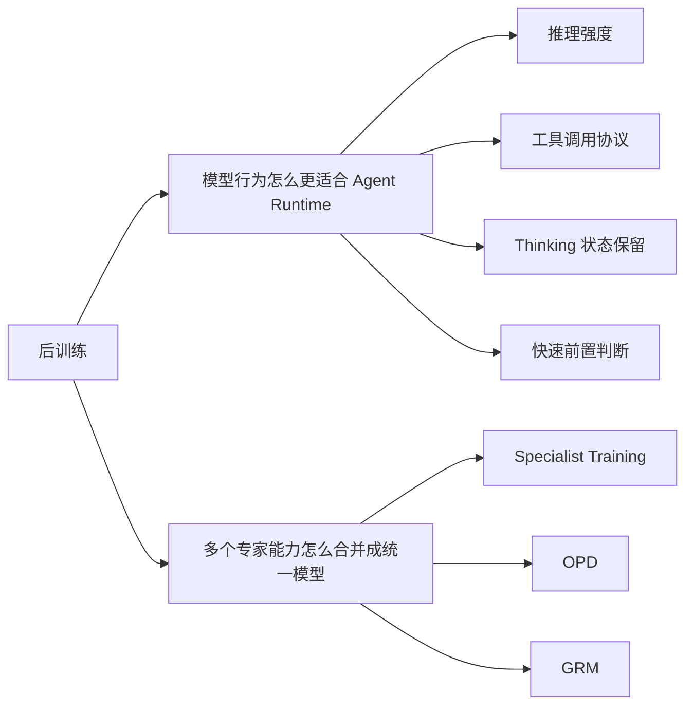

# 第 5 章：Post-Training——从专家训练到 Agent 工程

> 本文件是第五章的局部重构示例，暂不替换正式正文。当前只重构“章节导读 + 5.1 开头 + Reasoning Effort”这一小段，用于确认整体体例是否适合继续推广到全文。

---

## 章节导读

前几章讨论的是：DeepSeek V4 如何在模型结构、GPU 基础设施和预训练阶段，为 **1M context**、**长程推理** 和 **低成本推理** 打基础。

第五章讨论的是另一个问题：这些基础能力如何在后训练阶段变成真正可用的模型行为，尤其是面向 **reasoning、coding、tool use 和 agentic task** 的行为。

我建议把第五章按三条线来读：

| 主线 | 对应内容 | 解决的问题 |
|---|---|---|
| Agent 行为协议线 | Reasoning Effort、Tool Call Schema、Interleaved Thinking、Quick Instruction | 模型如何以更稳定的方式参与 Agent runtime |
| 能力整合线 | Specialist Training、OPD、GRM | 多个专家能力如何合并回统一模型 |
| 后训练基础设施线 | FP4 rollout、Teacher Scheduling、Fault-Tolerant Rollout、Million-Token RL、Sandbox | 这套后训练方案如何在真实分布式系统中跑起来 |

换句话说，第五章不是在单纯讲“RL 策略变了”，而是在讲：

> DeepSeek V4 如何把后训练从一次单一优化过程，升级成 **模型行为协议训练 + 专家能力整合 + 运行时基础设施托底** 的完整系统。

---

# 5.1 Post-Training Pipeline：后训练范式的变化

报告原文的 5.1 组织略微分散。为了更适合 Agent 工程读者理解，我把它拆成两条线：

1. **Agent 行为协议线**：Reasoning Effort、Tool Call Schema、Interleaved Thinking、Quick Instruction。它解释的是：模型如何被训练成更适合参与 Agent runtime。
2. **能力整合线**：Specialist Training、OPD、GRM。它解释的是：DeepSeek 如何避免 mixed RL 中多目标互相拉扯的问题，并把多个专家能力整合回统一模型。

这两条线分别对应两个问题：

---

## 5.1.1 Agent 行为协议线

这一部分是第五章里最值得 Agent 开发者关注的内容。

原因在于，它不只是“模型回答质量”的后训练，而是在训练模型如何参与一个真实 Agent runtime：什么时候深度推理、如何稳定地产生 tool call、工具调用后如何保留 reasoning state，以及一些高频前置判断如何复用已有上下文。

---

## Reasoning Effort：把推理强度变成可控档位

### 问题背景

Agent 任务并不总是需要同一种推理强度。

有些任务只是普通问答，模型应该快速响应；有些任务涉及代码修复、复杂排障、长链路工具调用，模型就需要更高的推理预算。

如果所有任务都按最高推理强度执行，会浪费 token 和延迟；如果所有任务都按低推理强度执行，又很容易在复杂任务里失败。

所以 Reasoning Effort 的核心问题是：

> 如何让模型在不同任务中使用不同推理预算，而不是把所有问题都当成同一种难度？

### 报告做法

DeepSeek V4 对 Flash 和 Pro 两个版本都设置了三档推理强度：

| 档位 | 直观理解 | 适合场景 |
|---|---|---|
| Non-think | 不显式展开推理 | 普通问答、低延迟场景 |
| Think High | 较高强度推理 | 一般复杂任务、需要多步分析的问题 |
| Think Max | 最大强度推理 | 复杂代码、困难数学、长链路 Agent 任务 |

在后训练过程中，DeepSeek 对三种推理强度给予了不同的推理上下文预算，并统一使用 `<think></think>` 包裹推理文本。

对于 Think Max 模式，报告中还展示了一段特殊系统提示词，要求模型彻底分解问题、压力测试逻辑、检查边界情况和替代假设。

### 工程类比

这很像后端系统里的请求分级：

| 后端系统 | 模型推理 |
|---|---|
| 普通查询走轻量路径 | Non-think |
| 中等复杂任务走标准业务逻辑 | Think High |
| 高风险 / 高复杂任务进入重型排查流程 | Think Max |

真正重要的不是“永远开最大档”，而是让系统能根据任务类型选择合适的执行强度。

### 对 Agent 工程的启发

Reasoning Effort 不只是一个模型参数，它会影响整个 Agent runtime 的调度策略。

例如：

- 简单工具调用前，不一定需要开启高推理档。
- 长链路代码修复、线上故障排查、复杂 SQL 分析，可能应该显式使用更高推理档。
- 如果 Agent 框架不能感知任务复杂度，就很难合理选择推理预算。

因此，Reasoning Effort 更像 Agent runtime 的一个执行策略参数，而不只是模型 API 的一个选项。

### 需要谨慎的地方

这里还需要区分不同模型家族的 thinking 暴露方式。

GPT 系列模型的推理内容通常是内化的，不会把原始 Chain of Thought 作为 message 直接吐出。Claude 系列虽然支持 extended thinking / thinking blocks，但也不是无控制地暴露原始 CoT。

相对而言，DeepSeek、Kimi、Qwen 等国内模型更常见的是显式输出 reasoning 内容。这会带来后续 Agent 框架兼容问题：

> 当 reasoning content 不再只是“模型自己的思考”，而是进入上下文拼接、工具调用和多轮状态管理时，Agent runtime 就必须决定如何保存、裁剪、回传和恢复这些 reasoning state。

这也为后面的 Interleaved Thinking 问题埋下伏笔。
