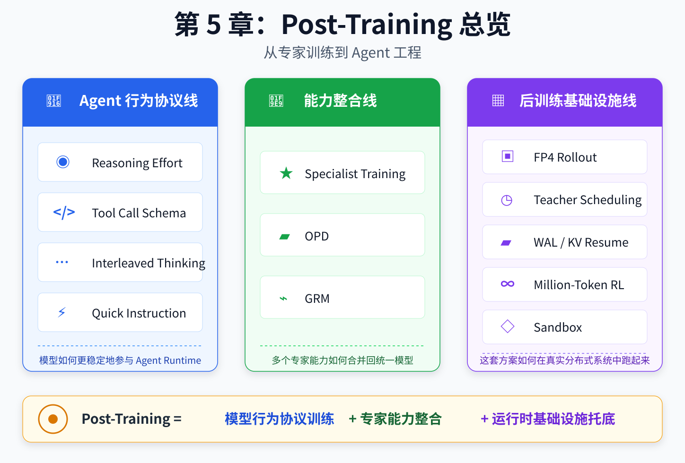
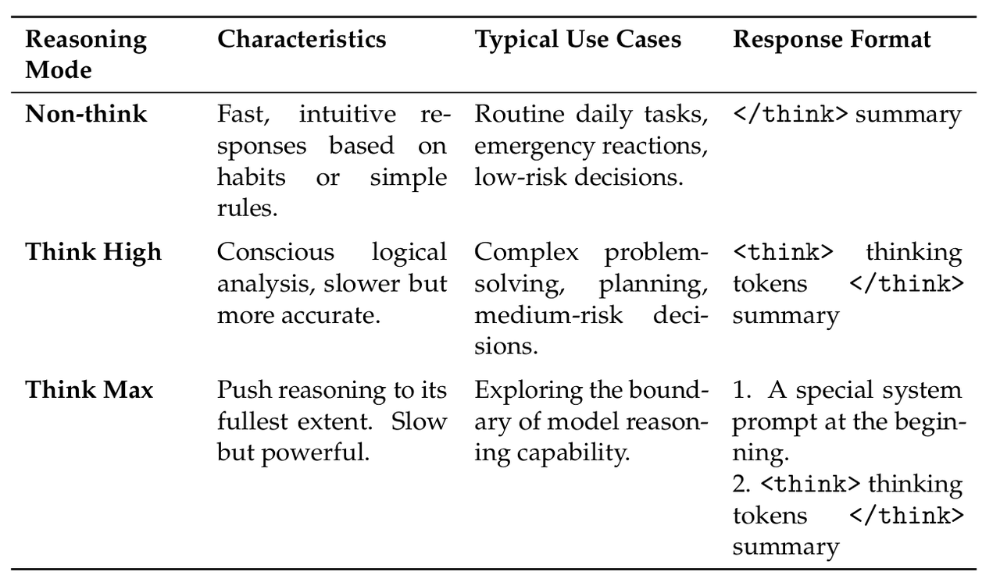

# 第 5 章：Post-Training 后训练，Agent 行为对齐和 RL 范式转变

---

## 章节导读

本章前两节聚焦于 V4 的后训练工程。5.1 和 5.2 的逻辑关系类似于第二章和第三章之间的关系，都是先讲技术路径，再讲工程实操。后两节 5.3 和 5.4 的内容主要在做 benchmark 评测，本身不是我们关注的重点。

5.1.1 这部分不仅在训练工程上做了很多阐述，还提到了很多和 agent 使用 / agent 开发有关的内容，可以说是所有 Agent 开发者都值得一读的部分，因此在这一节导读中尽可能忠于报告原文，不做过度概念简化。



### 本章阅读结构

| 部分 | 内容 | 说明 |
|---|---|---|
| 5.1 Post-Training Pipeline | 后训练总管线 | 技术路径 |
| 5.1.1 Specialist Training | 专家模型训练 | 很多处理与 Agent 工程强相关 |
| 5.1.2 On-Policy Distillation | 基模与专家的对齐和跟随 | 能力整合 |
| 5.2 RL and OPD Infrastructure | RL 和 OPD 的训练框架 | 工程实操 |
| 5.3 / 5.4 Evaluation | 模型评测 | 不是本文重点 |

---

# 5.1 Post-Training Pipeline：后训练范式的变化

报告这一节中的逻辑组织有些分散，可以大致划分为两个部分：

1. **面向 Agent 推理、工具使用和代码任务的行为对齐**
2. **后训练过程中 RL 范式转变**

前者更偏模型行为和 Agent 工程，后者更偏后训练策略本身。

---

## 5.1.1 面向 Agent 推理、工具使用和代码任务的行为对齐

这一部分相对庞杂，报告中提到了多个点，而这些均可以为 Agent 工程提供启发。

---

## Reasoning Effort：推理强度

### 报告做法



DS 把 Flash 和 Pro 两个版本均设置了三档推理强度：

| 推理档位 | 说明 |
|---|---|
| Non-think | 不显式展开 reasoning |
| Think High | 较高强度 reasoning |
| Think Max | 最大强度 reasoning |

在后训练过程中，DS 就对这三种不同推理强度，给予了不同的推理上下文预算，但都使用 `<think></think>` 来包裹推理文本。

特别地，对于 Think Max 模式，**DS 在开头注入了一段特殊的系统提示词**，这段系统提示词的报告原文如下：

```plaintext
Reasoning Effort: Absolute maximum with no shortcuts permitted.
You MUST be very thorough in your thinking and comprehensively decompose the problem to resolve the root cause, rigorously stress-testing your logic against all potential paths, edge cases, and adversarial scenarios.
Explicitly write out your entire deliberation process, documenting every intermediate step, considered alternative, and rejected hypothesis to ensure absolutely no assumption is left unchecked

推理努力：绝对达到最大值，不允许任何捷径。
你必须非常彻底地思考，全面分解问题以解决根本原因，严格地对你的逻辑进行压力测试，考察所有潜在路径、边界情况和对抗性场景。
明确写出你整个审议过程，记录每一个中间步骤、考虑过的替代方案和被否定的假设，以确保没有任何假设被放过
```

### 一些思考

这一做法其实已经和 Claude / GPT 系列模型相仿，提供不同档位的推理强度，用推理预算来换取思维强度并提高任务实现能力。内在逻辑均是通过控制 reasoning 的 token 预算来控制，外化出来的就是不同的推理档位。过去某些做法也会直接让用户输入一个token预算数字来控制推理强度。

GPT 系列的模型，推理内容全部是内化的，也就是说 Chain of Thought 本身不会暴露给外部作为 message 吐出模型。Claude 系列模型虽然会展示 thinking 的过程，但也不是把原始的 CoT 暴露出来，而是通过受控的 extended thinking / thinking blocks 机制呈现或管理。

相反地，国内模型如 kimi / qwen / deepseek 均是默认会用不同的格式，显式地吐出 reasoning 过程，这会带来后续 agent 交互的问题，我们后续马上就会提及。
